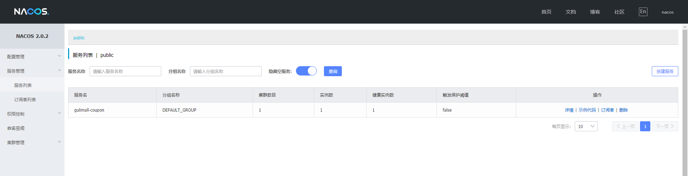
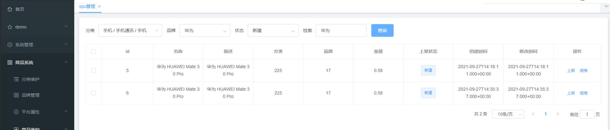
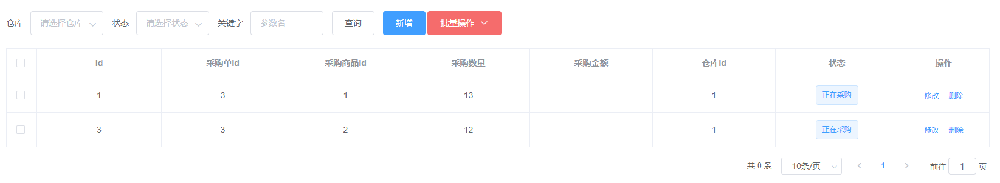
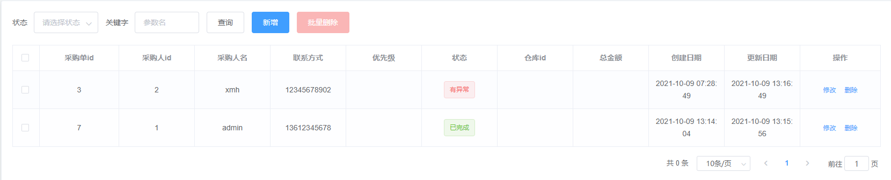

# 一、项目介绍

## 1. 谷粒商场微服务架构图


## 2. 微服务划分图


# 二、项目环境搭建

## 1. 虚拟机搭建环境

我购买的阿里云服务器，所以没操作虚拟机。

## 2. Linux安装docker

帮助文档：[https://docs.docker.com/engine/install/centos/](https://docs.docker.com/engine/install/centos/)

```shell
# 1. 卸载之前的docker
 sudo yum remove docker \
                  docker-client \
                  docker-client-latest \
                  docker-common \
                  docker-latest \
                  docker-latest-logrotate \
                  docker-logrotate \
                  docker-engine
                  
# 2.需要的安装包
yum install -y yum-utils

# 3.设置镜像的仓库
yum-config-manager \
    --add-repo \
    https://download.docker.com/linux/centos/docker-ce.repo
# 默认是从国外的，不推荐
# 推荐使用国内的
yum-config-manager \
    --add-repo \
    https://mirrors.aliyun.com/docker-ce/linux/centos/docker-ce.repo
# 更新yum软件包索引
yum makecache 

# 4.安装docker相关的 docker-ce 社区版 而ee是企业版
yum install docker-ce docker-ce-cli containerd.io
# 5、启动docker
docker systemctl start docker
# 6. 使用docker version查看是否按照成功
docker version
```

**配置阿里云镜像加速**

1、登录阿里云找到容器服务


2、找到镜像加速器


3、配置使用

```shell
sudo mkdir -p /etc/docker

sudo tee /etc/docker/daemon.json <<-'EOF'
{
  "registry-mirrors": ["https://2lxyghvy.mirror.aliyuncs.com"]
}
EOF

sudo systemctl daemon-reload

sudo systemctl restart docker
```


## 3. docker配置mysql

1、安装mysql5.7

```shell
docker pull mysql5.7

# 运行容器
sudo docker run -p 3312:3306 --name mysql01 \
-v /mydata/mysql/log:/var/log/mysql \
-v /mydata/mysql/data:/var/lib/mysql \
-v /mydata/mysql/conf:/etc/mysql \
-e MYSQL_ROOT_PASSWORD=root \
-d mysql:5.7
# 参数说明 -p 3312:3306 将容器的3306端口映射到主机的3312端口
# -v 宿主机文件目录:容器内目录  将容器内文件挂载到宿主机上
# -e MYSQL_ROOT_PASSWORD=root 设置mysql密码为root
# -d 后台启动
# --name 给启动容器起名字

# 使用docker ps 查看启动的容器
```


2、修改mysql配置文件

```shell
# 进入配置文件挂载的目录下
cd /mydata/mysql/conf

# 编辑配置文件my.cnf
vim my.cnf

# 新增配置文件内容
[client]
default-character-set=utf8
[mysql]
default-character-set=utf8
[mysqld]
init_connect='SET collation_connection = utf8_unicode_ci'
init_connect='SET NAMES utf8'
character-set-server=utf8
collation-server=utf8_unicode_ci
skip-character-set-client-handshake
skip-name-resolve

# 修改配置文件之后，重启容器
docker restart mysql01
```


## 4. docker配置redis

如果直接挂载的话docker会以为挂载的是一个目录，所以我们先创建一个文件然后再挂载，在虚拟机中。

```shell
# 1、创建配置文件
mkdir -p /mydata/redis/conf
touch /mydata/redis/conf/redis.conf

# 2、下载镜像
docker pull redis

# 3、启动容器
# 云服务器一定要修改端口或配置密码，否则会被拉去挖矿
docker run -p 6124:6379 --name redis \
-v /mydata/redis/data:/data  \
-v /mydata/redis/conf/redis.conf:/etc/redis/redis.conf \
-d redis redis-server /etc/redis/redis.conf

# 4、直接进入redis客户端
docker exec -it redis redis-cli
```

修改redis配置文件

```shell
vim /mydata/redis/conf/redis.conf

# 插入下面内容
appendonly yes    # 支持持久化
requirepass xxxxxx # 配置redis密码

# 保存
docker restart redis

# 进入redis客户端
docker exec -it redis redis-cli
auth xxxxxx
```

设置redis容器在docker启动的时候启动

```shell
docker update redis --restart=always
```

### **redis 配置文件解析**


> 转载知乎[https://zhuanlan.zhihu.com/p/144917964](https://zhuanlan.zhihu.com/p/144917964)


1、开头说明


　　这里没什么好说的，需要注意的是后面需要使用内存大小时，可以指定单位，通常是以 k,gb,m的形式出现，并且单位不区分大小写。


2、INCLUDES


　　我们知道Redis只有一个配置文件，如果多个人进行开发维护，那么就需要多个这样的配置文件，这时候多个配置文件就可以在此通过 include /path/to/local.conf 配置进来，而原本的 redis.conf 配置文件就作为一个总闸。

ps:如果用过struts2 开发的同学，在项目组中多人开发的情况下，通常会有多个struts2.xml 文件，这时候也会通过类时的配置引入进来。

另外需要注意的时，如果将此配置写在redis.conf 文件的开头，那么后面的配置会覆盖引入文件的配置，如果想以引入文件的配置为主，那么需要将 include 配置写在 redis.conf 文件的末尾。


3、MODULES


　　redis3.0的爆炸功能是新增了集群，而redis4.0就是在3.0的基础上新增了许多功能，其中这里的 自定义模块配置就是其中之一。通过这里的 loadmodule 配置将引入自定义模块来新增一些功能。


4、NETWORK


　　ps:这里的配置较长，我只截取了一部分，下同。

①、bind:绑定redis服务器网卡IP，默认为127.0.0.1,即本地回环地址。这样的话，访问redis服务只能通过本机的客户端连接，而无法通过远程连接。如果bind选项为空的话，那会接受所有来自于可用网络接口的连接。

②、port：指定redis运行的端口，默认是6379。由于Redis是单线程模型，因此单机开多个Redis进程的时候会修改端口。

③、timeout：设置客户端连接时的超时时间，单位为秒。当客户端在这段时间内没有发出任何指令，那么关闭该连接。默认值为0，表示不关闭。

④、tcp-keepalive ：单位是秒，表示将周期性的使用SO_KEEPALIVE检测客户端是否还处于健康状态，避免服务器一直阻塞，官方给出的建议值是300s，如果设置为0，则不会周期性的检测。


5、 GENERAL


　　具体配置详解：

①、daemonize:设置为yes表示指定Redis以守护进程的方式启动（后台启动）。默认值为 no

②、pidfile:配置PID文件路径，当redis作为守护进程运行的时候，它会把 pid 默认写到 /var/redis/run/redis_6379.pid 文件里面

③、loglevel ：定义日志级别。默认值为notice，有如下4种取值：

debug（记录大量日志信息，适用于开发、测试阶段）

verbose（较多日志信息）

notice（适量日志信息，使用于生产环境）

warning（仅有部分重要、关键信息才会被记录）

④、logfile ：配置log文件地址,默认打印在命令行终端的窗口上

⑤、databases：设置数据库的数目。默认的数据库是DB 0 ，可以在每个连接上使用select 命令选择一个不同的数据库，dbid是一个介于0到databases - 1 之间的数值。默认值是 16，也就是说默认Redis有16个数据库。


6、SNAPSHOTTING

这里的配置主要用来做持久化操作。


①、save：这里是用来配置触发 Redis的持久化条件，也就是什么时候将内存中的数据保存到硬盘。默认如下配置：

```text
save 900 1：表示900 秒内如果至少有 1 个 key 的值变化，则保存
save 300 10：表示300 秒内如果至少有 10 个 key 的值变化，则保存
save 60 10000：表示60 秒内如果至少有 10000 个 key 的值变化，则保存
```

当然如果你只是用Redis的缓存功能，不需要持久化，那么你可以注释掉所有的 save 行来停用保存功能。可以直接一个空字符串来实现停用：save ""

②、stop-writes-on-bgsave-error ：默认值为yes。当启用了RDB且最后一次后台保存数据失败，Redis是否停止接收数据。这会让用户意识到数据没有正确持久化到磁盘上，否则没有人会注意到灾难（disaster）发生了。如果Redis重启了，那么又可以重新开始接收数据了

③、rdbcompression ；默认值是yes。对于存储到磁盘中的快照，可以设置是否进行压缩存储。如果是的话，redis会采用LZF算法进行压缩。如果你不想消耗CPU来进行压缩的话，可以设置为关闭此功能，但是存储在磁盘上的快照会比较大。

④、rdbchecksum ：默认值是yes。在存储快照后，我们还可以让redis使用CRC64算法来进行数据校验，但是这样做会增加大约10%的性能消耗，如果希望获取到最大的性能提升，可以关闭此功能。

⑤、dbfilename ：设置快照的文件名，默认是 dump.rdb

⑥、dir：设置快照文件的存放路径，这个配置项一定是个目录，而不能是文件名。使用上面的 dbfilename 作为保存的文件名。


7、REPLICATION


①、slave-serve-stale-data：默认值为yes。当一个 slave 与 master 失去联系，或者复制正在进行的时候，slave 可能会有两种表现：

1) 如果为 yes ，slave 仍然会应答客户端请求，但返回的数据可能是过时，或者数据可能是空的在第一次同步的时候

2) 如果为 no ，在你执行除了 info he salveof 之外的其他命令时，slave 都将返回一个 "SYNC with master in progress" 的错误

②、slave-read-only：配置Redis的Slave实例是否接受写操作，即Slave是否为只读Redis。默认值为yes。

③、repl-diskless-sync：主从数据复制是否使用无硬盘复制功能。默认值为no。

④、repl-diskless-sync-delay：当启用无硬盘备份，服务器等待一段时间后才会通过套接字向从站传送RDB文件，这个等待时间是可配置的。 这一点很重要，因为一旦传送开始，就不可能再为一个新到达的从站服务。从站则要排队等待下一次RDB传送。因此服务器等待一段 时间以期更多的从站到达。延迟时间以秒为单位，默认为5秒。要关掉这一功能，只需将它设置为0秒，传送会立即启动。默认值为5。

⑤、repl-disable-tcp-nodelay：同步之后是否禁用从站上的TCP_NODELAY 如果你选择yes，redis会使用较少量的TCP包和带宽向从站发送数据。但这会导致在从站增加一点数据的延时。 Linux内核默认配置情况下最多40毫秒的延时。如果选择no，从站的数据延时不会那么多，但备份需要的带宽相对较多。默认情况下我们将潜在因素优化，但在高负载情况下或者在主从站都跳的情况下，把它切换为yes是个好主意。默认值为no。


8、SECURITY


①、rename-command：命令重命名，对于一些危险命令例如：

flushdb（清空数据库）

flushall（清空所有记录）

config（客户端连接后可配置服务器）

keys（客户端连接后可查看所有存在的键）

作为服务端redis-server，常常需要禁用以上命令来使得服务器更加安全，禁用的具体做法是是：

rename-command FLUSHALL "" 也可以保留命令但是不能轻易使用，重命名这个命令即可：

rename-command FLUSHALL abcdefg 　　这样，重启服务器后则需要使用新命令来执行操作，否则服务器会报错unknown command。

②、requirepass:设置redis连接密码

比如: requirepass 123 表示redis的连接密码为123。


9、CLIENTS


　　①、maxclients ：设置客户端最大并发连接数，默认无限制，Redis可以同时打开的客户端连接数为Redis进程可以打开的最大文件。 描述符数-32（redis server自身会使用一些），如果设置 maxclients为0 。表示不作限制。当客户端连接数到达限制时，Redis会关闭新的连接并向客户端返回max number of clients reached错误信息


10、MEMORY MANAGEMENT


　　①、maxmemory：设置Redis的最大内存，如果设置为0 。表示不作限制。通常是配合下面介绍的maxmemory-policy参数一起使用。

②、maxmemory-policy ：当内存使用达到maxmemory设置的最大值时，redis使用的内存清除策略。有以下几种可以选择：

1）volatile-lru 利用LRU算法移除设置过过期时间的key (LRU:最近使用 Least Recently Used )

2）allkeys-lru 利用LRU算法移除任何key

3）volatile-random 移除设置过过期时间的随机key

4）allkeys-random 移除随机ke

5）volatile-ttl 移除即将过期的key(minor TTL)

6）noeviction noeviction 不移除任何key，只是返回一个写错误 ，默认选项

③、maxmemory-samples ：LRU 和 minimal TTL 算法都不是精准的算法，但是相对精确的算法(为了节省内存)。随意你可以选择样本大小进行检，redis默认选择3个样本进行检测，你可以通过maxmemory-samples进行设置样本数。


11、APPEND ONLY MODE


①、appendonly：默认redis使用的是rdb方式持久化，这种方式在许多应用中已经足够用了。但是redis如果中途宕机，会导致可能有几分钟的数据丢失，根据save来策略进行持久化，Append Only File是另一种持久化方式， 可以提供更好的持久化特性。Redis会把每次写入的数据在接收后都写入appendonly.aof文件，每次启动时Redis都会先把这个文件的数据读入内存里，先忽略RDB文件。默认值为no。

②、appendfilename ：aof文件名，默认是"appendonly.aof"

③、appendfsync：aof持久化策略的配置；no表示不执行fsync，由操作系统保证数据同步到磁盘，速度最快；always表示每次写入都执行fsync，以保证数据同步到磁盘；everysec表示每秒执行一次fsync，可能会导致丢失这1s数据

④、no-appendfsync-on-rewrite：在aof重写或者写入rdb文件的时候，会执行大量IO，此时对于everysec和always的aof模式来说，执行fsync会造成阻塞过长时间，no-appendfsync-on-rewrite字段设置为默认设置为no。如果对延迟要求很高的应用，这个字段可以设置为yes，否则还是设置为no，这样对持久化特性来说这是更安全的选择。 设置为yes表示rewrite期间对新写操作不fsync,暂时存在内存中,等rewrite完成后再写入，默认为no，建议yes。Linux的默认fsync策略是30秒。可能丢失30秒数据。默认值为no。

⑤、auto-aof-rewrite-percentage：默认值为100。aof自动重写配置，当目前aof文件大小超过上一次重写的aof文件大小的百分之多少进行重写，即当aof文件增长到一定大小的时候，Redis能够调用bgrewriteaof对日志文件进行重写。当前AOF文件大小是上次日志重写得到AOF文件大小的二倍（设置为100）时，自动启动新的日志重写过程。

⑥、auto-aof-rewrite-min-size：64mb。设置允许重写的最小aof文件大小，避免了达到约定百分比但尺寸仍然很小的情况还要重写。

⑦、aof-load-truncated：aof文件可能在尾部是不完整的，当redis启动的时候，aof文件的数据被载入内存。重启可能发生在redis所在的主机操作系统宕机后，尤其在ext4文件系统没有加上data=ordered选项，出现这种现象 redis宕机或者异常终止不会造成尾部不完整现象，可以选择让redis退出，或者导入尽可能多的数据。如果选择的是yes，当截断的aof文件被导入的时候，会自动发布一个log给客户端然后load。如果是no，用户必须手动redis-check-aof修复AOF文件才可以。默认值为 yes。


12、LUA SCRIPTING


　　①、lua-time-limit：一个lua脚本执行的最大时间，单位为ms。默认值为5000.


13、REDIS CLUSTER


①、cluster-enabled：集群开关，默认是不开启集群模式。

②、cluster-config-file：集群配置文件的名称，每个节点都有一个集群相关的配置文件，持久化保存集群的信息。 这个文件并不需要手动配置，这个配置文件有Redis生成并更新，每个Redis集群节点需要一个单独的配置文件。请确保与实例运行的系统中配置文件名称不冲突。默认配置为nodes-6379.conf。

③、cluster-node-timeout ：可以配置值为15000。节点互连超时的阀值，集群节点超时毫秒数

④、cluster-slave-validity-factor ：可以配置值为10。在进行故障转移的时候，全部slave都会请求申请为master，但是有些slave可能与master断开连接一段时间了， 导致数据过于陈旧，这样的slave不应该被提升为master。该参数就是用来判断slave节点与master断线的时间是否过长。判断方法是：比较slave断开连接的时间和(node-timeout * slave-validity-factor) + repl-ping-slave-period 如果节点超时时间为三十秒, 并且slave-validity-factor为10,假设默认的repl-ping-slave-period是10秒，即如果超过310秒slave将不会尝试进行故障转移

⑤、cluster-migration-barrier ：可以配置值为1。master的slave数量大于该值，slave才能迁移到其他孤立master上，如这个参数若被设为2，那么只有当一个主节点拥有2 个可工作的从节点时，它的一个从节点会尝试迁移。

⑥、cluster-require-full-coverage：默认情况下，集群全部的slot有节点负责，集群状态才为ok，才能提供服务。 设置为no，可以在slot没有全部分配的时候提供服务。不建议打开该配置，这样会造成分区的时候，小分区的master一直在接受写请求，而造成很长时间数据不一致。


### redis 可视化工具安装

连接：[https://www.jb51.net/softs/669908.html#downintro2](https://www.jb51.net/softs/669908.html#downintro2)

下载完毕解压，运行文件夹中 redisdestop_v2020.5.0.exe  傻瓜式安装


**连接到远程redis**,输入账号密码即可


## 5. 配置开发环境

配置maven的阿里云镜像、jdk11

```xml
  <mirrors> 
	<mirror>
	<id>nexus-aliyun</id>
	<mirrorOf>central</mirrorOf>
	<name>Nexus aliyun</name>
	<url>http://maven.aliyun.com/nexus/content/groups/public</url>
	</mirror>
  </mirrors>


 <profiles>
    <id>jdk-11</id>
    <activation>
        <activeByDefault>true</activeByDefault>
        <jdk>11</jdk>
    </activation>
    <properties>
        <project.build.sourceEncoding>UTF-8</project.build.sourceEncoding>
        <maven.compiler.source>11</maven.compiler.source>
        <maven.compiler.target>11</maven.compiler.target>
        <maven.compiler.compilerVersion>11</maven.compiler.compilerVersion>
    </properties>
  </profiles>
```

IDEA安装插件lombok，mybatisX。IDEA设置里配置好maven

## 6. 安装vscode

下载地址[https://code.visualstudio.com/Download](https://code.visualstudio.com/Download)

vscode用于前端管理系统，在vsCode里安装插件

- Auto Close Tag
- Auto Rename Tag
- Chinese
- ESlint
- HTML CSS Support
- HTML Snippets
- JavaScript ES6
- Live Server
- open in brower
- Vetur

## 7. 配置git

git、github使用详细笔记[https://blog.csdn.net/weixin_44190665/article/details/118024018](https://blog.csdn.net/weixin_44190665/article/details/118024018)

## 8. IDEA配置码云

**1、新建仓库**


**2、idea绑定码云**

先下载gitee插件，下载后在settings中配置码云账号


**3、新建项目**


选择刚刚新建的仓库


## 9. 初始化项目架构

**1、在工程目录下新建pom.xml文件，右键点击 add as maven project, 作为父工程，做依赖管理。**

选取版本号（spring boot 2.3.2 + sprin gcloud Hoxton.SR8 + spring cloud alibaba 2.2.5.RELEASE）

```xml
<?xml version="1.0" encoding="UTF-8"?>

<project xmlns="http://maven.apache.org/POM/4.0.0" xmlns:xsi="http://www.w3.org/2001/XMLSchema-instance"
         xsi:schemaLocation="http://maven.apache.org/POM/4.0.0 http://maven.apache.org/xsd/maven-4.0.0.xsd">
  <modelVersion>4.0.0</modelVersion>

  <groupId>com.xmh.gulimall</groupId>
  <artifactId>gulimall</artifactId>
  <version>1.0.0-SNAPSHOT</version>
  <name>gulimall</name>
  <description>父工程，依赖管理</description>
  <packaging>pom</packaging>

  <modules>

  </modules>


  <!-- 统一管理jar包版本 -->
  <properties>
    <project.build.sourceEncoding>UTF-8</project.build.sourceEncoding>
    <maven.compiler.source>11</maven.compiler.source>
    <maven.compiler.target>11</maven.compiler.target>
  </properties>

  <!-- 子模块继承之后，提供作用：
      锁定版本+子modlue不用写groupId和version -->
  <dependencyManagement>
    <dependencies>
      <!--spring boot 2.3.2-->
      <dependency>
        <groupId>org.springframework.boot</groupId>
        <artifactId>spring-boot-dependencies</artifactId>
        <version>2.3.2.RELEASE</version>
        <type>pom</type>
        <scope>import</scope>
      </dependency>
      <!--spring cloud Hoxton.SR8-->
      <dependency>
        <groupId>org.springframework.cloud</groupId>
        <artifactId>spring-cloud-dependencies</artifactId>
        <version>Hoxton.SR8</version>
        <type>pom</type>
        <scope>import</scope>
      </dependency>
      <!--spring cloud alibaba 2.2.5.RELEASE-->
      <dependency>
        <groupId>com.alibaba.cloud</groupId>
        <artifactId>spring-cloud-alibaba-dependencies</artifactId>
        <version>2.2.5.RELEASE</version>
        <type>pom</type>
        <scope>import</scope>
      </dependency>
    </dependencies>
  </dependencyManagement>

  <build>
    <plugins>
      <plugin>
        <groupId>org.springframework.boot</groupId>
        <artifactId>spring-boot-maven-plugin</artifactId>
        <configuration>
          <fork>true</fork>
          <addResources>true</addResources>
        </configuration>
      </plugin>
    </plugins>
  </build>

</project>
```

**2、新建子模块**

* gulimall-xxx(product/order/ware/coupon/member)

* 每一个子模块的包名为com.xmh.gulimall.xxx(product/order/ware/coupon/member)

* 并在每个子模块下引入web、openfegin

新建maven项目 gulimall-xxx，导入依赖pom.xml

```xml
    <dependencies>
        <!--openfeign-->
        <dependency>
            <groupId>org.springframework.cloud</groupId>
            <artifactId>spring-cloud-starter-openfeign</artifactId>
        </dependency>
        <!--web-->
        <dependency>
            <groupId>org.springframework.boot</groupId>
            <artifactId>spring-boot-starter-web</artifactId>
        </dependency>
        <dependency>
            <groupId>org.springframework.boot</groupId>
            <artifactId>spring-boot-starter-actuator</artifactId>
        </dependency>
    </dependencies>
```

**3、过滤上传git的垃圾文件**

* 点开父工程的.gitignore文件，添加如下内容

```java
**/mvnw
**/mvnw.cmd

**/.mvn
**/target/

.idea

**/.gitignore
```

**4、右键项目提交**


填写提交信息、点击commit and push

**5、查看码云，提交成功**(图片为后补，可能有部分不一样)


## 10. 初始化数据库

sql文件地址：[https://gitee.com/blizzard0409/gulimall/tree/master/sql](https://gitee.com/blizzard0409/gulimall/tree/master/sql)

创建数据库gulimall_xxx(oms/pms/sms/ums/wms)，基字符集选择utf8mb4

分别在五个数据库下执行五个sql文件。


# 三、快速开发

## 1. 人人开源搭建后台管理系统

**1、码云上搜索人人开源，找到renren-fast(后台管理系统)，renren-fast-vue(前端), 克隆到本地。**


**2、删除renren-fast中的.git文件，把其余文件拷贝到项目中**

**3、修改父工程的pom.xml,把renren-fast 加入父工程**


**4、修改renren-fast之中的 pom.xm**l


* pom.xml报错

```
'parent.relativePath' of POM io.renren:renren-fast:3.0.0
```

报错原因：子模块的parent写的并不是子模块的上一级，而是继承了springboot

解决方法：在parent标签之中添加<relativePath ></relativePath>

```xml
	<parent>
		<groupId>org.springframework.boot</groupId>
		<artifactId>spring-boot-starter-parent</artifactId>
		<version>2.2.4.RELEASE</version>
		<relativePath ></relativePath>
	</parent>
```


* 如果pom.xml之中的plugin地方报错，引入相关依赖

```xml
<!-- https://mvnrepository.com/artifact/com.spotify/docker-maven-plugin -->
<dependency>
   <groupId>com.spotify</groupId>
   <artifactId>docker-maven-plugin</artifactId>
   <version>0.4.14</version>
</dependency>

<dependency>
	<groupId>org.codehaus.mojo</groupId>
	<artifactId>wagon-maven-plugin</artifactId>
	<version>1.0</version>
</dependency>
```

**5、创建后台管理系统的数据库gulimall_admin**

sql文件在renren-fast/db/ 目录下，找到其中的mysql.sql 复制，运行。


**6、修改renren-fast的配置文件、配置数据库**

查看application.yml，发现当前环境为dev


修改application-dev.yml, 配置成自己的数据源


**7、启动成功，访问**http://localhost:8080/renren-fast/测试


测试成功


**8、前端联调，首先安装node**

下载地址https://nodejs.org/dist/v10.16.3/，下载之后直接安装即可。安装后检查node.js


配置淘宝镜像

```shell
npm config set registry http://registry.npm.taobao.org/
```


运行vue项目之前，运行npm install命令，加载项目依赖


执行命令npm run dev运行项目

```shell
npm run dev
```

运行成功


访问http://localhost:8001/#/login，测试成功


## 2. 人人开源逆向工程搭建

**1、克隆renren-generator**


**2、删除其中的.git文件，复制到工程中，添加到父工程**

**3、pom.xml中添加<relativePath ></relativePath>**

**4、修改renren-generator的配置文件application.yml，配置自己的数据源**

先生成gulimall-pms


**5、修改生成器信息 generator.properties**


如果出现中文乱码，按照图下设置：


> 如果引入spring-boot-starter-parent 2.2.6.RELEASE爆红，参考问题2

**6、修改src/main/resources/template/Controller.java.vm**

删除导入shiro的语句


注释掉该位置，此处的注释是shiro提供的，我们以后要用spring security


**7、运行项目，访问localhost:80，选中所有表，生成代码**


**8、解压生成的代码，把mian文件夹复制到gulimall-product/src下**

\resources\src\views\modules\product （前端文件，用不到）

> 如果之前没有创建application.yml和启动类，手动创建


**9、解决生成的代码报错**

* 新建gulimall-common模块，用来引入每一个微服务公共的依赖、bean、工具类等

  先在父工程的pom.xml进行版本控制

  ```xml
  <!-- 统一管理jar包版本 -->
    <properties>
      <mybatis-plus.version>3.4.1</mybatis-plus.version>
      <lombok.version>1.18.20</lombok.version>
      <httpcore.version>4.4.14</httpcore.version>
      <commons.lang.version>2.6</commons.lang.version>
    </properties>
  
  	<dependencies>
        <dependency>
          <groupId>com.baomidou</groupId>
          <artifactId>mybatis-plus-boot-starter</artifactId>
          <version>${mybatis-plus.version}</version>
        </dependency>
        <dependency>
          <groupId>org.projectlombok</groupId>
          <artifactId>lombok</artifactId>
          <version>${lombok.version}</version>
          <optional>true</optional>
        </dependency>
        <dependency>
          <groupId>org.apache.httpcomponents</groupId>
          <artifactId>httpcore</artifactId>
          <version>${httpcore.version}</version>
        </dependency>
        <dependency>
          <groupId>commons-lang</groupId>
          <artifactId>commons-lang</artifactId>
          <version>${commons.lang.version}</version>
        </dependency>
      </dependencies>
  ```

  在gulimall-common引入公共依赖

  ```xml
  <dependencies>
          <dependency>
              <groupId>com.baomidou</groupId>
              <artifactId>mybatis-plus-boot-starter</artifactId>
          </dependency>
          <dependency>
              <groupId>org.projectlombok</groupId>
              <artifactId>lombok</artifactId>
          </dependency>
          <dependency>
              <groupId>org.apache.httpcomponents</groupId>
              <artifactId>httpcore</artifactId>
          </dependency>
          <dependency>
              <groupId>commons-lang</groupId>
              <artifactId>commons-lang</artifactId>
          </dependency>
      </dependencies>
  ```

  解决了dao、entity的报错。

  接下来创建公共类解决service报错

  

  在gulimall-common中按照要求创建包，引入PageUtils、Query、R、exception（在renren-fast里面复制）

  复制xss下面的HTMLFilter、SQLFilter

  

  挨个解决报错。。。解决所有报错！

## 3. 测试基本的CRUD功能

**1、在gulimall-common中导入mybatis-plus依赖（已完成）**

**2、配置数据源，以gulimall-product为例**

* 在gulimall-common中导入数据源

```xml
<!--父项目控制依赖-->
 <mysql-connector.version>8.0.17</mysql-connector.version>

      <dependency>
        <groupId>mysql</groupId>
        <artifactId>mysql-connector-java</artifactId>
        <version>${mysql-connector.version}</version>
      </dependency>

<!--gulimall-common引入依赖-->
        <dependency>
            <groupId>mysql</groupId>
            <artifactId>mysql-connector-java</artifactId>
        </dependency>
```

* 配置mybatis-plus

```yml
server:
  port: 10000

spring:
  datasource:
    username: root
    password: xxxxxx
    url: jdbc:mysql://55.144.13.121:1234/gulimall_pms?userUnicode=true&characterEncoding=UTF-8&useSSL=false&serverTimezone=Asia/Shanghai
    driver-class-name: com.mysql.jdbc.Driver

mybatis-plus:
  mapper-locations: classpath*:/mapper/**/*.xml
  global-config:
    db-config:
      id-type: auto   # 主键自增
```

**3、测试**

* 新建测试类


* 测试

  ```java
  @RunWith(SpringRunner.class)
  @SpringBootTest
  public class GulimallProductApplicationTests {
  
      @Autowired
      BrandService brandService;
  
      @Test
      public void contextLoads(){
          BrandEntity brandEntity = new BrandEntity();
          brandEntity.setName("华为");
          brandService.save(brandEntity);
          System.out.println("保存成功");
      }
  
  }
  ```

  查看数据库，新增数据成功

  同理自测删除、修改、查询。

  

## 4. 快速生成所有CRUD代码

**1、先配置微服务端口，按顺序coupon/member/order/product/ware分别为7000/8000/9000/10000/11000**

> 没有主启动类手动创建


**2、修改生成器代码配置，要修改三个位置**


**3、生成coupon的代码，复制到工程中，并在gulimall-coupon工程中引入gulimall-common依赖**

**4、修改gulimall-coupon的配置文件**

从product复制过去，只需要修改数据库名字


**5、访问http://localhost:7000/coupon/coupon/list测试**


测试成功！

**6、按照以上方法分别生成gulimall-member/gulimall-order/gulimall-ware的代码**

# 四、分布式组件

父工程引入依赖（已完成）（spring boot 2.3.2 + sprin gcloud Hoxton.SR8 + spring cloud alibaba 2.2.5.RELEASE）

## 1. nacos用作服务注册中心

**1、nacos下载安装**

* 下载地址：https://github.com/alibaba/nacos/releases


* 解压安装包，直接运行bin目录下的startup.cmd

> 如果nacos1.3.2启动报错 Unable to start embedded Tomcat
>
> 参考：https://blog.csdn.net/weixin_42982636/article/details/108221299

* 命令运行成功后直接访问http://localhost:8848/nacos，默认账号密码都是nacos


**2、使用nacos**

* 在项目里properties里写`spring.cloud.nacos.discovery.server-addr=127.0.0.1:8848`（yaml同理，指定nacos的地址）。再指定spring.applicatin.name告诉注册到nacos中以什么命名

  ```yml
  server:
    port: 7000
  
  spring:
    datasource:
      username: root
      password: xxxxxx
      url: jdbc:mysql://64.114.116.33:1234/gulimall_sms?userUnicode=true&characterEncoding=UTF-8&useSSL=false&serverTimezone=Asia/Shanghai
      driver-class-name: com.mysql.jdbc.Driver
    application:
      name: gulimall-coupon
    cloud:
      nacos:
        discovery:
          server-addr: 127.0.0.1:8848
          
          
  mybatis-plus:
    mapper-locations: classpath*:/mapper/**/*.xml
    global-config:
      db-config:
        id-type: auto   # 主键自增
  
  ```

* 引入依赖（放入common中）

  ```xml
          <dependency>
              <groupId>com.alibaba.cloud</groupId>
              <artifactId>spring-cloud-starter-alibaba-nacos-discovery</artifactId>
          </dependency>
  ```

* 在主启动类上使用 `@EnableDiscoveryClient` 注解开启服务注册与发现功能

  ```java
  @EnableDiscoveryClient
  @SpringBootApplication
  public class GulimallCouponApplication {
      public static void main(String[] args) {
          SpringApplication.run(GulimallCouponApplication.class, args);
      }
  }
  ```

**3、启动gulimall-coupon, 查看服务注册中心**



**4、按照以上步骤依次给member/order/product/ware配置**


## 2. openfegin远程调用

声明式远程调用

feign是一个声明式的HTTP客户端，他的目的就是让远程调用更加简单。给远程服务发的是HTTP请求。

会员服务想要远程调用优惠券服务，只需要给会员服务里引入openfeign依赖，他就有了远程调用其他服务的能力。

**1、引入依赖：（已完成）**

```xml
<dependency>
    <groupId>org.springframework.cloud</groupId>
    <artifactId>spring-cloud-starter-openfeign</artifactId>
</dependency>
```

**2、 演示member服务调用coupon服务**

* 在gulimall-coupon中的CouponController中添加测试方法

  ```java
      @RequestMapping("/member/list")
      public R membercoupons(){    //全系统的所有返回都返回R
          // 模拟去数据库查用户对于的优惠券
          CouponEntity couponEntity = new CouponEntity();
          couponEntity.setCouponName("满100-10");//优惠券的名字
          return R.ok().put("coupons",Arrays.asList(couponEntity));
      }
  ```

* 在member的主启动类上加注解`@EnableDiscoveryClient，`告诉member是一个远程调用客户端，member要调用东西的

  ```java
  @EnableDiscoveryClient
  @SpringBootApplication
  @EnableFeignClients(basePackages="com.xmh.gulimall.member.feign")//扫描接口方法注解
  public class GulimallMemberApplication {
      public static void main(String[] args) {
          SpringApplication.run(GulimallMemberApplication.class, args);
      }
  }
  ```

* 在`com.xmh.gulimall.member.feign`中新建接口`CouponFeignService`

  ```java
  @FeignClient("gulimall-coupon")//告诉spring cloud这个接口是一个远程客户端，要调用coupon服务(nacos中找到)
  public interface CouponFeignService {
  
      // 远程服务的url
      @RequestMapping("/coupon/coupon/member/list")//注意写全优惠券类上还有映射
      public R membercoupons();//得到一个R对象
  
  
  }
  ```

* 在member的MemberController写一个测试

  ```java
      @Autowired
      private CouponFeignService couponFeignService; //注入刚才的CouponFeignService接口
  
      @RequestMapping("/coupons")
      public R coupons(){
          MemberEntity memberEntity = new MemberEntity();
          memberEntity.setNickname("会员昵称张三");
          R membercoupons = couponFeignService.membercoupons();
  
          return R.ok().put("member", memberEntity).put("coupons", membercoupons.get("coupons"));
      }
  ```

* 启动gulimall-member，gulimall-coupon项目。访问http://localhost:8000/member/member/coupons测试

!

​	测试成功！

## 3. nacos用作配置中心

**1、common中添加依赖 nacos配置中心**

```xml
<dependency>
     <groupId>com.alibaba.cloud</groupId>
     <artifactId>spring-cloud-starter-alibaba-nacos-config</artifactId>
 </dependency>
```

**2、在coupons项目中创建/src/main/resources/bootstrap.yml，优先级别application.properties高**

```yml
# 改名字，对应nacos里的配置文件名
spring:
  application:
    name: gulimall-coupon
  cloud:
    nacos:
      config:
        server-addr: 127.0.0.1:8848
        file-extension: yaml # 指定配置文件为yaml格式
```

**3、浏览器去nacos里的配置列表，点击＋号，data ID：`gulimall-coupon.yaml`，配置**


**4、在controller中编写测试代码**

```java
    @Value("${coupon.user.name}")
    private String name;
    
    @Value("${coupon.user.age}")
    private int age;

    @RequestMapping("/nacos")
    public R nacos(){
        return R.ok().put("name", name).put("age", age);
    }
```

**5、访问http://localhost:7000/coupon/coupon/nacos测试**


**6、在coupon的控制层上加`@RefreshScope`支持动态刷新**


**7、新建coupon、member、order、product、ware五个命名空间分别保存自己的配置文件**

**nacos说明：**
最终方案：每个微服务创建自己的命名空间，然后使用配置分组区分环境（dev/test/prod)


## 4. 网关gateway-88

动态上下线：发送请求需要知道商品服务的地址，如果商品服务器有123服务器，1号掉线后，还得改，所以需要网关动态地管理，他能从注册中心中实时地感知某个服务上线还是下线。【先通过网关，网关路由到服务提供者】

拦截：请求也要加上询问权限，看用户有没有权限访问这个请求，也需要网关。

所以我们使用spring cloud的gateway组件做网关功能。

网关是请求流量的入口，常用功能包括路由转发，权限校验，限流控制等。

https://spring.io/projects/spring-cloud-gateway

参考手册：https://cloud.spring.io/spring-cloud-gateway/2.2.x/reference/html/

**三大核心概念：**

* Route: The basic building block of the gateway. It is defined by an ID, a destination URI, a collection of predicates断言, and a collection of filters. A route is matched if the aggregate predicate is true.发一个请求给网关，网关要将请求路由到指定的服务。路由有id，目的地uri，断言的集合，匹配了断言就能到达指定位置，
* Predicate断言: This is a Java 8 Function Predicate. The input type is a Spring Framework ServerWebExchange. This lets you match on anything from the HTTP request, such as headers or parameters.就是java里的断言函数，匹配请求里的任何信息，包括请求头等。根据请求头路由哪个服务
* Filter: These are instances of Spring Framework GatewayFilter that have been constructed with a specific factory. Here, you can modify requests and responses before or after sending the downstream request.过滤器请求和响应都可以被修改。
  客户端发请求给服务端。中间有网关。先交给映射器，如果能处理就交给handler处理，然后交给一系列filer，然后给指定的服务，再返回回来给客户端。

客户端发请求给服务端。中间有网关。先交给映射器，如果能处理就交给handler处理，然后交给一系列filer，然后给指定的服务，再返回回来给客户端。


**1、新建gulimall-gateway作为网关**

新建maven项目，引入依赖

```xml
    <dependencies>
        <dependency>
            <groupId>com.xmh.gulimall</groupId>
            <artifactId>gulimall-common</artifactId>
            <version>1.0.0-SNAPSHOT</version>
        </dependency>
        <dependency>
            <groupId>org.springframework.cloud</groupId>
            <artifactId>spring-cloud-starter-gateway</artifactId>
        </dependency>
    </dependencies>
```

在nacos上新建gateway命名空间，在命名空间中新建配置`gulimall-gateway.yaml`


配置application.yml

```yml
server:
  port: 88
spring:
  cloud:
    nacos:
      discovery:
        server-addr: 127.0.0.1:8848
  application:
    name: gulimall-gateway
```

配置bootstrap.yml

```yml
spring:
  application:
    name: gulimall-gateway
  cloud:
    nacos:
      config:
        server-addr: 127.0.0.1:8848
        file-extension: yaml
        namespace: d717d0ee-7a07-4125-9881-3ef57d696ad3
```

主启动类

```java
@SpringBootApplication(exclude = {DataSourceAutoConfiguration.class}) //不用数据源，过滤掉数据源配置
@EnableDiscoveryClient
public class GulimallGatewayApplication {
    public static void main(String[] args) {
        SpringApplication.run(GulimallGatewayApplication.class, args);
    }
}
```

**2、测试访问http://localhost:88?url=baidu 切换到百度， http://localhost:88?url=qq 切换到qq**

在网关的application.yml中配置路由

```yml
server:
  port: 88
spring:
  cloud:
    nacos:
      discovery:
        server-addr: 127.0.0.1:8848
    gateway:
      routes:
        - id: baidu_route              # 每一个路由的名字，唯一即可
          uri: https://www.baidu.com   # 匹配后提供服务的路由地址
          predicates:                 # 断言规则
            - Query=url,baidu         #如果url参数等于baidu 符合断言，转到uri

        - id: qq_route                  # 每一个路由的名字，唯一即可
          uri: https://www.qq.com   # 匹配后提供服务的路由地址
          predicates: # 断言规则
            - Query=url,qq         #如果url参数等于baidu 符合断言，转到uri

  application:
    name: gulimall-gateway
```

启动网关，访问http://localhost:88?url=baidu测试，成功！


# 五、前端基础

## 1. ES6基础

### 1、let & const

快捷键：`！+ Enter`生成模板

* let声明后不能作用于{}外，var可以
* let只能声明一次，var可以声明多次
* var会变量提升（使用在定义之前），let必须先定义再使用
* const一旦初始化后，不能改变

```html
<!DOCTYPE html>
<html lang="en">

<head>
    <meta charset="UTF-8">
    <meta http-equiv="X-UA-Compatible" content="IE=edge">
    <meta name="viewport" content="width=device-width, initial-scale=1.0">
    <title>Document</title>
</head>

<body>
    <script>
        // var 声明的变量往往会越域
        // let 声明的变量有严格局部作用域
        {
            var a = 1;
            let b = 2;
        }
        console.log(a);  // 1
        console.log(b);  // ReferenceError: b is not defined

        // var 可以声明多次
        // let 只能声明一次
        var m = 1
        var m = 2
        let n = 3
        //         let n = 4
        console.log(m)  // 2
        console.log(n)  // Identifier 'n' has already been declared

        // var 会变量提升
        // let 不存在变量提升
        console.log(x);  // undefined
        var x = 10;
        console.log(y);   //ReferenceError: y is not defined
        let y = 20;

        // let
        // 1. const声明之后不允许改变
        // 2. 一但声明必须初始化，否则会报错
        const a = 1;
        a = 3; //Uncaught TypeError: Assignment to constant variable.

    </script>
</body>

</html>
```

### 2、解构表达式

* 数组解构`let arr = [1,2,3];` `let [a,b,c] = arr`
* 对象解构`const{name:abc, age, language} = person` 其中`name:abc`代表把name改名为abc
* 字符串函数`str.startsWith();str.endsWith();str.includes();str.includes()`
* 字符串模板，``支持一个字符串定义为多行
* 占位符功能 ${}

```html
<!DOCTYPE html>
<html lang="en">
<head>
    <meta charset="UTF-8">
    <meta http-equiv="X-UA-Compatible" content="IE=edge">
    <meta name="viewport" content="width=device-width, initial-scale=1.0">
    <title>Document</title>
</head>
<body>
    <script>
        //数组解构
        let arr = [1,2,3];
        // // let a = arr[0];
        // // let b = arr[1];
        // // let c = arr[2];

        let [a,b,c] = arr;
        console.log(a,b,c)

        const person = {
            name: "jack",
            age: 21,
            language: ['java', 'js', 'css']
        }
        //         const name = person.name;
        //         const age = person.age;
        //         const language = person.language;

        //对象解构 // 把name属性变为abc，声明了abc、age、language三个变量
        const { name: abc, age, language } = person;
        console.log(abc, age, language)

        //4、字符串扩展
        let str = "hello.vue";
        console.log(str.startsWith("hello"));//true
        console.log(str.endsWith(".vue"));//true
        console.log(str.includes("e"));//true
        console.log(str.includes("hello"));//true

        //字符串模板 ``可以定义多行字符串
        let ss = `<div>
                    <span>hello world<span>
                </div>`;
        console.log(ss);
        
        function fun() {
            return "这是一个函数"
        }

        // 2、字符串插入变量和表达式。变量名写在 ${} 中，${} 中可以放入 JavaScript 表达式。
        let info = `我是${abc}，今年${age + 10}了, 我想说： ${fun()}`;
        console.log(info);

    </script>
</body>
</html>
```

### 3、函数优化

* 支持函数形参默认值`function add(a, b = 1){}`
* 支持不定参数`function fun(...values){}`
* 支持箭头函数`var print = obj => console.log(obj);`
* 支持箭头函数+解构函数`var hello2 = ({name}) => console.log("hello," +name);      hello2(person);`

```html
<!DOCTYPE html>
<html lang="en">

<head>
    <meta charset="UTF-8">
    <meta name="viewport" content="width=device-width, initial-scale=1.0">
    <meta http-equiv="X-UA-Compatible" content="ie=edge">
    <title>Document</title>
</head>
<body>

    <script>
        //在ES6以前，我们无法给一个函数参数设置默认值，只能采用变通写法：
        function add(a, b) {
            // 判断b是否为空，为空就给默认值1
            b = b || 1;
            return a + b;
        }
        // 传一个参数
        console.log(add(10));


        //现在可以这么写：直接给参数写上默认值，没传就会自动使用默认值
        function add2(a, b = 1) {
            return a + b;
        }
        console.log(add2(20));


        //2）、不定参数
        function fun(...values) {
            console.log(values.length)
        }
        fun(1, 2)      //2
        fun(1, 2, 3, 4)  //4

        //3）、箭头函数。lambda
        //以前声明一个方法
        // var print = function (obj) {
        //     console.log(obj);
        // }
        var print = obj => console.log(obj);
        print("hello");

        var sum = function (a, b) {
            c = a + b;
            return a + c;
        }

        var sum2 = (a, b) => a + b;
        console.log(sum2(11, 12));

        var sum3 = (a, b) => {
            c = a + b;
            return a + c;
        }
        console.log(sum3(10, 20))


        const person = {
            name: "jack",
            age: 21,
            language: ['java', 'js', 'css']
        }

        function hello(person) {
            console.log("hello," + person.name)
        }

        //箭头函数+解构
        var hello2 = ({name}) => console.log("hello," +name);
        hello2(person);

    </script>
</body>
</html>
```

### 4、对象优化

* 可以获取map的键值对`Object.keys()`、`Object.values`、`Object.entries`
* `Object.assgn(target,source1,source2)` 合并source1，source2到target
* 支持对象名声明简写：如果属性名和属性值的变量名相同可以省略
* `let someone = {...person}`取出person对象所有的属性拷贝到当前对象

```html
<!DOCTYPE html>
<html lang="en">

<head>
    <meta charset="UTF-8">
    <meta name="viewport" content="width=device-width, initial-scale=1.0">
    <meta http-equiv="X-UA-Compatible" content="ie=edge">
    <title>Document</title>
</head>

<body>
    <script>
        const person = {
            name: "jack",
            age: 21,
            language: ['java', 'js', 'css']
        }

        console.log(Object.keys(person));//["name", "age", "language"]
        console.log(Object.values(person));//["jack", 21, Array(3)]
        console.log(Object.entries(person));//[Array(2), Array(2), Array(2)]

        const target = { a: 1 };
        const source1 = { b: 2 };
        const source2 = { c: 3 };

        // 合并
        //{a:1,b:2,c:3}
        Object.assign(target, source1, source2);

        console.log(target);//["name", "age", "language"]

        //2）、声明对象简写
        const age = 23
        const name = "张三"
        const person1 = { age: age, name: name }
        // 等价于
        const person2 = { age, name }//声明对象简写
        console.log(person2);

        //3）、对象的函数属性简写
        let person3 = {
            name: "jack",
            // 以前：
            eat: function (food) {
                console.log(this.name + "在吃" + food);
            },
            //箭头函数this不能使用，要使用的话需要使用：对象.属性
            eat2: food => console.log(person3.name + "在吃" + food),
            eat3(food) {
                console.log(this.name + "在吃" + food);
            }
        }

        person3.eat("香蕉");
        person3.eat2("苹果")
        person3.eat3("橘子");

        //4）、对象拓展运算符

        // 1、拷贝对象（深拷贝）
        let p1 = { name: "Amy", age: 15 }
        let someone = { ...p1 }
        console.log(someone)  //{name: "Amy", age: 15}

        // 2、合并对象
        let age1 = { age: 15 }
        let name1 = { name: "Amy" }
        let p2 = { name: "zhangsan" }
        p2 = { ...age1, ...name1 }
        console.log(p2)
    </script>
</body>

</html>
```

### 5、map和reduce

* `arr.map()`接收一个函数，将arr中的所有元素用接收到的函数处理后放入新的数组
* `arr.reduce()`为数组中的每一个元素依次执行回调函数，不包括数组中被删除或从未被赋值的元素，

```html
<!DOCTYPE html>
<html lang="en">

<head>
    <meta charset="UTF-8">
    <meta name="viewport" content="width=device-width, initial-scale=1.0">
    <meta http-equiv="X-UA-Compatible" content="ie=edge">
    <title>Document</title>
</head>

<body>

    <!DOCTYPE html>
    <html lang="en">

    <head>
        <meta charset="UTF-8">
        <meta name="viewport" content="width=device-width, initial-scale=1.0">
        <meta http-equiv="X-UA-Compatible" content="ie=edge">
        <title>Document</title>
    </head>

    <body>


        <script>
            //数组中新增了map和reduce方法。
            //map()：接收一个函数，将原数组中的所有元素用这个函数处理后放入新数组返回。
            let arr = ['1', '20', '-5', '3'];

            //  arr = arr.map((item)=>{
            //     return item*2
            //  });
            arr = arr.map(item => item * 2);


            console.log(arr);
            //reduce() 为数组中的每一个元素依次执行回调函数，不包括数组中被删除或从未被赋值的元素，
            //[2, 40, -10, 6]
            //arr.reduce(callback,[initialValue])
            /**
             1、previousValue （上一次调用回调返回的值，或者是提供的初始值（initialValue））
        2、currentValue （数组中当前被处理的元素）
        3、index （当前元素在数组中的索引）
        4、array （调用 reduce 的数组）*/
            let result = arr.reduce((a, b) => {
                console.log("上一次处理后：" + a);
                console.log("当前正在处理：" + b);
                return a + b;
            }, 100);
            console.log(result)


        </script>
    </body>

    </html>
    <script>
        //数组中新增了map和reduce方法。
        //map()：接收一个函数，将原数组中的所有元素用这个函数处理后放入新数组返回。
        let arr = ['1', '20', '-5', '3'];

        //  arr = arr.map((item)=>{
        //     return item*2
        //  });
        arr = arr.map(item => item * 2);


        console.log(arr);
        //reduce() 为数组中的每一个元素依次执行回调函数，不包括数组中被删除或从未被赋值的元素，
        //[2, 40, -10, 6]
        //arr.reduce(callback,[initialValue])
        /**
        1、previousValue （上一次调用回调返回的值，或者是提供的初始值（initialValue））
        2、currentValue （数组中当前被处理的元素）
        3、index （当前元素在数组中的索引）
        4、array （调用 reduce 的数组）*/
        let result = arr.reduce((a, b) => {
            console.log("上一次处理后：" + a);
            console.log("当前正在处理：" + b);
            return a + b;
        }, 100);
        console.log(result)


    </script>
</body>

</html>
```

### 6、promise

* 优化异步操作。封装ajax
* 把Ajax封装到Promise中，赋值给let p
* 在Ajax中成功使用resolve(data)，失败使用reject(err)
* p.then().catch()

```html
<!DOCTYPE html>
<html lang="en">

<head>
    <meta charset="UTF-8">
    <meta name="viewport" content="width=device-width, initial-scale=1.0">
    <meta http-equiv="X-UA-Compatible" content="ie=edge">
    <title>Document</title>
    <script src="https://cdn.bootcss.com/jquery/3.4.1/jquery.min.js"></script>
</head>

<body>

    <script>
        //1、查出当前用户信息
        //2、按照当前用户的id查出他的课程
        //3、按照当前课程id查出分数
        // $.ajax({
        //     url: "mock/user.json",
        //     success(data) {
        //         console.log("查询用户：", data);
        //         $.ajax({
        //             url: `mock/user_corse_${data.id}.json`,
        //             success(data) {
        //                 console.log("查询到课程：", data);
        //                 $.ajax({
        //                     url: `mock/corse_score_${data.id}.json`,
        //                     success(data) {
        //                         console.log("查询到分数：", data);
        //                     },
        //                     error(error) {
        //                         console.log("出现异常了：" + error);
        //                     }
        //                 });
        //             },
        //             error(error) {
        //                 console.log("出现异常了：" + error);
        //             }
        //         });
        //     },
        //     error(error) {
        //         console.log("出现异常了：" + error);
        //     }
        // });


        //1、Promise可以封装异步操作
        // let p = new Promise((resolve, reject) => {
        //     //1、异步操作
        //     $.ajax({
        //         url: "mock/user.json",
        //         success: function (data) {
        //             console.log("查询用户成功:", data)
        //             resolve(data);
        //         },
        //         error: function (err) {
        //             reject(err);
        //         }
        //     });
        // });

        // p.then((obj) => {
        //     return new Promise((resolve, reject) => {
        //         $.ajax({
        //             url: `mock/user_corse_${obj.id}.json`,
        //             success: function (data) {
        //                 console.log("查询用户课程成功:", data)
        //                 resolve(data);
        //             },
        //             error: function (err) {
        //                 reject(err)
        //             }
        //         });
        //     })
        // }).then((data) => {
        //     console.log("上一步的结果", data)
        //     $.ajax({
        //         url: `mock/corse_score_${data.id}.json`,
        //         success: function (data) {
        //             console.log("查询课程得分成功:", data)
        //         },
        //         error: function (err) {
        //         }
        //     });
        // })

        function get(url, data) {
            return new Promise((resolve, reject) => {
                $.ajax({
                    url: url,
                    data: data,
                    success: function (data) {
                        resolve(data);
                    },
                    error: function (err) {
                        reject(err)
                    }
                })
            });
        }

        get("mock/user.json")
            .then((data) => {
                console.log("用户查询成功~~~:", data)
                return get(`mock/user_corse_${data.id}.json`);
            })
            .then((data) => {
                console.log("课程查询成功~~~:", data)
                return get(`mock/corse_score_${data.id}.json`);
            })
            .then((data)=>{
                console.log("课程成绩查询成功~~~:", data)
            })
            .catch((err)=>{
                console.log("出现异常",err)
            });

    </script>
</body>

</html>
```

### 7、模块化

- `export`用于规定模块的对外接口,`export`不仅可以导出对象，一切JS变量都可以导出。比如：基本类型变量、函数、数组、对象
- `import`用于导入其他模块提供的功能

```javascript
// user.js

var name = "jack"
var age = 21
function add(a,b){
    return a + b;
}
// 导出变量和函数
export {name,age,add}

---------------------------------------------------------------
// hello.js
    
// 导出后可以重命名
export default {
    sum(a, b) {
        return a + b;
    }
}


--------------------------------------------------------------
// main.js

import abc from "./hello.js"
import {name,add} from "./user.js"

abc.sum(1,2);
console.log(name);
add(1,3);
```

## 2. VUE基础

MVVM思想

M：model 包括数据和一些基本操作
V：view 视图，页面渲染结果
VM：View-model，模型与视图间的双向操作（无需开发人员干涉）
视图和数据通过VM绑定起来，model里有变化会自动地通过Directives填写到视view中，视图表单中添加了内容也会自动地通过DOM Listeners保存到模型中。

官方文档：https://cn.vuejs.org/v2/guide/

### 1、VUE安装

给当前项目安装vue

```shell
npm init -y
npm install vue
```

引入vue

```html
<script src="./node_modules/vue/dist/vue.js"></script>
```


### 2、v-model, v-on

* new VUE
* v-model 双向绑定
* v-on 绑定事件

```html
<!DOCTYPE html>
<html lang="en">
<head>
    <meta charset="UTF-8">
    <meta http-equiv="X-UA-Compatible" content="IE=edge">
    <meta name="viewport" content="width=device-width, initial-scale=1.0">
    <title>Document</title>
</head>
<body>
    <div id="app">
        <input type="text" v-model="num">
        <!-- v-model实现双向绑定。此处代表输入框和vue里的data绑定 -->
        
        <button v-on:click="num++">点赞</button>
        <!-- v-on:click绑定事件，实现自增。 -->
        
        <button v-on:click="cancel">取消</button>
        <!-- 回调自定义的方法。 此时字符串里代表的函数 -->
        
        <h1> {{name}} ,非常帅，有{{num}}个人为他点赞{{hello()}}</h1>
        <!-- 先从vue中拿到值填充到dom，input再改变num值，vue实例更新，然后此处也更新 -->
    </div>

    <!-- 导入依赖 -->
    <script src="./node_modules/vue/dist/vue.js"></script>

    <script>
        //1、vue声明式渲染
        let vm = new Vue({ //生成vue对象
            el: "#app",//绑定元素 div id="app" // 可以指定恰标签，但是不可以指定body标签
            data: {  //封装数据
                name: "张三",  // 也可以使用{} //表单中可以取出
                num: 1
            },
            methods:{  //封装方法
                cancel(){
                    this.num -- ;
                },
                hello(){
                    return "1"
                }
            }
        });
        // 还可以在html控制台vm.name

        //2、双向绑定,模型变化，视图变化。反之亦然。
        //3、事件处理

        //v-xx：指令

        //1、创建vue实例，关联页面的模板，将自己的数据（data）渲染到关联的模板，响应式的
        //2、指令来简化对dom的一些操作。
        //3、声明方法来做更复杂的操作。methods里面可以封装方法。

    </script>
</body>
</html>
```

### 3、v-text、v-html、v-ref

```html
<!DOCTYPE html>
<html lang="en">
<head>
    <meta charset="UTF-8">
    <meta name="viewport" content="width=device-width, initial-scale=1.0">
    <meta http-equiv="X-UA-Compatible" content="ie=edge">
    <title>Document</title>
</head>
<body>
   
    <div id="app">
        {{msg}}  {{1+1}}  {{hello()}} 前面的内容如果网速慢的话会先显示括号，然后才替换成数据。
        v-html 和v-text能解决这个问题
        <br/>
        
        用v-html取内容
        <span v-html="msg"></span>
        
        <br/>
        原样显示
        <span v-text="msg"></span>  
    </div>
   
    <script src="../node_modules/vue/dist/vue.js"></script>

    <script>
        new Vue({
            el:"#app",
            data:{
                msg:"<h1>Hello</h1>",
                link:"http://www.baidu.com"
            },
            methods:{
                hello(){
                    return "World"
                }
            }
        })
    </>
    
</body>
</html>
```

### 4、单向绑定v-bind:

* 花括号只能写在标签体内（`<div 标签内> 标签体 </div>`），不能用在标签内。

  插值表达式只能用在标签体里，如果我们这么用`<a href="{{}}">`是不起作用的，所以要用v-bind

* 跳转页面`<a v-bind:href="link">跳转</a>`

* 用`v-bind:`，简写为`:`。表示把model绑定到view。可以设置src、title、class等

```html
<!DOCTYPE html>
<html lang="en">
<head>
    <meta charset="UTF-8">
    <meta name="viewport" content="width=device-width, initial-scale=1.0">
    <meta http-equiv="X-UA-Compatible" content="ie=edge">
</head>
<body>

    <!-- 给html标签的属性绑定 -->
    <div id="app"> 

        <a v-bind:href="link">跳转</a>

        <!-- class,style  {class名：vue值}-->
        <span v-bind:class="{active:isActive,'text-danger':hasError}"
          :style="{color: color1,fontSize: size}">你好</span>

    </div>

    <script src="../node_modules/vue/dist/vue.js"></script>

    <script>
        let vm = new Vue({
            el:"#app",
            data:{
                link: "http://www.baidu.com",
                isActive:true,
                hasError:true,
                color1:'red',
                size:'36px'
            }
        })
    </script>

</body>
</html>
```

### 5、双向绑定v-model

```html
<!DOCTYPE html>
<html lang="en">
<head>
    <meta charset="UTF-8">
    <meta name="viewport" content="width=device-width, initial-scale=1.0">
    <meta http-equiv="X-UA-Compatible" content="ie=edge">
    <title>Document</title>
</head>
<body>

    <!-- 表单项，自定义组件 -->
    <div id="app">

        精通的语言：如果是多选框，那么会把每个value值赋值给vue数据
            <input type="checkbox" v-model="language" value="Java"> java<br/>
            <input type="checkbox" v-model="language" value="PHP"> PHP<br/>
            <input type="checkbox" v-model="language" value="Python"> Python<br/>
        选中了 {{language.join(",")}}
    </div>
    
    <script src="../node_modules/vue/dist/vue.js"></script>

    <script>
        let vm = new Vue({
            el:"#app",
            data:{
                language: []
            }
        })
    </script>

</body>
</html>
```

### 6、v-on事件

* 事件监听可以使用 v-on 指令

* `v-on:事件类型="方法"` ，可以简写成`@事件类型="方法"`

* Vue.js 为 v-on 提供了事件修饰符来处理 DOM 事件细节，如：event.preventDefault() 或 event.stopPropagation()。

* Vue.js 通过由点 . 表示的指令后缀来调用修饰符。
  * .stop - 阻止冒泡
  * .prevent - 阻止默认事件
  * .capture - 阻止捕获
  * .self - 只监听触发该元素的事件
  * .once - 只触发一次
  * .left - 左键事件
  * .right - 右键事件
  * .middle - 中间滚轮事

```html
<!DOCTYPE html>
<html lang="en">

<head>
    <meta charset="UTF-8">
    <meta name="viewport" content="width=device-width, initial-scale=1.0">
    <meta http-equiv="X-UA-Compatible" content="ie=edge">
    <title>Document</title>
</head>

<body>
    <div id="app">
                
        <!--事件中直接写js片段-->
        <button v-on:click="num++">点赞</button>
        <!--事件指定一个回调函数，必须是Vue实例中定义的函数-->
        <button @click="cancel">取消</button>
        <!--  -->
        <h1>有{{num}}个赞</h1>


        <!-- 事件修饰符 -->
        <div style="border: 1px solid red;padding: 20px;" v-on:click.once="hello">
            大div
            <div style="border: 1px solid blue;padding: 20px;" @click.stop="hello">
                小div <br />
                <a href="http://www.baidu.com" @click.prevent.stop="hello">去百度</a>
            </div>
        </div>


        <!-- 按键修饰符： -->
        <input type="text" v-model="num" v-on:keyup.up="num+=2" @keyup.down="num-=2" @click.ctrl="num=10"><br />

        提示：

    </div>
    <script src="../node_modules/vue/dist/vue.js"></script>

    <script>
        new Vue({
            el:"#app",
            data:{
                num: 1
            },
            methods:{
                cancel(){
                    this.num--;
                },
                hello(){
                    alert("点击了")
                }
            }
        })
    </script>
</body>

</html>
```

### 7、v-for遍历

* 可以遍历 数组[] 字典{} 。对于字典`<li v-for="(value, key, index) in object">`
* 遍历的时候都加上:key来区分不同数据，提高vue渲染效率

```html
<!DOCTYPE html>
<html lang="en">

<head>
    <meta charset="UTF-8">
    <meta name="viewport" content="width=device-width, initial-scale=1.0">
    <meta http-equiv="X-UA-Compatible" content="ie=edge">
    <title>Document</title>
</head>

<body>

    <div id="app">
        <ul>
            <!-- 4、遍历的时候都加上:key来区分不同数据，提高vue渲染效率 -->
            <li v-for="(user,index) in users" :key="user.name" v-if="user.gender == '女'">
                <!-- 1、显示user信息：v-for="item in items" -->
               当前索引：{{index}} ==> {{user.name}}  ==>   
                  {{user.gender}} ==>{{user.age}} <br>
                <!-- 2、获取数组下标：v-for="(item,index) in items" -->
                <!-- 3、遍历对象：
                        v-for="value in object"
                        v-for="(value,key) in object"
                        v-for="(value,key,index) in object" 
                -->
                对象信息：
                <span v-for="(v,k,i) in user">{{k}}=={{v}}=={{i}}；</span>
                <!-- 4、遍历的时候都加上:key来区分不同数据，提高vue渲染效率 -->
            </li>

            
        </ul>

        <ul>
            <li v-for="(num,index) in nums" :key="index"></li>
        </ul>
    </div>
    <script src="../node_modules/vue/dist/vue.js"></script>
    <script>         
        let app = new Vue({
            el: "#app",
            data: {
                users: [
                { name: '柳岩', gender: '女', age: 21 },
                { name: '张三', gender: '男', age: 18 },
                { name: '范冰冰', gender: '女', age: 24 },
                { name: '刘亦菲', gender: '女', age: 18 },
                { name: '古力娜扎', gender: '女', age: 25 }
                ],
                nums: [1,2,3,4,4]
            },
        })
    </script>
</body>

</html>
```

### 8、v-if和v-show

* 在vue实例的data指定一个bool变量，然后v-show赋值即可。show里的字符串也可以比较

* if是根据表达式的真假，切换元素的显示和隐藏（操作dom元素）

* 区别：show的标签F12一直都在，if的标签会移除，

* if操作dom树对性能消耗大

```html
<!DOCTYPE html>
<html lang="en">

<head>
    <meta charset="UTF-8">
    <meta name="viewport" content="width=device-width, initial-scale=1.0">
    <meta http-equiv="X-UA-Compatible" content="ie=edge">
    <title>Document</title>
</head>

<body>
    <!-- 
        v-if，顾名思义，条件判断。当得到结果为true时，所在的元素才会被渲染。
        v-show，当得到结果为true时，所在的元素才会被显示。 
    -->
    <div id="app">
        <button v-on:click="show = !show">点我呀</button>
        <!-- 1、使用v-if显示 -->
        <h1 v-if="show">if=看到我....</h1>
        <!-- 2、使用v-show显示 -->
        <h1 v-show="show">show=看到我</h1>
    </div>

    <script src="../node_modules/vue/dist/vue.js"></script>
        
    <script>
        let app = new Vue({
            el: "#app",
            data: {
                show: true
            }
        })
    </script>

</body>

</html>
```

### 9、v-else和v-else-if

```html
<!DOCTYPE html>
<html lang="en">

<head>
    <meta charset="UTF-8">
    <meta name="viewport" content="width=device-width, initial-scale=1.0">
    <meta http-equiv="X-UA-Compatible" content="ie=edge">
    <title>Document</title>
</head>

<body>
    <div id="app">
        <button v-on:click="random=Math.random()">点我呀</button>
        <span>{{random}}</span>

        <h1 v-if="random>=0.75">
            看到我啦? &gt;= 0.75
        </h1>
        <h1 v-else-if="random>=0.5">
            看到我啦? &gt;= 0.5
        </h1>
        <h1 v-else-if="random>=0.2">
            看到我啦? &gt;= 0.2
        </h1>
        <h1 v-else>
            看到我啦? &lt; 0.2
        </h1>

    </div>


    <script src="../node_modules/vue/dist/vue.js"></script>
        
    <script>         
        let app = new Vue({
            el: "#app",
            data: { random: 1 }
        })     
    </script>
</body>

</html>
```

### 10、计算属性和监听器

计算属性computed：**属性**不是具体值，而是通过一个函数计算出来的，随时变化

```html
<div id="app">
    <p>原始字符串: {{ message }}</p>
    <p>计算后反转字符串: {{ reversedMessage }}</p>
</div>

<script>
    var vm = new Vue({
        el: '#app',
        data: {
            message: 'Runoob!'
        },
        computed: {
            // 计算属性的 getter
            reversedMessage: function () {
                // `this` 指向 vm 实例
                return this.message.split('').reverse().join('')
            }
        }
    })
</script>
```

监听watch:监听属性 watch，我们可以通过 watch 来响应数据的变化。

以下实例通过使用 watch 实现计数器：

```html
<!DOCTYPE html>
<html lang="en">

<head>
    <meta charset="UTF-8">
    <meta name="viewport" content="width=device-width, initial-scale=1.0">
    <meta http-equiv="X-UA-Compatible" content="ie=edge">
    <title>Document</title>
</head>

<body>
    <div id="app">
        <!-- 某些结果是基于之前数据实时计算出来的，我们可以利用计算属性。来完成 -->
        <ul>
            <li>西游记； 价格：{{xyjPrice}}，数量：<input type="number" v-model="xyjNum"> </li>
            <li>水浒传； 价格：{{shzPrice}}，数量：<input type="number" v-model="shzNum"> </li>
            <li>总价：{{totalPrice}}</li>
            {{msg}}
        </ul>
    </div>
    <script src="../node_modules/vue/dist/vue.js"></script>

    <script>
        //watch可以让我们监控一个值的变化。从而做出相应的反应。
        new Vue({
            el: "#app",
            data: {
                xyjPrice: 99.98,
                shzPrice: 98.00,
                xyjNum: 1,
                shzNum: 1,
                msg: ""
            },
            computed: {
                totalPrice(){
                    return this.xyjPrice*this.xyjNum + this.shzPrice*this.shzNum
                }
            },
            watch: {
                xyjNum: function(newVal,oldVal){
                    if(newVal>=3){
                        this.msg = "库存超出限制";
                        this.xyjNum = 3
                    }else{
                        this.msg = "";
                    }
                }
            },
        })
    </script>

</body>

</html>
```

### 11、过滤器filter

过滤器filter：定义filter组件后，管道符后面跟具体过滤器`{{user.gender | gFilter}}`

```html
<!DOCTYPE html>
<html lang="en">

<head>
    <meta charset="UTF-8">
    <meta name="viewport" content="width=device-width, initial-scale=1.0">
    <meta http-equiv="X-UA-Compatible" content="ie=edge">
    <title>Document</title>
</head>

<body>
    <!-- 过滤器常用来处理文本格式化的操作。过滤器可以用在两个地方：双花括号插值和 v-bind 表达式 -->
    <div id="app">
        <ul>
            <li v-for="user in userList">
                {{user.id}} ==> {{user.name}} ==> {{user.gender == 1?"男":"女"}} ==>
                {{user.gender | genderFilter}} ==> {{user.gender | gFilter}}
            </li>
        </ul>
    </div>
    <script src="../node_modules/vue/dist/vue.js"></script>

    <script>

        // 全局过滤器
        Vue.filter("gFilter", function (val) {
            if (val == 1) {
                return "男~~~";
            } else {
                return "女~~~";
            }
        })

        let vm = new Vue({
            el: "#app",
            data: {
                userList: [
                    { id: 1, name: 'jacky', gender: 1 },
                    { id: 2, name: 'peter', gender: 0 }
                ]
            },
            filters: { // 局部过滤器，只可以在当前vue实例中使用
                genderFilter(val) {
                    if (val == 1) {
                        return "男";
                    } else {
                        return "女";
                    }
                }
            }
        })
    </script>
</body>

</html>
```

### 12、组件化

* 在大型应用开发的时候，页面可以划分成很多部分。往往不同的页面，也会有相同的部分。例如可能会有相同的头部导航。 

* 但是如果每个页面都自开发，这无疑增加了我们开发的成本。所以我们会把页面的不同分拆分成立的组件，然后在不同页面就可以共享这些组件，避免重复开发。 

* 在vue里，所有的vue实例都是组件

* 组件其实也是一个vue实例，因此它在定义时也会接收：data、methods、生命周期函数等

* 不同的是组件不会与页面的元素绑定（所以不写el），否则就无法复用了，因此没有el属性。

* 但是组件渲染需要html模板，所以增加了template属性，值就是HTML模板

* data必须是一个函数，不再是一个对象。

* 全局组件定义完毕，任何vue实例都可以直接在HTML中通过组件名称来使用组件了

  

```html
<!DOCTYPE html>
<html lang="en">

<head>
    <meta charset="UTF-8">
    <meta name="viewport" content="width=device-width, initial-scale=1.0">
    <meta http-equiv="X-UA-Compatible" content="ie=edge">
</head>

<body>

    <div id="app">
        <button v-on:click="count++">我被点击了 {{count}} 次</button>

        每个对象都是独立统计的
        <counter></counter>
        <counter></counter>
        <counter></counter>
        <counter></counter>
        <counter></counter>

        <button-counter></button-counter>
    </div>
    <script src="../node_modules/vue/dist/vue.js"></script>


    <script>
        //1、全局声明注册一个组件 // counter标签，代表button
        // 把页面中<counter>标签替换为指定的template，而template中的数据用data填充
        Vue.component("counter", {
            template: `<button v-on:click="count++">我被点击了 {{count}} 次</button>`,
            data() {// 如果 Vue 没有这条规则，点击一个按钮就可能会像如下代码一样影响到其它所有实例：
                return {
                    count: 1 // 数据
                }
            }
        });

        //2、局部声明一个组件
        const buttonCounter = {
            template: `<button v-on:click="count++">我被点击了 {{count}} 次~~~</button>`,
            data() {
                return {
                    count: 1
                }
            }
        };

        new Vue({
            el: "#app",
            data: {
                count: 1
            },
            components: { // 局部声明的组件
                'button-counter': buttonCounter
            }
        })
    </script>
</body>

</html>
```

### 13、生命周期和钩子函数

​	每个vue实例在被创建时都要经过一系列的初始化过程：创建实例，装载模板、渲染模板等等。vue为生命周期中的每个状态都设置了钩子函数（监听函）。每当vue实列处于不同的生命周期时，对应的函数就会被触发调用。


```html
<!DOCTYPE html>
<html lang="en">

<head>
    <meta charset="UTF-8">
    <meta name="viewport" content="width=device-width, initial-scale=1.0">
    <meta http-equiv="X-UA-Compatible" content="ie=edge">
    <title>Document</title>
</head>

<body>
    <div id="app">
        <span id="num">{{num}}</span>
        <button @click="num++">赞！</button>
        <h2>{{name}}，有{{num}}个人点赞</h2>
    </div>

    <script src="../node_modules/vue/dist/vue.js"></script>
    
    <script>
        let app = new Vue({
            el: "#app",
            data: {
                name: "张三",
                num: 100
            },
            methods: {
                show() {
                    return this.name;
                },
                add() {
                    this.num++;
                }
            },
            beforeCreate() {
                console.log("=========beforeCreate=============");
                console.log("数据模型未加载：" + this.name, this.num);
                console.log("方法未加载：" + this.show());
                console.log("html模板未加载：" + document.getElementById("num"));
            },
            created: function () {
                console.log("=========created=============");
                console.log("数据模型已加载：" + this.name, this.num);
                console.log("方法已加载：" + this.show());
                console.log("html模板已加载：" + document.getElementById("num"));
                console.log("html模板未渲染：" + document.getElementById("num").innerText);
            },
            beforeMount() {
                console.log("=========beforeMount=============");
                console.log("html模板未渲染：" + document.getElementById("num").innerText);
            },
            mounted() {
                console.log("=========mounted=============");
                console.log("html模板已渲染：" + document.getElementById("num").innerText);
            },
            beforeUpdate() {
                console.log("=========beforeUpdate=============");
                console.log("数据模型已更新：" + this.num);
                console.log("html模板未更新：" + document.getElementById("num").innerText);
            },
            updated() {
                console.log("=========updated=============");
                console.log("数据模型已更新：" + this.num);
                console.log("html模板已更新：" + document.getElementById("num").innerText);
            }
        });
    </script>
</body>

</html>
```

## 3. vue-dome

### 1、全局安装webpack

```shell
npm install webpack -g
```

### 2、全局安装vue脚手架

```shell
npm install -g @vue/cli-init
```

### 3、初始化vue项目

在工程文件夹下cmd，输入以下命令初始化vue项目appname为想要起的工程名

```shell
vue init webpack appname
```


如果一直卡在downloading template，配置淘宝镜像

```shell
npm config set chromedriver_cdnurl https://npm.taobao.org/mirrors/chromedriver
```

初始化成功，运行项目

```shell
cd vue-dome
npm run dev
```

启动成功。


### 4、vue项目目录结构

| 目录/文件    | 说明                                                         |
| ------------ | ------------------------------------------------------------ |
| build        | 项目构建(webpack)相关代码                                    |
| config       | 配置目录，包括端口号等。我们初学可以使用默认的。             |
| node_modules | npm 加载的项目依赖模块                                       |
| src          | 这里是我们要开发的目录，基本上要做的事情都在这个目录里。里面包含了几个目录及文件：`assets`: 放置一些图片，如logo等。`components`: 目录里面放了一个组件文件，可以不用。`App.vue`: 项目入口文件，我们也可以直接将组件写这里，而不使用 components 目录。`main.js`: 项目的核心文件。 |
| static       | 静态资源目录，如图片、字体等。                               |
| test         | 初始测试目录，可删除                                         |
| .xxxx文件    | 这些是一些配置文件，包括语法配置，git配置等                  |
| index.html   | 首页入口文件。                                               |
| package.json | 项目配置文件。                                               |
| README.md    | 项目的说明文档，markdown 格式                                |

### 5、修改vue项目

**1、分析项目的关系结构**

1) index.html

其中只有一个`div`

```html
  <body>
    <div id="app"></div>
    <!-- built files will be auto injected -->
  </body>
```

2) main.js

new Vue绑定div

```javascript
import Vue from 'vue'
import App from './App'
import router from './router'

Vue.config.productionTip = false

/* eslint-disable no-new */
new Vue({
  el: '#app',
  router, //采用router路由
  components: { App },//绑定App组件
  template: '<App/>'
})
```

3) App.vue

* 首先显示一张图片，图片路径为`"./assets/logo.png`

- 其中的`<router-view/>`是根据url要决定访问的vue,在main.js中提及了使用的是`./router`规则

```vue
<template>
  <div id="app">
    
    <router-view/>
  </div>
</template>

<script>
export default {
  name: 'App'
}
</script>

<style>
...
</style>
```

4) router/index.js

routes表示路由规则

当访问`/`时， 显示组件`Helloword`

```javascript
import Vue from 'vue'
import Router from 'vue-router'
import HelloWorld from '@/components/HelloWorld'

Vue.use(Router)

export default new Router({
  routes: [
    {
      path: '/',
      name: 'HelloWorld',
      component: HelloWorld
    }
  ]
})
```

**2、实现点击Hello，显示自己创建的Hello组件**

1) 创建hello.vue组件

```vue
<template>
    <div>
        <h1>你好，hello，{{name}}</h1>
    </div>
</template>

<script>
export default {
    data(){
        return {
            name: "张三"
        }
    }
}
</script>

<style>

</style>
```

2) 编写路由，修改/router/index.js

```javascript
import Vue from 'vue'
import Router from 'vue-router'
import HelloWorld from '@/components/HelloWorld'
import Hello from '@/components/hello' //导入自定义的组件

Vue.use(Router)

export default new Router({
  routes: [
    {
      path: '/',
      name: 'HelloWorld',
      component: HelloWorld
    },
    //新增路由
    {
      path: '/hello',
      name: "Hello",
      component: Hello
    }
  ]
})
```

3) 修改App.vue

```vue
<template>
  <div id="app">
    
    <router-link to="/hello">去hello</router-link> <!--新增去hello-->
    <router-link to="/">去首页</router-link><!--新增去首页-->
    <router-view/>
  </div>
</template>
```

4) 运行测试效果

### 6、快速生成组件模板

1、文件->首选项->用户代码  新建全局代码片段

2、把下面代码粘贴进去

```vue
{
    "Print to console": {
        "prefix": "vue",
        "body": [
            "<!-- $1 -->",
            "<template>",
            "<div class='$2'>$5</div>",
            "</template>",
            "",
            "<script>",
            "//这里可以导入其他文件（比如：组件，工具js，第三方插件js，json文件，图片文件等等）",
            "//例如：import 《组件名称》 from '《组件路径》';",
            "",
            "export default {",
            "//import引入的组件需要注入到对象中才能使用",
            "components: {},",
            "data() {",
            "//这里存放数据",
            "return {",
            "",
            "};",
            "},",
            "//监听属性 类似于data概念",
            "computed: {},",
            "//监控data中的数据变化",
            "watch: {},",
            "//方法集合",
            "methods: {",
            "",
            "},",
            "//生命周期 - 创建完成（可以访问当前this实例）",
            "created() {",
            "",
            "},",
            "//生命周期 - 挂载完成（可以访问DOM元素）",
            "mounted() {",
            "",
            "},",
            "beforeCreate() {}, //生命周期 - 创建之前",
            "beforeMount() {}, //生命周期 - 挂载之前",
            "beforeUpdate() {}, //生命周期 - 更新之前",
            "updated() {}, //生命周期 - 更新之后",
            "beforeDestroy() {}, //生命周期 - 销毁之前",
            "destroyed() {}, //生命周期 - 销毁完成",
            "activated() {}, //如果页面有keep-alive缓存功能，这个函数会触发",
            "}",
            "</script>",
            "<style scoped>",
            "$4",
            "</style>"
        ],
        "description": "生成vue模板"
    }
    
}
```

3、在创建组件时直接输入`vue`点击回车就可生成模板


## 4. ElementUI

官方文档：https://element.eleme.cn/#/zh-CN/component/installation

1、安装

```shell
npm install element-ui
```

2、在main.js下引入

```javascript
import ElementUI from 'element-ui';
import 'element-ui/lib/theme-chalk/index.css';

Vue.use(ElementUI);
```

然后就可以使用elementui之中的组件。

3、快速搭建后台管理系统的页面

elementui手册中找到`Container 布局容器`，找到代码直接复制到`App.vue`组件

启动测试：


4、实现当点击用户列表，显示用户。点击hello组件，显示hello。


1) 把`<el-main>`中的数据列表换成路由视图`<router-view></router-view>`


2) 新建MyTable组件，用来显示用户数据

```vue
<!--  -->
<template>
  <div class="">
    <el-table :data="tableData">
      <el-table-column prop="date" label="日期" width="140"> </el-table-column>
      <el-table-column prop="name" label="姓名" width="120"> </el-table-column>
      <el-table-column prop="address" label="地址"> </el-table-column>
    </el-table>
  </div>
</template>

<script>
export default {
  data() {
    const item = {
      date: "2016-05-02",
      name: "王小虎",
      address: "上海市普陀区金沙江路 1518 弄",
    };
    return {
      tableData: Array(20).fill(item),
    };
  },
};
</script>
<style scoped>
</style>
```

3) 添加路由规则

```javascript
import MyTable from '@/components/MyTable'


	{
      path: '/mytable',
      name: "mytable",
      components: MyTable
    }
```

4) 修改App.vue


启动测试

# 六、java8特性

> 在开始编码之前简单介绍一下lambda表达式和Stream API，不需要可以跳过。
>
> 部分转载：https://www.jianshu.com/p/8e3b8a483bd8

## 1、Lambda表达式

1、举例：(o1, o2)->Integer.compare(o1, o2)

2、格式：

* -> :lambda操作符 或 箭头操作符
* -> 左边: lambda形参列表（其实就是接口中的抽象方法的形参）
* -> 右边: lambda体（其实就是重写的抽象方法的方法体）

3、总结：

-> 左边: lambda形参列表的参数类型可以省略（类型推断），如果形参列表只有一个参数，其一对（）也可以省略

-> 右边: lambda体应该使用一对{}包裹；如果lambda体只执行一条语句（可能是return语句），可以省略这一对{}和return关键字

## 2、Stream API

### 1、简介：

​	Stream是Java8中处理集合的关键抽象概念，它可以指定你希望对集合进行的操作，可以执行非常复杂的查找、过滤和映射数据等操作。

​	使用Stream API对集合数据进行操作，就类似于使用sql执行的数据库查询。也可以使用Stream API来并行执行操作。简而言之，Stream API提供了一种高效且易于使用的处理数据的方式。

### 2、Stream的操作流程：

（1）、创建Stream ：一个数据源（如：集合、数组），获取一个流

（2）、中间操作： 一个中间操作链，对数据源的数据进行处理

（3）、终止操作（终端操作）： 一个终止操作，执行中间操作链，并产生结果

### 3、生成流

- 由Collection创建流：

  ```java
  // 1.1可以通过Collection系列集合提供的stream()或parallelStream()
          List<String> list = new ArrayList<>();
          Stream<String> stream1 = list.stream();
  ```

- 由数组创建流：

  

  ```java
  // 1.2通过Arrays中的静态方法stream()获取数组流
          Employee[] emps = new Employee[10];
          Stream<Employee> stream2 = Arrays.stream(emps);
  ```

  

### 4、中间操作

* `filter`--接收 Lambda，从流中排除某些元素。

  ```java
  // (1)、filter——接收 Lambda ， 从流中排除某些元素。
      @Test
      public void testFilter() {
          //这里加入了终止操作 ，不然中间操作一系列不会执行
          //中间操作只有在碰到终止操作才会执行
          emps.stream()
          .filter((e)->e.getAge()>18)
          .forEach(System.out::println);//终止操作
          
      }
  ```

  注意：这里filter主要是过滤一些条件，这里的话就是把年龄小于18岁的Employee对象给过滤掉，然后用forEach给遍历一下，因为中间操作只有碰到终止操作才会执行，不然的话，看不到过滤效果。以下的操作都大部分都forEach了一下，为方便看到效果。filter用的还是很多的

  

* `limit`--截断流，使其元素不超过给定数量。

  ```java
  // （2）、limit——截断流，使其元素不超过给定数量。
      @Test
      public void testLimit() {
      emps.stream()
          .filter((e)->e.getAge()>8)
          .limit(4)//跟数据库中的limit有异曲同工之妙
          .forEach(System.out::println);//终止操作
  
      }
  ```

  注意：这里我利用了上面的filter跟limit，代码意思是：过滤掉年龄小于8的，只要4条数据。这种"."式操作很有意思，就是中间操作都可以一直".",直到得到你想要的要求。

  

* `skip(n)`--跳过元素，返回一个扔掉了前n个元素的流。若流中元素不足n个，则返回一个空流。与limit(n) 互补

  ```java
  // （3）、skip(n) —— 跳过元素，返回一个扔掉了前 n 个元素的流。若流中元素不足 n 个，则返回一个空流。与 limit(n) 互补
      @Test
      public void testSkip() {
      emps.stream()
          .filter((e)->e.getAge()>8)
          .skip(2)//这里可以查找filter过滤后的数据，前两个不要，要后面的，与limit相反
          .forEach(System.out::println);//终止操作
      }
  ```

  注意：这里同样使用了filter中间操作，也可以不用，代码意思是：过滤掉年龄小于8岁的employee对象，然后前两个对象不要，只要后面的对象。跟limit意思相反。

* `distinct`--筛选，通过流所生成元素的 hashCode() 和 equals() 去除重复元素

  ```java
  // （4）、distinct——筛选，通过流所生成元素的 hashCode() 和 equals() 去除重复元素
      @Test
      public void testDistinct() {
      emps.stream()
          .distinct()//去除重复的元素，因为通过流所生成元素的 hashCode() 和 equals() 去除重复元素，所以对象要重写hashCode跟equals方法
          .forEach(System.out::println);//终止操作
      }
  ```

  注意:distinct，去除重复的元素，因为通过流所生成元素的 hashCode() 和 equals() 去除重复元素，所以对象要重写hashCode跟equals方法，我在Employee对象中重写了这两个方法。

* `map`--接收Lambda，将元素转换成其他形式或提取信息。接收一个函数作为参数，该函数会被应用到每个元素上，并将其映射成一个新的元素。

* `flatMap`--接收一个函数作为参数，将流中的每个值都转换成另一个流，然后把所有流连接成一个流

  ```java
  //  map-接收Lambda，将元素转换成其他形式或提取信息。接收一个函数作为参数，该函数会被应用到每个元素上，并将其映射成一个新的元素。
      @Test
      public void testMapAndflatMap() {
          List<String> list=Arrays.asList("aaa","bbb","ccc","ddd");
          list.stream()
          .map((str)->str.toUpperCase())//里面是Function
          .forEach(System.out::println);
          
          System.out.println("----------------------------------");
          //这里是只打印名字，map映射，根据Employee::getName返回一个name，映射成新的及结果name
          emps.stream()
          .map(Employee::getName)
          .forEach(System.out::println);
          
          System.out.println("======================================");
          
          //流中流
          Stream<Stream<Character>> stream = list.stream()
          .map(StreamAPI::filterCharacter);
          //{{a,a,a},{b,b,b}}
          //map是一个个流（这个流中有元素）加入流中
          
          stream.forEach(sm->{
              sm.forEach(System.out::println);
          });
          
          System.out.println("=============引进flatMap=============");
  //      只有一个流
          Stream<Character> flatMap = list.stream()
          .flatMap(StreamAPI::filterCharacter);
          //flatMap是将一个个流中的元素加入流中
          //{a,a,a,b,b,b}
          flatMap.forEach(System.out::println);
          
      }
      /**
       * 测试map跟flatMap的区别
       * 有点跟集合中的add跟addAll方法类似
       * add是将无论是元素还是集合，整体加到其中一个集合中去[1,2,3.[2,3]]
       * addAll是将无论是元素还是集合，都是将元素加到另一个集合中去。[1,2,3,2,3]
       * @param str
       * @return
       */
      public static Stream<Character> filterCharacter(String str){
          List<Character> list=new ArrayList<>();
          for (Character character : str.toCharArray()) {
              list.add(character);
          }
          return list.stream();
      }
  ```

  注意：map跟flatMap还是有区别的，map是一个个流（这个流中有元素）加入流中，flatMap是将一个个流中的元素加入流中.

* `sorted(Comparator com)`----定制排序（Comparator）

  ```java
  @Test
      public  void  testSorted() {
          List<String> list=Arrays.asList("ccc","aaa","bbb","ddd","eee");
          list.stream()
          .sorted()
          .forEach(System.out::println);
          
          System.out.println("=======定制排序=========");
          
          emps.stream()
          .sorted((x, y) -> {
              if(x.getAge() == y.getAge()){
                  return x.getName().compareTo(y.getName());
              }else{
                  return Integer.compare(x.getAge(), y.getAge());
              }
          }).forEach(System.out::println);
      }
  ```

### 5、终止操作

* `allMatch`——检查是否匹配所有元素

  ```java
  System.out.println("==========allMatch==============");
          boolean allMatch = emps.stream()
                                 .allMatch((e)->e.getStatus().equals(Status.BUSY));
          System.out.println(allMatch);
  ```

* `anyMatch`——检查是否至少匹配一个元素

  ```java
  System.out.println("==========anyMatch==============");
          boolean anyMatch = emps.stream()
                                 .anyMatch((e)->e.getAge()>10);
          System.out.println(anyMatch);
  ```

* `noneMatch`——检查是否没有匹配的元素

  ```java
  System.out.println("==========noneMatch==============");
          boolean noneMatch = emps.stream()
                                  .noneMatch((e)->e.getStatus().equals(Status.BUSY));
          System.out.println(noneMatch);
  ```

* `findFirst`——返回第一个元素

  ```java
  System.out.println("==========findFirst==============");
          Optional<Employee2> findFirst = emps.stream()
                                              .sorted((e1, e2) -> Double.compare(e1.getSalary(), e2.getSalary()))//按照工资排序并输出第一个
                                              .findFirst();       
          System.out.println(findFirst);
  ```

* `findAny`——返回当前流中的任意元素

  ```java
  System.out.println("==========findAny==============");
          Optional<Employee2> findAny = emps.stream()
              .filter((e)->e.getStatus().equals(Status.BUSY))
              .findAny();
          System.out.println(findAny);
  ```

* `count`——返回流中元素的总个数

  ```java
  System.out.println("==========count==============");
          long count = emps.stream()
              .count();
          System.out.println(count);
  ```

* `max`——返回流中最大值

  ```java
  System.out.println("==========max==============");
          Optional<Double> max = emps.stream()
              .map(Employee2::getSalary)
              .max(Double::compare);
          System.out.println(max);
  ```

* `min`——返回流中最小值

  ```java
  System.out.println("==========min==============");
          Optional<Employee2> min = emps.stream()
                                        .min((e1,e2)->Double.compare(e1.getSalary(), e2.getSalary()));
          System.out.println(min);
  ```

* `reduce(T identity, BinaryOperator) / reduce(BinaryOperator)` ——可以将流中元素反复结合起来，得到一个值。

  ```java
  @Test
      public void testReduce() {
          List<Integer> list= Arrays.asList(1,2,3,4,5,6,7,8,9,10);
          Integer sum = list.stream()
              .reduce(0,(x,y)->x+y);
          System.out.println(sum);
          
          Optional<Double> reduce = emps.stream()
              .map(Employee2::getSalary)
              .reduce(Double::sum);
          System.out.println(reduce.get());
          
      }
  ```

   

Collector接口中方法的实现决定了如何对流执行收集操作（如收集到List、Set、Map）。但是Collectors实用类提供了很多静态方法，可以方便地创建常见收集器实例，具体方法与实例如下表：

| 方法              | 返回类型              | 作用                                                         |
| ----------------- | --------------------- | ------------------------------------------------------------ |
| toList            | List<T>               | 把流中元素收集到List                                         |
| toSet             | Set<T>                | 把流中元素收集到Set                                          |
| toCollection      | Conllection<T>        | 把流中元素收集到创建的集合                                   |
| counting          | Long                  | 计算流元素中的个数                                           |
| summingInt        | Integer               | 对流中元素的整数属性求和                                     |
| avargingInt       | Double                | 计算流中元素Integer属性的平均值                              |
| summarizingInt    | IntSummaryStatistics  | 收集流中Integer属性的统计值,如平均值                         |
| joining           | String                | 连接流中的每个字符串                                         |
| maxBy             | Optional<T>           | 根据比较器选择最大值                                         |
| minBy             | Optional<T>           | 根据比较器选择最小值                                         |
| reducing          | 归约产生的类型        | 从一个作为累加器的初始值开始，利用BinaryOperator与流中元素逐个结合，从而归约成单个值 |
| collectingAndThen | 转换函数返回的类型    | 包裹另一个收集器，对其结果转换函数                           |
| groupingBy        | Map<K, List<T>>       | 根据某属性值对流分组，属性为K，结果为V                       |
| partitioningBy    | Map<Boolean, List<T>> | 根据true或者false进行分区                                    |

* `Collectors.toList()`

  ```java
  List<String> collect = emps.stream()
              .map(Employee2::getName)
              .collect(Collectors.toList());
          collect.forEach(System.out::println);
  ```

* `Collectors.toSet()`

  ```java
    Set<String> collect2 = emps.stream()
              .map(Employee2::getName)
              .collect(Collectors.toSet());
          collect2.forEach(System.out::println);
  ```

* `Collectors.toCollection(HashSet::new)`

  ```java
  HashSet<String> collect3 = emps.stream()
              .map(Employee2::getName)
              .collect(Collectors.toCollection(HashSet::new));
          collect3.forEach(System.out::println);
  ```

* `Collectors.maxBy()`

  ```java
  Optional<Double> collect = emps.stream()
              .map(Employee2::getSalary)
              .collect(Collectors.maxBy(Double::compare));
          System.out.println(collect.get());
          
          Optional<Employee2> collect2 = emps.stream()
              .collect(Collectors.maxBy((e1, e2) -> Double.compare(e1.getSalary(), e2.getSalary())));
          System.out.println(collect2.get());
  ```

* `Collectors.minBy()`

  ```java
  Optional<Double> collect4 = emps.stream()
          .map(Employee2::getSalary)
          .collect(Collectors.minBy(Double::compare));
          System.out.println(collect4);
          
          
          Optional<Employee2> collect3 = emps.stream()
          .collect(Collectors.minBy((e1,e2)->Double.compare(e1.getSalary(),e2.getSalary())));
          System.out.println(collect3.get());
  ```

* `Collectors.summingDouble()`

  ```java
  Double collect5 = emps.stream()
          .collect(Collectors.summingDouble(Employee2::getSalary));
      System.out.println(collect5);
  ```

* `Collectors.averagingDouble()`

  ```java
  Double collect6 = emps.stream()
      .collect(Collectors.averagingDouble((e)->e.getSalary()));
      
      Double collect7 = emps.stream()
      .collect(Collectors.averagingDouble(Employee2::getSalary));
      
      System.out.println("collect6："+collect6);
      System.out.println("collect7："+collect7);
  ```

* `Collectors.counting()`

  ```java\
  //总数
      Long collect8 = emps.stream()
                         .collect(Collectors.counting());
      System.out.println(collect8);
  ```

* `Collectors.summarizingDouble()`

  ```java
  DoubleSummaryStatistics collect9 = emps.stream()
          .collect(Collectors.summarizingDouble(Employee2::getSalary));
      long count = collect9.getCount();
      double average = collect9.getAverage();
      double max = collect9.getMax();
      double min = collect9.getMin();
      double sum = collect9.getSum();
      System.out.println("count:"+count);
      System.out.println("average:"+average);
      System.out.println("max:"+max);
      System.out.println("min:"+min);
      System.out.println("sum:"+sum);
  ```

* `Collectors.groupingBy()`

  ```java
  //分组
      @Test
      public void testCollect3() {
          Map<Status, List<Employee2>> collect = emps.stream()
          .collect(Collectors.groupingBy((e)->e.getStatus()));
          System.out.println(collect);
          
          
          Map<Status, List<Employee2>> collect2 = emps.stream()
              .collect(Collectors.groupingBy(Employee2::getStatus));
          System.out.println(collect2);
      }
  ```

* `Collectors.groupingBy()`

  ```java
  //多级分组
      @Test
      public void testCollect4() {
          Map<Status, Map<String, List<Employee2>>> collect = emps.stream()
              .collect(Collectors.groupingBy(Employee2::getStatus, Collectors.groupingBy((e)->{
                  if(e.getAge() >= 60)
                      return "老年";
                  else if(e.getAge() >= 35)
                      return "中年";
                  else
                      return "成年";
              })));
          System.out.println(collect);
      }
  ```

* `Collectors.partitioningBy()`

  ```java
  //多级分组
      @Test
      public void testCollect4() {
          Map<Status, Map<String, List<Employee2>>> collect = emps.stream()
              .collect(Collectors.groupingBy(Employee2::getStatus, Collectors.groupingBy((e)->{
                  if(e.getAge() >= 60)
                      return "老年";
                  else if(e.getAge() >= 35)
                      return "中年";
                  else
                      return "成年";
              })));
          System.out.println(collect);
      }
  ```

* `Collectors.joining()`

  ```java
  //组接字符串
      @Test
      public void testCollect6() {
          String collect = emps.stream()
          .map((e)->e.getName())
          .collect(Collectors.joining());
          System.out.println(collect);
          
          String collect3 = emps.stream()
          .map(Employee2::getName)
          .collect(Collectors.joining(","));
          System.out.println(collect3);
          
          
          String collect2 = emps.stream()
              .map(Employee2::getName)
              .collect(Collectors.joining(",", "prefix", "subfix"));
          System.out.println(collect2);
          
          
      }
      @Test
      public void testCollect7() {
          Optional<Double> collect = emps.stream()
          .map(Employee2::getSalary)
          .collect(Collectors.reducing(Double::sum));
          System.out.println(collect.get());
      }
  ```


# 七、商品服务-三级分类

## 1、查询-递归树形结构获取

**实现查询出所有分类和子分类，并且把它们以父子的结构组装起**

1、先把数据导入表`pms_category`，数据库文件sql/pms_catelog.sql

表说明：


2、修改CategoryController

```java
    /**
     * 查出所有分类以及子分类，以树形结构组装起来
     */
    @RequestMapping("/list/tree")
    public R list(){
        List<CategoryEntity> entities = categoryService.listWithTree();

        return R.ok().put("data", entities);
    }
```

3、`CategoryEntity`新增属性

```java
	@TableField(exist = false) //表示数据库表中不存在
	private List<CategoryEntity> children;
```

4、`categoryService`接口新增方法`listWithTree()`,编写实现类

```java
	@Override
    public List<CategoryEntity> listWithTree() {

        //1、查出所有分类
        List<CategoryEntity> entities = baseMapper.selectList(null);

        //2、组装成父子的树形结构

        //2.1 找到所有的一级分类
        List<CategoryEntity> level1Menus = entities.stream()
                .filter(categoryEntity -> categoryEntity.getParentCid() == 0)
                .map((menu)->{
                    // 设置一级分类的子分类
                    menu.setChildren(getChildren(menu, entities));
                    return menu;
                }).sorted((menu1, menu2) -> {
                    //排序
                    return (menu1.getSort() == null ? 0 : menu1.getSort()) - (menu2.getSort() == null ? 0 : menu2.getSort());
                })
                .collect(Collectors.toList());


        return level1Menus;
    }

    //递归查找所有菜单的子菜单
    private List<CategoryEntity> getChildren(CategoryEntity root, List<CategoryEntity> all){
        List<CategoryEntity> children = all.stream()
                .filter(CategoryEntity -> CategoryEntity.getParentCid().equals(root.getCatId()))
                .map(categoryEntity -> {
                    //递归查找
                    categoryEntity.setChildren(getChildren(categoryEntity, all));
                    return categoryEntity;
                })
                .sorted((menu1, menu2) -> {
                    return (menu1.getSort() == null ? 0 : menu1.getSort()) - (menu2.getSort() == null ? 0 : menu2.getSort());
                })
                .collect(Collectors.toList());
        return children;
    }
```

5、启动测试，打开控制台，重新发送请求，查看数据


## 2、三级分类的前端

1、启动renren-fast和renren-fast-vue

2、登录进去，新增一级菜单`商品系统`


新增菜单`分类维护`，在`商品系统`下，路由为`product/category`


新增之后的菜单在都保存在数据库之中，查看`gulimall_admin`中的`sys_menu`表


4、前端路由规则

在左侧点击【商品系统-分类维护】，希望在此展示3级分类。可以看到

* url是`http://localhost:8001/#/product-category`

- 填写的菜单路由是`product/category`
- 对应的视图是`src/view/modules/product/category.vue`

所以如果我们要自定义`product/category`视图的话，就要创建`src/view/mudules/product/category.vue`

创建vue模板，然后去elementui看如何使用多级目录

```vue
<!--  -->
<template>
<el-tree :data="data" :props="defaultProps" @node-click="handleNodeClick"></el-tree>
</template>

<script>
//这里可以导入其他文件（比如：组件，工具js，第三方插件js，json文件，图片文件等等）
//例如：import 《组件名称》 from '《组件路径》';

export default {
//import引入的组件需要注入到对象中才能使用
components: {},
data() {
      return {
        data: [],
        defaultProps: {
          children: 'children',
          label: 'label'
        }
      };
    },
    methods: {
      handleNodeClick(data) {
        console.log(data);
      },
      //获取后台数据
      getMenus(){
          this.$http({
          url: this.$http.adornUrl('/product/category/list/tree'),
          method: 'get'
        }).then(data=>{
            console.log("成功了获取到菜单数据....", data)
        })
      }
    },
//监听属性 类似于data概念
computed: {},
//监控data中的数据变化
watch: {},
//生命周期 - 创建完成（可以访问当前this实例）
created() {
    //创建完成时，就调用getMenus函数
    this.getMenus();
},
//生命周期 - 挂载完成（可以访问DOM元素）
mounted() {

},
beforeCreate() {}, //生命周期 - 创建之前
beforeMount() {}, //生命周期 - 挂载之前
beforeUpdate() {}, //生命周期 - 更新之前
updated() {}, //生命周期 - 更新之后
beforeDestroy() {}, //生命周期 - 销毁之前
destroyed() {}, //生命周期 - 销毁完成
activated() {}, //如果页面有keep-alive缓存功能，这个函数会触发
}
</script>
<style scoped>

</style>
```

启动测试


发现，他是给8080端口发的请求，而我们的商品服务在10000端口。我们以后还会同时发向更多的端口，所以需要配置网关，前端只向网关发送请求，然后由网关自己路由到相应端口。

5、让前端向网关发送端口

修改`static/config/index.js`

```javascript
/**
 * 开发环境
 */
;(function () {
  window.SITE_CONFIG = {};

  // api接口请求地址
  window.SITE_CONFIG['baseUrl'] = 'http://localhost:88/api';

  // cdn地址 = 域名 + 版本号
  window.SITE_CONFIG['domain']  = './'; // 域名
  window.SITE_CONFIG['version'] = '';   // 版本号(年月日时分)
  window.SITE_CONFIG['cdnUrl']  = window.SITE_CONFIG.domain + window.SITE_CONFIG.version;
})();

```

刷新，发现验证码出不来。

`分析原因：前端给网关发验证码请求，但是验证码请求在renren-fast服务里，所以要想使验证码好使，需要把renren-fast服务注册到服务中心，并且由网关进行路由`


6、renren-fast注册到服务注册中心

* 引入nacos依赖

  ```xml
  		<dependency>
  			<groupId>com.alibaba.cloud</groupId>
  			<artifactId>spring-cloud-starter-alibaba-nacos-discovery</artifactId>
  			<version>2.2.5.RELEASE</version>
  		</dependency>
  ```

* 修改配置文件`application.yml`

  ```yml
  spring:
    application:
      name: renren-fast
    cloud:
      nacos:
        discovery:
          server-addr: 127.0.0.1:8848
  ```

* 开启服务注册功能

  ```java
  @EnableDiscoveryClient
  ```

* 注册成功

  

7、配置网关,新增路由

```yml
        - id: admin_route
          uri: lb://renren-fast
          predicates:
            - Path=/api/**    # 把所有api开头的请求都转发给renren-fast
          filters:
            - RewritePath=/api/(?<segment>.*),/renren-fast/$\{segment}  
            # 默认规则， 请求过来：http://localhost:88/api/captcha.jpg   转发-->  http://renren-fast:8080/api/captcha.jpg
            # 但是真正的路径是http://renren-fast:8080/renren-fast/captcha.jpg
            # 所以使用路径重写把/api/* 改变成 /renren-fast/*
```

测试访问，出现跨域问题

## 3、解决跨域问题

1、什么是跨域问题？

指的是`浏览器`不能执行其他网站的脚本，它是由浏览器的同源策略造成的，是浏览器对javascript施加的安全限制。

`同源策略`：是指协议，域名，端口都要相同，其中有一个不同都会产生跨域问题

| URL                                                        | 说明                           | 是否允许通信                         |
| ---------------------------------------------------------- | ------------------------------ | ------------------------------------ |
| http://www.a.com/a.js<br/>http://www.a.com/b.js            | 同一域名下                     | 允许                                 |
| http://www.a.com/lab/a.js<br/>http://www.a.com/script/b.js | 同一域名下不同文件夹           | 允许                                 |
| http://www.a.com:8000/a.js<br/>http://www.a.com/b.js       | 同一域名，不同端口             | 不允许                               |
| http://www.a.com/a.js <br/>https://www.a.com/b.js          | 同一域名，不同协议             | 不允许                               |
| http://www.a.com/a.js <br/>http://70.32.92.74/b.js         | 域名和域名对应ip               | 不允许                               |
| http://www.a.com/a.js <br/>http://script.a.com/b.js        | 主域相同，子域不同             | 不允许                               |
| http://www.a.com/a.js <br/>http://a.com/b.js               | 同一域名，不同二级域名（同上） | 不允许（cookie这种情况下也不允许访问 |
| http://www.cnblogs.com/a.js<br/>http://www.a.com/b.js      | 不同域名                       | 不允许                               |

2、跨域的流程

跨域请求的实现是通过预检请求实现的，先发送一个OPSTIONS探路，收到响应允许跨域后再发送真实请求


3、解决办法1：使用nginx部署为同一域


4、解决方法2: 配置当次请求允许跨域

* Access-Control-Allow-Origin ： 支持哪些来源的请求跨域
* Access-Control-Allow-Method ： 支持那些方法跨域
* Access-Control-Allow-Credentials ：跨域请求默认不包含cookie，设置为true可以包含cookie
* Access-Control-Expose-Headers ： 跨域请求暴露的字段
  * CORS请求时，XMLHttpRequest对象的getResponseHeader()方法只能拿到6个基本字段：
    Cache-Control、Content-Language、Content-Type、Expires、Last-Modified、Pragma
    如果想拿到其他字段，就必须在Access-Control-Expose-Headers里面指定。

* Access-Control-Max-Age ：表明该响应的有效时间为多少秒。在有效时间内，浏览器无须为同一请求再次发起预检请求。请注意，浏览器自身维护了一个最大有效时间，如果该首部字段的值超过了最大有效时间，将失效。


**5、用方法2解决跨域问题： 配置filter，每个请求来了以后，返回给浏览器之前都添加上那些字段**

在gulimall-gateway中新建配置类

```java
@Configuration
public class GulimallCorsConfiguration {

    @Bean
    public CorsWebFilter corsWebFilter(){
        UrlBasedCorsConfigurationSource source = new UrlBasedCorsConfigurationSource();

        CorsConfiguration corsConfiguration= new CorsConfiguration();
        //1、配置跨域
        // 允许跨域的头
        corsConfiguration.addAllowedHeader("*");
        // 允许跨域的请求方式
        corsConfiguration.addAllowedMethod("*");
        // 允许跨域的请求来源
        corsConfiguration.addAllowedOrigin("*");
        // 是否允许携带cookie跨域
        corsConfiguration.setAllowCredentials(true);

        // 任意url都要进行跨域配置
        source.registerCorsConfiguration("/**",corsConfiguration);
        return new CorsWebFilter(source);

    }
}
```

6、注释掉renren-fast/src/main/java/io.renren/config/CorsConfig之中的跨域

7、成功解决跨域问题，登录到后台管理界面

## 4、前端展示查询结果

1、查询不到数据


2、在网关中配置新的路由

```yml
        # 精确的路由要放在上面
        - id: product_route
          uri: lb://gulimall-product
          predicates:
            - Path=/api/product/**
          filters:
            - RewritePath=/api/(?<segment>.*),/$\{segment}
```

3、测试，获取到了数据，但是没有展示

4、发现返回的是一个对象，对象.data.data才是我们要的数据。 修改`category.vue`

```vue
<!--  -->
<template>
<el-tree :data="menus" :props="defaultProps" @node-click="handleNodeClick"></el-tree>
</template>

<script>
//这里可以导入其他文件（比如：组件，工具js，第三方插件js，json文件，图片文件等等）
//例如：import 《组件名称》 from '《组件路径》';

export default {
//import引入的组件需要注入到对象中才能使用
components: {},
data() {
      return {
        menus: [],
        defaultProps: {
          children: 'children', //子节点
          label: 'name' //name属性作为标签的值，展示出来
        }
      };
    },
    methods: {
      handleNodeClick(data) {
        console.log(data);
      },
      getMenus(){
          this.$http({
          url: this.$http.adornUrl('/product/category/list/tree'),
          method: 'get'
        }).then(({data})=>{
            console.log("成功了获取到菜单数据....", data.data)
            this.menus = data.data;
        })
      }
    },
//监听属性 类似于data概念
computed: {},
//监控data中的数据变化
watch: {},
//生命周期 - 创建完成（可以访问当前this实例）
created() {
    this.getMenus();
},
//生命周期 - 挂载完成（可以访问DOM元素）
mounted() {

},
beforeCreate() {}, //生命周期 - 创建之前
beforeMount() {}, //生命周期 - 挂载之前
beforeUpdate() {}, //生命周期 - 更新之前
updated() {}, //生命周期 - 更新之后
beforeDestroy() {}, //生命周期 - 销毁之前
destroyed() {}, //生命周期 - 销毁完成
activated() {}, //如果页面有keep-alive缓存功能，这个函数会触发
}
</script>
<style scoped>

</style>
```

5、启动测试，成功！

## 5、三级分类删除

**1、菜单删除的页面展示**

```
node与data
在element-ui的tree中，有2个非常重要的属性

node代表当前结点（是否展开等信息，element-ui自带属性），
data是结点数据，是自己的数据。
data从哪里来：前面ajax发送请求，拿到data，赋值给menus属性，而menus属性绑定到标签的data属性。而node是ui的默认规则
```

实现：

* 在每一个菜单后面添加`append, delete`
* 点击按钮时，不进行菜单的打开合并`:expand-on-click-node="false"`
* 当没有子菜单时，才可以显示delete按钮。当为一级、二级菜单时，才显示append按钮
* 添加多选框`show-checkbox`
* 设置`node-key=""`标识每一个节点的不同

```vue
<!--  -->
<template>
  <el-tree
    :data="menus"
    show-checkbox
    :props="defaultProps"
    @node-click="handleNodeClick"
    :expand-on-click-node="false"
    node-key="catId"
  >
    <span class="custom-tree-node" slot-scope="{ node, data }">
      <span>{{ node.label }}</span>
      <span>
        <el-button
          type="text"
          v-if="node.level <= 2"
          size="mini"
          @click="() => append(data)"
        >
          Append
        </el-button>
        <el-button
          type="text"
          v-if="node.childNodes.length == 0"
          size="mini"
          @click="() => remove(node, data)"
        >
          Delete
        </el-button>
      </span>
    </span>
  </el-tree>
</template>

<script>
//这里可以导入其他文件（比如：组件，工具js，第三方插件js，json文件，图片文件等等）
//例如：import 《组件名称》 from '《组件路径》';

export default {
  //import引入的组件需要注入到对象中才能使用
  components: {},
  data() {
    return {
      menus: [],
      defaultProps: {
        children: "children", //子节点
        label: "name", //name属性作为标签的值，展示出来
      },
    };
  },
  methods: {
    handleNodeClick(data) {},
    getMenus() {
      this.$http({
        url: this.$http.adornUrl("/product/category/list/tree"),
        method: "get",
      }).then(({ data }) => {
        console.log("成功了获取到菜单数据....", data.data);
        this.menus = data.data;
      });
    },
    append(data) {
      console.log("append", data);
    },
    remove(node, data) {
      console.log("remove", node, data);
    },
  },
  //监听属性 类似于data概念
  computed: {},
  //监控data中的数据变化
  watch: {},
  //生命周期 - 创建完成（可以访问当前this实例）
  created() {
    this.getMenus();
  },
  //生命周期 - 挂载完成（可以访问DOM元素）
  mounted() {},
  beforeCreate() {}, //生命周期 - 创建之前
  beforeMount() {}, //生命周期 - 挂载之前
  beforeUpdate() {}, //生命周期 - 更新之前
  updated() {}, //生命周期 - 更新之后
  beforeDestroy() {}, //生命周期 - 销毁之前
  destroyed() {}, //生命周期 - 销毁完成
  activated() {}, //如果页面有keep-alive缓存功能，这个函数会触发
};
</script>
<style scoped>
</style>
```

**2、编写删除的后台代码**

* 查看controller，发现参数`@RequestBody`注解，请求体里面的数据，只有post请求才有请求体。

* 逻辑删除步骤

  * 配置统一的全局规则（可以省略）

    ```properties
    # 配置逻辑删除
    mybatis-plus.global-config.db-config.logic-delete-value=0
    mybatis-plus.global-config.db-config.logic-not-delete-value=1
    ```

  * 配置逻辑删除组件（3.1.1开始不需要这一步）

  * 实体类字段上加上`@TableLogic(value = "1", delval = "0")`注解，三级分类把showStatus字段作为逻辑删除字段

* 在service接口中声明方法`removeMenuByIds`，Impl里面实现。 留下一个TODO `检查当前删除的菜单，是否被别的地方引用`。 controller中引用。

```java
    // CategoryServiceImpl
	@Override
    public void removeMenuByIds(List<Long> catIds) {
        //TODO 1、检查当前删除的菜单，是否被别的地方引用
        baseMapper.deleteBatchIds(catIds);
    }
```

* 重启项目，进行测试，idea->tools->Http Client->Test RESTful web service

```http
### Send POST request with json body
POST http://localhost:88/api/product/category/delete
Content-Type: application/json


[1431]
```

​	测试成功

* 可以打印日志,在配置文件中修改日志级别

```yml
logging:
  level:
    com.xmh.guliamll.product: debug
```


**3、前端向后端发请求**

新增两个代码块，发送get请求和post请求。 `文件->首选项->用户片段`

```
    "http-get请求": {
        "prefix": "httpget",
        "body":[
            "this.\\$http({",
            "url: this.\\$http.adornUrl(''),",
            "method:'get',",
            "params:this.\\$http.adornParams({})",
            "}).then(({data})=>{",
            "})"
        ],
        "description":"httpGET请求"
    },

    "http-post请求":{
        "prefix":"httppost",
        "body":[
            "this.\\$http({",
            "url:this.\\$http.adornUrl(''),",
            "method:'post',",
            "data: this.\\$http.adornData(data, false)",
            "}).then(({data})=>{ })"
        ],
        "description":"httpPOST请求"
    }
```

实现：

* 编写前端remove方法，实现向后端发送请求

* 点击`delete`弹出提示框，是否删除这个节点： elementui中`MessageBox 弹框`中的`确认消息`添加到删除之前
* 删除成功后有消息提示： elementui中`Message 消息提示`
* 原来展开状态的菜单栏，在删除之后也应该展开: `el-tree`组件的`default-expanded-keys`属性,默认展开。 每次删除之后，把删除菜单的`父菜单的id值`赋给默认展开值即可。

```javascript
//在el-tree中设置默认展开属性，绑定给expandedKey
:default-expanded-keys="expandedKey"

//data中添加属性
expandedKey: [],

//完整的remove方法
    remove(node, data) {
      var ids = [data.catId];
      this.$confirm(`是否删除【${data.name}】菜单？`, "提示", {
        confirmButtonText: "确定",
        cancelButtonText: "取消",
        type: "warning",
      })
        .then(() => {
          this.$http({
            url: this.$http.adornUrl("/product/category/delete"),
            method: "post",
            data: this.$http.adornData(ids, false),
          }).then(({ data }) => {
            this.$message({
              message: "菜单删除成功",
              type: "success",
            });
            //刷新出新的菜单
            this.getMenus();
            //设置需要默认展开的菜单
            this.expandedKey = [node.parent.data.catId]
          });
        })
        .catch(() => {});
    },
```

## 6、三级分类新增

1、elementui中`Dialog 对话框`

* 一个会话的属性为:`visible.sync=“dialogVisible”`
* 导出的data中"dialogVisible = false"
* 点击确认或者取消后的逻辑都是@click=“dialogVisible = false” 关闭会话

2、点击append，弹出对话框，输入分类名称

3、点击确定，添加到数据库： 新建方法`addCategory`发送post请求到后端； 因为要把数据添加到数据库，所以在前端数据中按照数据库的格式声明一个`category`。点击append时，计算`category`属性，点击确定时发送post请求。

```vue
<!--对话框组件-->
	<el-dialog title="提示" :visible.sync="dialogVisible" width="30%">
      <el-form :model="categroy">
        <el-form-item label="分类名称">
          <el-input v-model="categroy.name" autocomplete="off"></el-input>
        </el-form-item>
      </el-form>
      <span slot="footer" class="dialog-footer">
        <el-button @click="dialogVisible = false">取 消</el-button>
        <el-button type="primary" @click="addCategory">确 定</el-button>
      </span>
    </el-dialog>
```

```javascript
//1data中新增数据
//按照数据库格式声明的数据
      categroy: { name: "", parentCid: 0, catLevel: 0, showStatus: 1, sort: 0 },
//判断是否显示对话框
      dialogVisible: false,

          
//修改append方法，新增addCategory方法
//点击append后，计算category属性，显示对话框
    append(data) {
      console.log("append", data);
      this.dialogVisible = true;
      this.categroy.parentCid = data.catId;
      this.categroy.catLevel = data.catLevel * 1 + 1;
    },

//点击确定后，发送post请求
//成功后显示添加成功，展开刚才的菜单
    addCategory() {
      console.log("提交的数据", this.categroy);
      this.$http({
        url: this.$http.adornUrl("/product/category/save"),
        method: "post",
        data: this.$http.adornData(this.categroy, false),
      }).then(({ data }) => {
          this.$message({
              message: "添加成功",
              type: "success",
            });
            //刷新出新的菜单
            this.getMenus();
            //设置需要默认展开的菜单
            this.expandedKey = [this.categroy.parentCid];
            this.dialogVisible = false;
      });
```

## 7、基本修改功能

实现修改名称，图标，计量单位。

1、新增Edit按钮：复制之前的append

2、查看controller，发现updata方法是由id进行更新的，所以`data`中的`category`中新增`catId`

3、增加、修改的时候也修改图标和计量单位，所以data的`category`新增`inco，productUnit`

4、新建`edit`方法，用来绑定Edit按钮。新建`editCategory`方法，用来绑定对话框的确定按钮。

5、复用对话框：

* data数据中新增`dialogType`，用来标记此时对话框是由edit打开的，还是由append打开的。
* 新建方法`submitData`，与对话框的确定按钮进行绑定，在方法中判断，如果`dialogType==add`调用addCategory()，如果`dialogType==edit`调用editCategory()
* data数据中新增`title`,绑定对话框的title，用来做提示信息。判断`dialogType`的值，来选择提示信息。

6、防止多个人同时操作，对话框中的回显的信息应该是由数据库中读出来的：点击Edit按钮，发送httpget请求。（看好返回的数据）

7、编辑`editCategory`方法：

* controller之中的更新是动态更新，根据id，发回去什么值修改什么值，所以把要修改的数据发回后端就好。
* 成功之后发送提示消息，展开刚才的菜单。

8、编辑之后，再点击添加，发现会回显刚才编辑的信息。所以在`append`方法中重置回显的信息。

代码+注释:

```vue
<!--编辑按钮-->
		  <el-button type="text" size="mini" @click="() => edit(data)">
            Edit
          </el-button>

<!--可复用的对话框-->
	<el-dialog :title="title" :visible.sync="dialogVisible" width="30%">
      <el-form :model="categroy">
        <el-form-item label="分类名称">
          <el-input v-model="categroy.name" autocomplete="off"></el-input>
        </el-form-item>
        <el-form-item label="图标">
          <el-input v-model="categroy.inco" autocomplete="off"></el-input>
        </el-form-item>
        <el-form-item label="计量单位">
          <el-input
            v-model="categroy.productUnit"
            autocomplete="off"
          ></el-input>
        </el-form-item>
      </el-form>
      <span slot="footer" class="dialog-footer">
        <el-button @click="dialogVisible = false">取 消</el-button>
        <el-button type="primary" @click="submitData">确 定</el-button>
      </span>
    </el-dialog>
```

```javascript
//data， 新增了title、dialogType。 categroy中新增了inco、productUnit、catId
  data() {
    return {
      title: "",
      dialogType: "",
      categroy: {
        name: "",
        parentCid: 0,
        catLevel: 0,
        showStatus: 1,
        sort: 0,
        inco: "",
        productUnit: "",
        catId: null,
      },
      dialogVisible: false,
      menus: [],
      expandedKey: [],
      defaultProps: {
        children: "children", //子节点
        label: "name", //name属性作为标签的值，展示出来
      },
    };
      

//方法
     //绑定对话框的确定按钮，根据dialogType判断调用哪个函数
    submitData() {
      if (this.dialogType == "add") {
        this.addCategory();
      }
      if (this.dialogType == "edit") {
        this.editCategory();
      }
    },
        
        //绑定Edit按钮，设置dialogType、title，从后台读取数据，展示到对话框内
    edit(data) {
      this.dialogType = "edit";
      this.title = "修改菜单";
      this.dialogVisible = true;
      this.$http({
        url: this.$http.adornUrl(`/product/category/info/${data.catId}`),
        method: "get",
      }).then(({ data }) => {
        console.log(data);
        this.categroy.catId = data.data.catId;
        this.categroy.name = data.data.name;
        this.categroy.inco = data.data.inco;
        this.categroy.productUnit = data.data.productUnit;
      });
    },
        
        //绑定对话框的确定按钮，向后台发送更新请求，传过去想要修改的字段
    editCategory() {
      var { catId, name, inco, productUnit } = this.categroy;
      this.$http({
        url: this.$http.adornUrl("/product/category/update"),
        method: "post",
        data: this.$http.adornData({ catId, name, inco, productUnit }, false),
      }).then(({ data }) => {
        this.$message({
          message: "修改成功",
          type: "success",
        });
        //刷新出新的菜单
        this.getMenus();
        //设置需要默认展开的菜单
        this.expandedKey = [this.categroy.parentCid];
        this.dialogVisible = false;
      });
    }，
    
    //点击append按钮，清空编辑之后的回显数据
    append(data) {
      this.dialogType = "add";
      this.title = "添加菜单";
      console.log("append", data);
      this.dialogVisible = true;
      this.categroy.parentCid = data.catId;
      this.categroy.catLevel = data.catLevel * 1 + 1;
      this.categroy.name = "",
      this.categroy.inco = "",
      this.categroy.productUnit = ""
    },
```

## 8、拖拽修改功能

1、拖拽功能的前端实现：lementui树型控件->可拖拽节点

* 在`<el-tree>`中加入属性`draggable`表示节点可拖拽。
* 在`<el-tree>`中加入属性`:allow-drop="allowDrop"`，拖拽时判定目标节点能否被放置。
* `allowDrop`有三个参数`draggingNode`表示拖拽的节点，`dropNode`表示拖拽到哪个节点，`type`表示拖拽的类型'prev'、'inner' 和 'next'，表示拖拽到目标节点之前、里面、之后。
* `allowDrop`函数实现判断，拖拽后必须保持数型的三层结构。
  * 节点的深度 = 最深深度 - 当前深度 + 1
  * 当拖拽节点拖拽到目标节点的内部，要满足： 拖拽节点的深度 + 目标节点的深度 <= 3
  * 当拖拽节点拖拽的目标节点的两侧，要满足： 拖拽节点的深度 + 目标节点的父节点的深度 <= 3

代码 + 注释：

```vue
<!--el-tree中添加属性-->
	   draggable
      :allow-drop="allowDrop"
```

```javascript
// data中新增属性，用来记录当前节点的最大深度
maxLevel: 1,
    
    
//新增方法
    allowDrop(draggingNode, dropNode, type) {
      console.log("allowDrag:", draggingNode, dropNode, type);
      //节点的最大深度
      this.countNodeLevel(draggingNode.data);
      console.log("level:", this.maxLevel);
      //当前节点的深度
      let deep = (this.maxLevel - draggingNode.data.catLevel) + 1;
      console.log(deep)
      if (type == "inner"){
          return (deep + dropNode.level) <= 3;
      }else{
          return (deep + dropNode.parent.level) <= 3;
      }
    },

    //计算当前节点的最大深度
    countNodeLevel(node) {
        //找到所有的子节点，求出最大深度
        if (node.children != null && node.children.length > 0){
            for (let i = 0; i < node.children.length; i++){
                if (node.children[i].catLevel > this.maxLevel){
                    this.maxLevel = node.children[i].catLevel;
                }
                this.countNodeLevel(node.children[i]);
            }
        }
    },
```

2、拖拽功能的数据收集

* 在`<el-tree>`中加入属性`@node-drop="handleDrop"`,表示拖拽事件结束后触发事件`handleDrop`,`handleDrop`共四个参数，`draggingNode`：被拖拽节点对应的 Node; `dropNode:`结束拖拽时最后进入的节点; `dropType:`被拖拽节点的放置位置（before、after、inner）;`ev:`event
* 拖拽可能影响的节点的数据：parentCid、catLevel、sort
  * data中新增`updateNodes`，把所有要修改的节点都传进来。
  * 要修改的数据：拖拽节点的parentCid、catLevel、sort
  * 要修改的数据：新的兄弟节点的sort （把新的节点收集起来，然后重新排序）
  * 要修改的数据：子节点的catLevel 

代码 + 注释：

```javascript
//el-tree中新增属性，绑定handleDrop，表示拖拽完触发
@node-drop="handleDrop"

//data 中新增数据，用来记录需要更新的节点（拖拽的节点（parentCid、catLevel、sort），拖拽后的兄弟节点（sort），拖拽节点的子节点（catLevel））
updateNodes: [],
    

//新增方法
    handleDrop(draggingNode, dropNode, dropType, ev) {
      console.log("handleDrop: ", draggingNode, dropNode, dropType);
      //1、当前节点最新父节点的id
      let pCid = 0;
      //拖拽后的兄弟节点，分两种情况，一种是拖拽到两侧，一种是拖拽到内部
      let sibings = null;
      if (dropType == "before" || dropType == "after") {
        pCid = dropNode.parent.data.catId == undefined ? 0: dropNode.parent.data.catId;
        sibings = dropNode.parent.childNodes;
      } else {
        pCid = dropNode.data.catId;
        sibings = dropNode.childNodes;
      }

      //2、当前拖拽节点的最新顺序
      //遍历所有的兄弟节点，如果是拖拽节点，传入（catId，sort，parentCid，catLevel），如果是兄弟节点传入（catId，sort）
      for (let i = 0; i < sibings.length; i++) {
          if (sibings[i].data.catId == draggingNode.data.catId){
              //如果遍历的是当前正在拖拽的节点
              let catLevel = draggingNode.level;
              if (sibings[i].level != draggingNode.level){
                  //当前节点的层级发生变化
                  catLevel = sibings[i].level;
                  //修改他子节点的层级
                  this.updateChildNodeLevel(sibings[i]);
              }
              this.updateNodes.push({catId:sibings[i].data.catId, sort: i, parentCid: pCid, catLevel:catLevel});
          }else{
              this.updateNodes.push({catId:sibings[i].data.catId, sort: i});
          }
          
      }
    
    
    
    //每次拖拽后把数据清空，否则要修改的节点将会越拖越多
    this.updateNodes = [],
    this.maxLevel = 1,
    }

// 修改拖拽节点的子节点的层级
updateChildNodeLevel(node){
        if (node.childNodes.length > 0){
            for (let i = 0; i < node.childNodes.length; i++){
                //遍历子节点，传入（catId，catLevel）
                var cNode = node.childNodes[i].data;
                this.updateNodes.push({catId:cNode.catId,catLevel:node.childNodes[i].level});
                //处理子节点的子节点
                this.updateChildNodeLevel(node.childNodes[i]);
            }
        }
    },
```

3、拖拽功能实现

* 在后端编写批量修改的方法`update/sort`
* 前端发送post请求，把要修改的数据发送过来
* 提示信息，展开拖拽节点的父节点

```java
    //批量修改
	@RequestMapping("/update/sort")
    public R updateSort(@RequestBody CategoryEntity[] category){
        categoryService.updateBatchById(Arrays.asList(category));
        return R.ok();
    }
```

测试批量修改：

```http
POST http://localhost:88/api/product/category/update/sort
Content-Type: application/json

[
  {
    "catId": 1,
    "sort" : 10
  },
  {
    "catId": 226,
    "catLevel": 2
  }
]
```

前端发送请求：

```javascript
this.$http({
        url: this.$http.adornUrl("/product/category/update/sort"),
        method: "post",
        data: this.$http.adornData(this.updateNodes, false),
      }).then(({ data }) => {
        this.$message({
          message: "菜单顺序修改成功",
          type: "success",
        });
        //刷新出新的菜单
        this.getMenus();
        //设置需要默认展开的菜单
        this.expandedKey = [pCid];
      });
```

4、批量拖拽功能

* 添加开关，控制拖拽功能是否开启
* 每次拖拽都要和数据库交互，不合理。批量拖拽过后，一次性保存。

```vue
<!--添加拖拽开关和批量保存按钮-->
	<el-switch
      v-model="draggable"
      active-text="开启拖拽"
      inactive-text="关闭拖拽"
    >
    </el-switch>
    <el-button v-if="draggable" size="small" round @click="batchSave"
      >批量保存</el-button
    >
```

```javascript
//data中新增数据
 pCid:[], //批量保存过后要展开的菜单id
 draggable: false, //绑定拖拽开关是否打开
  

//修改了一些方法，修复bug，修改过的方法都贴在下面了
     
//点击批量保存按钮，发送请求
    batchSave() {
      this.$http({
        url: this.$http.adornUrl("/product/category/update/sort"),
        method: "post",
        data: this.$http.adornData(this.updateNodes, false),
      }).then(({ data }) => {
        this.$message({
          message: "菜单顺序修改成功",
          type: "success",
        });
        //刷新出新的菜单
        this.getMenus();
        //设置需要默认展开的菜单
        this.expandedKey = this.pCid;
      });

      this.updateNodes = [];
    },
  
        
//
    handleDrop(draggingNode, dropNode, dropType, ev) {
      console.log("handleDrop: ", draggingNode, dropNode, dropType);
      //1、当前节点最新父节点的id
      let pCid = 0;
      let sibings = null;
      if (dropType == "before" || dropType == "after") {
        pCid =
          dropNode.parent.data.catId == undefined
            ? 0
            : dropNode.parent.data.catId;
        sibings = dropNode.parent.childNodes;
      } else {
        pCid = dropNode.data.catId;
        sibings = dropNode.childNodes;
      }

      //2、当前拖拽节点的最新顺序
      for (let i = 0; i < sibings.length; i++) {
        if (sibings[i].data.catId == draggingNode.data.catId) {
          //如果遍历的是当前正在拖拽的节点
          let catLevel = draggingNode.level;
          if (sibings[i].level != draggingNode.level) {
            //当前节点的层级发生变化
            catLevel = sibings[i].level;
            //修改他子节点的层级
            this.updateChildNodeLevel(sibings[i]);
          }
          this.updateNodes.push({
            catId: sibings[i].data.catId,
            sort: i,
            parentCid: pCid,
            catLevel: catLevel,
          });
        } else {
          this.updateNodes.push({ catId: sibings[i].data.catId, sort: i });
        }
      }

      this.pCid.push(pCid);
      console.log(this.pCid)
      //3、当前拖拽节点的最新层级
      //console.log("updateNodes", this.updateNodes)
      //拖拽之后重新置1
      this.maxLevel = 1;
    },
        
// 修改拖拽判断逻辑
   allowDrop(draggingNode, dropNode, type) {
      console.log("allowDrag:", draggingNode, dropNode, type);
      this.maxLevel = draggingNode.level;
      //节点的最大深度
      this.countNodeLevel(draggingNode);
      console.log("maxLevel:", this.maxLevel);
      //当前节点的深度
      let deep = Math.abs(this.maxLevel - draggingNode.level) + 1;
      console.log("level",deep);
      if (type == "inner") {
        return deep + dropNode.level <= 3;
      } else {
        return deep + dropNode.parent.level <= 3;
      }
    },
        
//计算深度时，用当前数据，而不是数据库中的数据。因为可能还没来得及保存到数据库
	countNodeLevel(node) {
      //找到所有的子节点，求出最大深度
      if (node.childNodes != null && node.childNodes.length > 0) {
        for (let i = 0; i < node.childNodes.length; i++) {
          if (node.childNodes[i].level > this.maxLevel) {
            this.maxLevel = node.childNodes[i].level;
          }
          this.countNodeLevel(node.childNodes[i]);
        }
      }
    },
```

## 9、批量删除功能

* 新增删除按钮

```vue
<el-button type="danger" size="small" @click="batchDelete" round>批量删除</el-button>

<!--eltree中新增属性，用作组件的唯一标示-->
ref="menuTree"
```

* 批量删除方法

```javascript
batchDelete(){
      let catIds = [];
      let catNames = [];
      let checkedNodes = this.$refs.menuTree.getCheckedNodes();
      for (let i = 0; i < checkedNodes.length; i++){
          catIds.push(checkedNodes[i].catId);
          catNames.push(checkedNodes[i].name);
      }
      this.$confirm(`是否批量删除【${catNames}】菜单？`, "提示", {
        confirmButtonText: "确定",
        cancelButtonText: "取消",
        type: "warning",
      }).then(()=>{
        this.$http({
        url:this.$http.adornUrl('/product/category/delete'),
        method:'post',
        data: this.$http.adornData(catIds, false)
        }).then(({data})=>{ 
          this.$message({
          message: "菜单批量删除成功",
          type: "success",
        });
        this.getMenus();
        })
      }).catch(()=>{

      });

    },
```

# 八、商品服务-品牌管理

## idea删除文件恢复

这里要用到之前生成的renren-fast前端代码。。但是我给删除了。还好idea可以找回删除文件。

1、右键点击resources->Local History->Show History


2、找到删除前端的记录

3、右键->Revert。 找回成功！


## 1、使用逆向工程前后端代码

1、菜单管理->新增菜单


2、把生成的前端代码复制到前端工程下

前端代码路径`\product\main\resources\src\views\modules\product`


3、没有新增删除按钮： 修改权限，Ctrl+Shift+F查找`isAuth`，全部返回为true


4、查看效果


## 2、效果优化-快速显示开关

1、在列表中添加自定义列：中间加`<template></template>`标签。可以通过 `Scoped slot` 可以获取到 row, column, $index 和 store（table 内部的状态管理）的数据

2、修改开关状态，发送修改请求

3、数据库中showStatus是01，开关默认值是true/false。 所以在开关中设置`:active-value="1" 、:inactive-value="0"`属性，与数据库同步

代码+注释：

```vue
<!--brand.vue中显示状态那一列-->
      <el-table-column
        prop="showStatus"
        header-align="center"
        align="center"
        label="显示状态"
      >
        <template slot-scope="scope">
          <el-switch
            v-model="scope.row.showStatus"
            active-color="#13ce66"
            inactive-color="#ff4949"
            :active-value="1" 
            :inactive-value="0"
            @change="updateBrandStatus(scope.row)" 
          >
          </el-switch>
        </template>
      </el-table-column>

<!--brand-add-or-update.vue中显示状态那一列-->
      <el-form-item label="显示状态" prop="showStatus">
        <el-switch
          v-model="dataForm.showStatus"
          active-color="#13ce66"
          inactive-color="#ff4949"
          :active-value="1"
          :inactive-value="0"
        >
        </el-switch>
      </el-form-item>
```

```javascript
//brand.vue中新增方法，用来修改状态
updateBrandStatus(data) {
      let { brandId, showStatus } = data;
      this.$http({
        url: this.$http.adornUrl("/product/brand/update"),
        method: "post",
        data: this.$http.adornData({ brandId, showStatus }, false),
      }).then(({ data }) => {
        this.$message({
          message: "状态修改成功",
          type: "success",
        });
      });
    },
```

## 3、文件上传功能

和传统的单体应用不同，这里我们选择将数据上传到分布式文件服务器上。

这里我们选择将图片放置到阿里云上，使用对象存储。

帮助文档：

* https://github.com/alibaba/aliyun-spring-boot/blob/master/aliyun-spring-boot-samples/aliyun-oss-spring-boot-sample/README-zh.md 

* https://help.aliyun.com/document_detail/32009.html?spm=a2c4g.11186623.6.768.549d59aaWuZMGJ 

上传策略：服务端签名后直传


1、开通阿里云OSS对象存储服务，创建新的Bucket


2、获取`Endpoint`、`AccessKey ID`、`AccessKey Secret`

创建子账户


点击创建用户


新建成功后得到`AccessKey ID`、`AccessKey Secret`

对子账户分配权限，管理OSS对象存储服务


Endpoint。 （gulimall-xmh -> 概览 -> Endpoint（地域节点）)


3、建立第三方工程(直接实现服务端签名后直传，之前测试的就不在笔记上记录了)

* 新建module,`gulimall-third-party`
* 引入依赖

```xml
    <dependencies>
        <dependency>
            <groupId>com.xmh.gulimall</groupId>
            <artifactId>gulimall-common</artifactId>
            <version>1.0.0-SNAPSHOT</version>
            <exclusions>
                <exclusion>
                    <groupId>com.baomidou</groupId>
                    <artifactId>mybatis-plus-boot-starter</artifactId>
                </exclusion>
            </exclusions>
        </dependency>
        <dependency>
            <groupId>com.alibaba.cloud</groupId>
            <artifactId>spring-cloud-starter-alicloud-oss</artifactId>
            <version>2.2.0.RELEASE</version>
        </dependency>
        <!--openfeign-->
        <dependency>
            <groupId>org.springframework.cloud</groupId>
            <artifactId>spring-cloud-starter-openfeign</artifactId>
        </dependency>
        <!--web-->
        <dependency>
            <groupId>org.springframework.boot</groupId>
            <artifactId>spring-boot-starter-web</artifactId>
        </dependency>
        <dependency>
            <groupId>org.springframework.boot</groupId>
            <artifactId>spring-boot-starter-actuator</artifactId>
        </dependency>
        <dependency>
            <groupId>org.springframework.boot</groupId>
            <artifactId>spring-boot-starter-test</artifactId>
            <scope>test</scope>
        </dependency>
        <dependency>
            <groupId>org.junit.jupiter</groupId>
            <artifactId>junit-jupiter</artifactId>
            <scope>test</scope>
        </dependency>
    </dependencies>
```

* nacos新建命名空间`third-party`
* 命名空间中新建配置文件`oss.yaml`

```yaml
spring:
  cloud:
    alicloud:
      oss:
        endpoint: 
        bucket: 
      access-key: 
      secret-key: 
```

* 项目新建`bootstrap.yml`

```yml
spring:
  application:
    name: gulimall-third-party
  cloud:
    nacos:
      config:
        server-addr: 127.0.0.1:8848
        namespace: cf3e63e0-da0b-4ee2-a535-cf4266d1b8fc
        extension-configs[0]:
          data-id: oss.yaml
          group: DEFAULT_GROUP
          refresh: true
```

* 项目新建`application.yml`

```yml
spring:
  cloud:
    nacos:
      discovery:
        server-addr: 127.0.0.1:8848
  application:
    name: gulimall-third-party
server:
  port: 30000
```

* 新建主启动类`com/xmh/gulimall/thirdparty/GulimallThirdPartyApplication.java`

```java
@SpringBootApplication
@EnableDiscoveryClient
public class GulimallThirdPartyApplication {
    public static void main(String[] args) {
        SpringApplication.run(GulimallThirdPartyApplication.class, args);
    }
}
```

4、测试上传文件功能

```java
@SpringBootTest
class GulimallThirdPartyApplicationTest {

    @Autowired
    OSSClient ossClient;

    @Test
    public void testUpload() throws FileNotFoundException {

        //上传文件流。
        InputStream inputStream = new FileInputStream("E:\\SystemDefault\\桌面\\1.jpg");
        ossClient.putObject("gulimall-xmh", "hahaha1.jpg", inputStream);

        // 关闭OSSClient。
        ossClient.shutdown();
        System.out.println("上传成功.");
    }

}
```

5、新建controller

```java
@RestController
public class OssController {

    @Autowired
    OSS ossClient;

    @Value("${spring.cloud.alicloud.oss.endpoint}")
    String endpoint;

    @Value("${spring.cloud.alicloud.oss.bucket}")
    String bucket;

    @Value("${spring.cloud.alicloud.access-key}")
    String accessId;
    @Value("${spring.cloud.alicloud.secret-key}")
    String accessKey;

    @RequestMapping("/oss/policy")
    public Map<String, String> policy(){

        String host = "https://" + bucket + "." + endpoint; // host的格式为 bucketname.endpoint

        String format = new SimpleDateFormat("yyyy-MM-dd").format(new Date());
        String dir = format; // 用户上传文件时指定的前缀。

        Map<String, String> respMap=null;
        try {
            long expireTime = 30;
            long expireEndTime = System.currentTimeMillis() + expireTime * 1000;
            Date expiration = new Date(expireEndTime);
            PolicyConditions policyConds = new PolicyConditions();
            policyConds.addConditionItem(PolicyConditions.COND_CONTENT_LENGTH_RANGE, 0, 1048576000);
            policyConds.addConditionItem(MatchMode.StartWith, PolicyConditions.COND_KEY, dir);

            String postPolicy = ossClient.generatePostPolicy(expiration, policyConds);
            byte[] binaryData = postPolicy.getBytes("utf-8");
            String encodedPolicy = BinaryUtil.toBase64String(binaryData);
            String postSignature = ossClient.calculatePostSignature(postPolicy);

            respMap= new LinkedHashMap<String, String>();
            respMap.put("accessid", accessId);
            respMap.put("policy", encodedPolicy);
            respMap.put("signature", postSignature);
            respMap.put("dir", dir);
            respMap.put("host", host);
            respMap.put("expire", String.valueOf(expireEndTime / 1000));

        } catch (Exception e) {
            // Assert.fail(e.getMessage());
            System.out.println(e.getMessage());
        } finally {
            ossClient.shutdown();
        }
        return respMap;
    }

}
```

6、配置网关

```yml
        - id: third_party_route
          uri: lb://gulimall-third-party
          predicates:
            - Path=/api/thirdparty/**
          filters:
            - RewritePath=/api/thirdparty/(?<segment>.*),/$\{segment}
```

访问http://localhost:88/api/thirdparty/oss/policy测试


7、前端联调，实现文件上传功能

* 文件上传组件在/renren-fast-vue/src/components中

* 修改组件中`el-upload`中的`action`属性，替换成自己的Bucket域名


* 把单个文件上传组件应用到`brand-add-or-update.vue`

```javascript
//在<script>标签中导入组件
import singleUpload from "@/components/upload/singleUpload"

//在export default中声明要用到的组件
  components:{
    singleUpload
  },
```

```vue
      <!--用新的组件替换原来的输入框-->
	  <el-form-item label="品牌logo地址" prop="logo">
        <singleUpload v-model="dataForm.logo"></singleUpload>
      </el-form-item>
```

8、解决跨域问题


创建新规则


配置成功后，点击图片上传，进行测试。


测试成功！

## 4、效果优化-显示图片

新增品牌，发现在品牌logo下面显示的是地址。应该显示图片。


在品牌logo下添加图片标签

```vue
      <el-table-column
        prop="logo"
        header-align="center"
        align="center"
        label="品牌logo"
      >
        <template slot-scope="scope">
          
        </template>
      </el-table-column>
```

## 5、前端表单校验

* 首字母只能为a-z或者A-Z的一个字母
* 排序必须是大于等于0的一个整数

el-form中`rules`表示校验规则

```javascript
//排序加上.number表示要接受一个数字        
<el-input v-model.number="dataForm.sort" placeholder="排序"></el-input>

	    //首字母校验规则
		firstLetter: [
          {
            validator: (rule, value, callback) => {
              if (value == '') {
                callback(new Error("首字母必须填写"));
              } else if (!/^[a-zA-Z]$/.test(value)) {
                callback(new Error("首字母必须在a-z或者A-Z之间"));
              } else {
                callback();
              }
            },
            trigger: "blur",
          },
        ],
        //排序字段校验规则
        sort: [
          {
            validator: (rule, value, callback) => {
              if (value == '') {
                callback(new Error("排序字段必须填写"));
              } else if (!Number.isInteger(value) || value < 0) {
                callback(new Error("排序字段必须是一个大于等于0的整数"));
              } else {
                callback();
              }
            },
            trigger: "blur",
          },
        ],
```

## 6、JSR303数字校验

1、**基本校验实现**

* springboot2.3.0以上需要手动引入依赖,引入到common中

```xml
        <!-- https://mvnrepository.com/artifact/org.springframework.boot/spring-boot-starter-validation -->
        <dependency>
            <groupId>org.springframework.boot</groupId>
            <artifactId>spring-boot-starter-validation</artifactId>
            <version>2.3.2.RELEASE</version>
        </dependency>
```

* 给bean添加校验注解，并定义自己的message提示

```java
@Data
@TableName("pms_brand")
public class BrandEntity implements Serializable {
	private static final long serialVersionUID = 1L;

	/**
	 * 品牌id
	 */
	@TableId
	private Long brandId;
	/**
	 * 品牌名
	 */
	@NotBlank(message = "品牌名必须提交")
	private String name;
	/**
	 * 品牌logo地址
	 */
	@NotEmpty
	@URL(message = "logo必须是一个合法的url地址")
	private String logo;
	/**
	 * 介绍
	 */
	private String descript;
	/**
	 * 显示状态[0-不显示；1-显示]
	 */
	private Integer showStatus;
	/**
	 * 检索首字母
	 */
	@NotEmpty
	@Pattern(regexp = "/^[a-zA-Z]$/", message = "检索首字母必须是一个字母")
	private String firstLetter;
	/**
	 * 排序
	 */
	@NotNull
	@Min(value = 0, message = "排序必须大于等于0")
	private Integer sort;

}
```

* 在需要校验的方法上添加`@Valid`注解，并返回提示信息
* 给校验的bean后紧跟着一个BindingResult，就可以获取到校验的结果

```java
    @RequestMapping("/save")
    //@RequiresPermissions("product:brand:save")
    public R save(@Valid @RequestBody BrandEntity brand, BindingResult result){
        if (result.hasErrors()){
            Map<String, String> map = new HashMap<>();
            //1、获取校验的结果
            result.getFieldErrors().forEach((item)->{
                //获取到错误提示
                String message = item.getDefaultMessage();
                //获取到错误属性的名字
                String field = item.getField();
                map.put(field, message);
            });
            return R.error().put("data", map);
        }else{
            brandService.save(brand);
        }
        return R.ok();
    }
```

测试：

```http
POST http://localhost:88/api/product/brand/save
Content-Type: application/json

{"name": "aa", "logo": "avc"}
```

测试结果：


**2、统一异常处理**

* 针对于错误状态码，是我们进行随意定义的，然而正规开发过程中，错误状态码有着严格的定义规则，如该在项目中我们的错误状态码定义


为了定义这些错误状态码，我们可以单独定义一个常量类，用来存储这些错误状态码。

在common中新建`BizCodeEnume`用来存储状态码

```java
/***
 * 错误码和错误信息定义类
 * 1. 错误码定义规则为5为数字
 * 2. 前两位表示业务场景，最后三位表示错误码。例如：100001。10:通用 001:系统未知异常
 * 3. 维护错误码后需要维护错误描述，将他们定义为枚举形式
 * 错误码列表：
 *  10: 通用
 *      001：参数格式校验
 *  11: 商品
 *  12: 订单
 *  13: 购物车
 *  14: 物流
 */
public enum BizCodeEnum {

    UNKNOW_EXEPTION(10000,"系统未知异常"),

    VALID_EXCEPTION( 10001,"参数格式校验失败");

    private int code;
    private String msg;
    BizCodeEnum(int code, String msg) {
        this.code = code;
        this.msg = msg;
    }

    public int getCode() {
        return code;
    }

    public String getMsg() {
        return msg;
    }
}
```

* 在product里面新建类`GulimallExceptionControllerAdvice`，用来集中处理所有异常

```java
@RestControllerAdvice(basePackages = "com.xmh.gulimall.product.controller")
public class GulimallExceptionControllerAdvice {

    // 处理数据校验异常
    @ExceptionHandler(value = MethodArgumentNotValidException.class)
    public R handleVaildException(MethodArgumentNotValidException e){
        BindingResult bindingResult = e.getBindingResult();
        Map<String, String> errorMap = new HashMap<>();
        bindingResult.getFieldErrors().forEach((fieldError)->{
            errorMap.put(fieldError.getField(), fieldError.getDefaultMessage());
        });

        return R.error(BizCodeEnume.VALID_EXCEPTION.getCode(),BizCodeEnume.VALID_EXCEPTION.getMsg()).put("data", errorMap);
    }

    //处理全局异常
    @ExceptionHandler(value = Throwable.class)
    public R handleException(Throwable throwable){
        return R.error(BizCodeEnume.UNKNOW_EXEPTION.getCode(), BizCodeEnume.UNKNOW_EXEPTION.getMsg());
    }

}
```

* 测试集结果


**3、分组校验功能**

* 在common中新建valid包，里面新建两个空接口`AddGroup`,`UpdateGroup`用来分组

* 给校验注解，标注上groups，指定什么情况下才需要进行校验

  如：指定在更新和添加的时候，都需要进行校验

  ```java
  	@NotEmpty
  	@NotBlank(message = "品牌名必须非空",groups = {UpdateGroup.class,AddGroup.class})
  	private String name;
  ```

  在这种情况下，没有指定分组的校验注解，默认是不起作用的。想要起作用就必须要加groups。

* 业务方法参数上使用@Validated注解，并在value中给出group接口，标记当前校验是哪个组

  ```java
  	 @RequestMapping("/save")
      public R save(@Valided({AddGroup.class}) @RequestBody BrandEntity brand){
          ...
      }
  ```

* 默认情况下，在分组校验情况下，没有指定指定分组的校验注解，将不会生效，它只会在不分组的情况下生效

**4、自定义校验**

* 编写一个自定义校验注解`ListValue`
* 新建配置文件`ValidationMessages.properties`保存注解信息
* 编写一个自定义校验器`ListValueConstraintValidator`
* 关联自定义的校验器和自定义的校验注解`（可以指定多个不同的校验器，适配不同类型的校验）`

校验注解：

```java
@Documented
@Constraint(validatedBy = {})
@Target({ElementType.METHOD, ElementType.FIELD, ElementType.ANNOTATION_TYPE, ElementType.CONSTRUCTOR, ElementType.PARAMETER, ElementType.TYPE_USE})
@Retention(RetentionPolicy.RUNTIME)
public @interface ListValue {
    String message() default "{com.xmh.common.valid.ListValue.message}";

    Class<?>[] groups() default {};

    Class<? extends Payload>[] payload() default {};

    int[] vals() default {};
}
```

配置文件：

```properties
com.xmh.common.valid.ListValue.message=必须提交指定的值
```

校验器:

```java
public class ListValueConstraintValidator implements ConstraintValidator<ListValue,Integer> {
    private Set<Integer> set=new HashSet<>();
    @Override
    public void initialize(ListValue constraintAnnotation) {
        int[] value = constraintAnnotation.vals();
        for (int i : value) {
            set.add(i);
        }

    }

    @Override
    public boolean isValid(Integer value, ConstraintValidatorContext context) {
        return  set.contains(value);
    }
}
```

关联校验器和校验注解：在校验注解的`@Constraint`注解上关联校验器

```java
@Constraint(validatedBy = {ListValueConstraintValidator.class})
```

校验注解添加到showStatus上，进行测试

```java
	@ListValue(vals = {0, 1},groups = {AddGroup.class, UpdateGroup.class})
	private Integer showStatus;
```


# 九、商品服务-属性分组

>  运行`sys_menus.sql`创建全部菜单
>
>  以后前端代码不自己编写了，复制/代码/前端/modules/文件夹里面的内容复制到vs中
>
>  接口文档地址：https://easydoc.xyz/s/78237135


## 1、前端组件抽取

想要实现点击菜单的左边，能够实现在右边展示数据并且修改。


1、前端组件

* 在modeules下新建`common/categroy.vue`，公共组件。抽出去左侧菜单

  ```vue
  <!--  -->
  <template>
    <el-tree :data="menus" :props="defaultProps" node-key="catId" ref="menuTree">
    </el-tree>
  </template>
  
  <script>
  //这里可以导入其他文件（比如：组件，工具js，第三方插件js，json文件，图片文件等等）
  //例如：import 《组件名称》 from '《组件路径》';
  
  export default {
    //import引入的组件需要注入到对象中才能使用
    components: {},
    data() {
      //这里存放数据
      return {
        menus: [],
        expandedKey: [],
        defaultProps: {
          children: "children", //子节点
          label: "name", //name属性作为标签的值，展示出来
        },
      };
    },
    //监听属性 类似于data概念
    computed: {},
    //监控data中的数据变化
    watch: {},
    //方法集合
    methods: {
      getMenus() {
        this.$http({
          url: this.$http.adornUrl("/product/category/list/tree"),
          method: "get",
        }).then(({ data }) => {
          console.log("成功了获取到菜单数据....", data.data);
          this.menus = data.data;
        });
      },
    },
    //生命周期 - 创建完成（可以访问当前this实例）
    created() {
        this.getMenus();
    },
    //生命周期 - 挂载完成（可以访问DOM元素）
    mounted() {},
    beforeCreate() {}, //生命周期 - 创建之前
    beforeMount() {}, //生命周期 - 挂载之前
    beforeUpdate() {}, //生命周期 - 更新之前
    updated() {}, //生命周期 - 更新之后
    beforeDestroy() {}, //生命周期 - 销毁之前
    destroyed() {}, //生命周期 - 销毁完成
    activated() {}, //如果页面有keep-alive缓存功能，这个函数会触发
  };
  </script>
  <style scoped>
  </style>
  ```

* 把前端是生成的`attrgroup-add-or-update.vue`复制到modules/product下

* 在modules/product/下创建`attrgroup.vue`

  * 布局：左侧6用来显示菜单，右侧18用来显示表格
  * 引入公共组件`Category, AddOrUpdate`
  * 剩下的复制生成的`attrgroup.vue`

  ```vue
  <!--  -->
  <template>
    <el-row :gutter="20">
      <el-col :span="6"><category></category></el-col>
      <el-col :span="18"
        ><div class="mod-config">
          <el-form
            :inline="true"
            :model="dataForm"
            @keyup.enter.native="getDataList()"
          >
            <el-form-item>
              <el-input
                v-model="dataForm.key"
                placeholder="参数名"
                clearable
              ></el-input>
            </el-form-item>
            <el-form-item>
              <el-button @click="getDataList()">查询</el-button>
              <el-button
                v-if="isAuth('product:attrgroup:save')"
                type="primary"
                @click="addOrUpdateHandle()"
                >新增</el-button
              >
              <el-button
                v-if="isAuth('product:attrgroup:delete')"
                type="danger"
                @click="deleteHandle()"
                :disabled="dataListSelections.length <= 0"
                >批量删除</el-button
              >
            </el-form-item>
          </el-form>
          <el-table
            :data="dataList"
            border
            v-loading="dataListLoading"
            @selection-change="selectionChangeHandle"
            style="width: 100%"
          >
            <el-table-column
              type="selection"
              header-align="center"
              align="center"
              width="50"
            >
            </el-table-column>
            <el-table-column
              prop="attrGroupId"
              header-align="center"
              align="center"
              label="分组id"
            >
            </el-table-column>
            <el-table-column
              prop="attrGroupName"
              header-align="center"
              align="center"
              label="组名"
            >
            </el-table-column>
            <el-table-column
              prop="sort"
              header-align="center"
              align="center"
              label="排序"
            >
            </el-table-column>
            <el-table-column
              prop="descript"
              header-align="center"
              align="center"
              label="描述"
            >
            </el-table-column>
            <el-table-column
              prop="icon"
              header-align="center"
              align="center"
              label="组图标"
            >
            </el-table-column>
            <el-table-column
              prop="catelogId"
              header-align="center"
              align="center"
              label="所属分类id"
            >
            </el-table-column>
            <el-table-column
              fixed="right"
              header-align="center"
              align="center"
              width="150"
              label="操作"
            >
              <template slot-scope="scope">
                <el-button
                  type="text"
                  size="small"
                  @click="addOrUpdateHandle(scope.row.attrGroupId)"
                  >修改</el-button
                >
                <el-button
                  type="text"
                  size="small"
                  @click="deleteHandle(scope.row.attrGroupId)"
                  >删除</el-button
                >
              </template>
            </el-table-column>
          </el-table>
          <el-pagination
            @size-change="sizeChangeHandle"
            @current-change="currentChangeHandle"
            :current-page="pageIndex"
            :page-sizes="[10, 20, 50, 100]"
            :page-size="pageSize"
            :total="totalPage"
            layout="total, sizes, prev, pager, next, jumper"
          >
          </el-pagination>
          <!-- 弹窗, 新增 / 修改 -->
          <add-or-update
            v-if="addOrUpdateVisible"
            ref="addOrUpdate"
            @refreshDataList="getDataList"
          ></add-or-update></div
      ></el-col>
    </el-row>
  </template>
  
  <script>
  //这里可以导入其他文件（比如：组件，工具js，第三方插件js，json文件，图片文件等等）
  //例如：import 《组件名称》 from '《组件路径》';
  import Category from "../common/category.vue";
  import AddOrUpdate from "./attrgroup-add-or-update.vue";
  
  export default {
    //import引入的组件需要注入到对象中才能使用
    components: { Category, AddOrUpdate},
    data() {
      return {
        dataForm: {
          key: "",
        },
        dataList: [],
        pageIndex: 1,
        pageSize: 10,
        totalPage: 0,
        dataListLoading: false,
        dataListSelections: [],
        addOrUpdateVisible: false,
      };
    },
    activated() {
      this.getDataList();
    },
    methods: {
      // 获取数据列表
      getDataList() {
        this.dataListLoading = true;
        this.$http({
          url: this.$http.adornUrl("/product/attrgroup/list"),
          method: "get",
          params: this.$http.adornParams({
            page: this.pageIndex,
            limit: this.pageSize,
            key: this.dataForm.key,
          }),
        }).then(({ data }) => {
          if (data && data.code === 0) {
            this.dataList = data.page.list;
            this.totalPage = data.page.totalCount;
          } else {
            this.dataList = [];
            this.totalPage = 0;
          }
          this.dataListLoading = false;
        });
      },
      // 每页数
      sizeChangeHandle(val) {
        this.pageSize = val;
        this.pageIndex = 1;
        this.getDataList();
      },
      // 当前页
      currentChangeHandle(val) {
        this.pageIndex = val;
        this.getDataList();
      },
      // 多选
      selectionChangeHandle(val) {
        this.dataListSelections = val;
      },
      // 新增 / 修改
      addOrUpdateHandle(id) {
        this.addOrUpdateVisible = true;
        this.$nextTick(() => {
          this.$refs.addOrUpdate.init(id);
        });
      },
      // 删除
      deleteHandle(id) {
        var ids = id
          ? [id]
          : this.dataListSelections.map((item) => {
              return item.attrGroupId;
            });
        this.$confirm(
          `确定对[id=${ids.join(",")}]进行[${id ? "删除" : "批量删除"}]操作?`,
          "提示",
          {
            confirmButtonText: "确定",
            cancelButtonText: "取消",
            type: "warning",
          }
        ).then(() => {
          this.$http({
            url: this.$http.adornUrl("/product/attrgroup/delete"),
            method: "post",
            data: this.$http.adornData(ids, false),
          }).then(({ data }) => {
            if (data && data.code === 0) {
              this.$message({
                message: "操作成功",
                type: "success",
                duration: 1500,
                onClose: () => {
                  this.getDataList();
                },
              });
            } else {
              this.$message.error(data.msg);
            }
          });
        });
      },
    },
  };
  </script>
  <style scoped>
  </style>
  ```

  

## 2、父子组件传递数据

要实现功能：点击左侧，右侧表格对应内容显示。

父子组件传递数据：`category.vue`点击时，引用它的`attgroup.vue`能感知到， 然后通知到add-or-update

1、子组件发送事件

* 在`category.vue`中的树形控件绑定点击事件`@node-click="nodeclick"`

* node-click方法中有三个参数(data, node, component),data表示当前数据，node为elementui封装的数据
* 点击之后向父组件发送事件：`this.$emit("tree-node-click",...)` ...为参数

```javascript
//组件绑定事件
<el-tree :data="menus" :props="defaultProps" node-key="catId" ref="menuTree" @node-click="nodeclick">

    
//methods中新增方法
	nodeclick(data, node, component){
      console.log("子组件categroy的节点被点击:", data,node,component);
      this.$emit("tree-node-click", data,node,component); //向父组件发送tree-node-click事件
    }
```

2、父组件接收事件

```javascript
//引用的组件，可能会发散tree-node-click事件，当接收到时，触发父组件的treenodeclick方法
<category @tree-node-click="treenodeclick"></category>


//methods中新增treenodeclick方法，验证父组件是否接收到
      treenodeclick(data, node, component){
          console.log("attrgroup感知到category的节点被点击：",data, node, component);
          console.log("刚才被点击的菜单名字", data.name);
      },
```

3、启动测试


## 3、获取分类属性分组

1、接口url：

```
/product/attrgroup/list/{catelogId}
```

2、修改controller

```java
    @RequestMapping("/list/{catelogId}")
    public R list(@RequestParam Map<String, Object> params, @PathVariable Long catelogId){
        //PageUtils page = attrGroupService.queryPage(params);
        PageUtils page = attrGroupService.queryPage(params, catelogId);
        return R.ok().put("page", page);
    }
```

3、service新增接口，实现类新增方法

```java
@Override
    public PageUtils queryPage(Map<String, Object> params, Long catelogId) {
        if (catelogId == 0){ //如果传过来的id是0，则查询所有属性
            //this.page两个参数，第一个参数是查询页码信息，其中Query.getPage方法传入一个map，会自动封装成IPage
            //第二个参数是查询条件，空的wapper就是查询全部
            IPage<AttrGroupEntity> page = this.page(new Query<AttrGroupEntity>().getPage(params),
                    new QueryWrapper<AttrGroupEntity>());
            return new PageUtils(page);
        }else{
            String key = (String) params.get("key");
            QueryWrapper<AttrGroupEntity> wapper = new QueryWrapper<AttrGroupEntity>().eq("catelog_id", catelogId);
            if (!StringUtils.isEmpty(key)){
                wapper.and((obj)->{
                    obj.like("attr_group_name", key).or().eq("attr_group_id", key);
                });
            }
            IPage<AttrGroupEntity> page = this.page(new Query<AttrGroupEntity>().getPage(params),
                    wapper);
            return new PageUtils(page);
        }

    }
```

4、测试

```http
GET http://localhost:88/api/product/attrgroup/list/1?page=1&key=aa
Content-Type: application/json


###
```

测试结果：


5、修改前端代码

* 修改getDataList()中的请求路径

* data中新增`catId`

* methods中修改点击方法

```javascript
    treenodeclick(data, node, component) {
      //必须是三级分类，才显示属性
      if (data.catLevel == 3){
          this.catId = data.catId;
          this.getDataList();
      }
    },
```

6、数据库中新增数据，进行测试

## 4、属性分组新增功能

新增时，父id改换成选择框

1、新增选择框，添加菜单数据

* 发现可以选择但是并不显示名称，原因是显示的属性是`label`，通过`props`属性进行绑定

```vue
      <!--v-model 绑定要提交的数据，options绑定选择菜单, props绑定选择框的参数-->
      <el-form-item label="所属分类id" prop="catelogId">
        <el-cascader v-model="dataForm.catelogIds" :options="categroys" :props="props"></el-cascader>
      </el-form-item>
```

```javascript
//data中新增属性，props用来绑定选择框的参数，categorys用来保存菜单
	  props:{
        value:"catId",
        label:"name",
        children:"children"
      },
      categroys:[],
          
//方法中新增getCategorys(),用来获取选择菜单的值
getCategorys() {
      this.$http({
        url: this.$http.adornUrl("/product/category/list/tree"),
        method: "get",
      }).then(({ data }) => {
        console.log("成功了获取到菜单数据....", data.data);
        this.categroys = data.data;
      });
    },
        
        
//组件创建的时候就要获取菜单的值
  created(){
    this.getCategorys();
  }        
```

2、发现返回的数据，三级菜单下面也有children（为空）解决方法：设置后端，当children为空时，不返回children字段

在children字段上添加注解：当值为空时，不返回当前字段

```java
@JsonInclude(JsonInclude.Include.NON_EMPTY)
```

3、选择之后报错，原因是：el-cascader绑定的`dataForm.catelogId`是一个数组，其中包含选择框的父节点id和自己的id。而我们要提交的只是他自己的id。

```javascript
//修改data中的dataFrom
      dataForm: {
        attrGroupId: 0,
        attrGroupName: "",
        sort: "",
        descript: "",
        icon: "",
        catelogIds: [], //保存父节点和子节点的id
        catelogId: 0 //保存要提交的子节点的id
      },
          
//修改表单提交方法，要传送的数据，只传最后一个子id
catelogId: this.dataForm.catelogIds[this.dataForm.catelogIds.length - 1],
```

## 5、修改回显分类功能

1、前端新增完整路径

```javascript
init(id) {
      this.dataForm.attrGroupId = id || 0;
      this.visible = true;
      this.$nextTick(() => {
        this.$refs["dataForm"].resetFields();
        if (this.dataForm.attrGroupId) {
          this.$http({
            url: this.$http.adornUrl(
              `/product/attrgroup/info/${this.dataForm.attrGroupId}`
            ),
            method: "get",
            params: this.$http.adornParams(),
          }).then(({ data }) => {
            if (data && data.code === 0) {
              this.dataForm.attrGroupName = data.attrGroup.attrGroupName;
              this.dataForm.sort = data.attrGroup.sort;
              this.dataForm.descript = data.attrGroup.descript;
              this.dataForm.icon = data.attrGroup.icon;
              this.dataForm.catelogId = data.attrGroup.catelogId;
              //查出catelogId的完整路径
              this.dataForm.catelogPath = data.attrGroup.catelogPath;
            }
          });
        }
      });
    },
```

2、后端`AttrGroupEntity`新增完整路径属性

```java
	@TableField(exist = false)
	private Long[] catelogPath;
```

3、修改controller

```java
    @Autowired
    private CategoryService categoryService;    

	@RequestMapping("/info/{attrGroupId}")
    public R info(@PathVariable("attrGroupId") Long attrGroupId){
		AttrGroupEntity attrGroup = attrGroupService.getById(attrGroupId);

		Long catelogId = attrGroup.getCatelogId();
		//根据id查询完整路径
		Long[] path = categoryService.findCatelogPath(catelogId);

		attrGroup.setCatelogPath(path);
        return R.ok().put("attrGroup", attrGroup);
    }
```

4、修改categoryService，新增接口，实现方法

```java
//categoryService接口

    /*
     *找到catelogId的完整路径
     */
    Long[] findCatelogPath(Long catelogId);


//categoryServiceImpl实现方法
	//查找完整路径方法
	@Override
    public Long[] findCatelogPath(Long catelogId) {
        List<Long> paths = new ArrayList<>();
        List<Long> parentPath = findParentPath(catelogId, paths);
        return parentPath.toArray(new Long[parentPath.size()]);
    }

	//递归查找父节点id
    public List<Long> findParentPath(Long catelogId,List<Long> paths){
        //1、收集当前节点id
        CategoryEntity byId = this.getById(catelogId);
        if (byId.getParentCid() != 0){
            findParentPath(byId.getParentCid(), paths);
        }
        paths.add(catelogId);
        return paths;
    }
```

5、当对话框关闭时，情况数据，防止不合理回显

```javascript
  <el-dialog
    :title="!dataForm.attrGroupId ? '新增' : '修改'"
    :close-on-click-modal="false"
    :visible.sync="visible"
    @closed="dialogClose" //关闭时，绑定方法dialogClose
  >
        
  //新增方法
    dialogClose(){
      this.dataForm.catelogPath = [];
    },
```

6、选择框加上搜索功能：`filterable`， 显示提示信息`placeholder="试试搜索：手机"`

```vue
        <el-cascader
          placeholder="试试搜索：手机"
          filterable
          v-model="dataForm.catelogPath"
          :options="categroys"
          :props="props"
        ></el-cascader>
```

## 6、实现分页-引入插件

发现自动生成的分页条不好使，原因是没有引入mybatis-plus的分页插件。新建配置类，引入如下配置

```java
@Configuration
public class MybatisPlusConfig {

    // 最新版
    @Bean
    public MybatisPlusInterceptor mybatisPlusInterceptor() {
        MybatisPlusInterceptor interceptor = new MybatisPlusInterceptor();
        interceptor.addInnerInterceptor(new PaginationInnerInterceptor(DbType.H2));
        return interceptor;
    }

}
```

# 十、商品服务-关联分类

1、添加数据，把写好的所有前端代码复制到指定目录下

> 文件资料在工程目录下docs文件夹内

2、小米品牌下面可能包括手机、电器等分类，同样手机分类可能包括小米、华为等多个品牌。所以品牌与分类是多对多的关系。表`pms_category_brand_relation`保存品牌与分类的多对多关系

3、查看文档，`获取品牌关联的分类: /product/categorybrandrelation/catelog/list`

根据传过来的brandId，查找所有的分类信息

```java
    /**
     * 获取当前品牌关联的所有分类列表
     */
    @GetMapping("/catelog/list")
    public R catelogList(@RequestParam("brandId") Long brandId){
        List<CategoryBrandRelationEntity> data = categoryBrandRelationService.list(
                new QueryWrapper<CategoryBrandRelationEntity>().eq("brand_id", brandId)
        );

        return R.ok().put("data", data);
    }
```

4、新增品牌与分类关联关系:`product/categorybrandrelation/save`

保存的时候，前端传过来brandid和categoryid，存储的时候还要存brandName和categoryName，所以在保存之前进行查找

controller

```java
    /**
     * 保存
     */
    @RequestMapping("/save")
    //@RequiresPermissions("product:categorybrandrelation:save")
    public R save(@RequestBody CategoryBrandRelationEntity categoryBrandRelation){
		categoryBrandRelationService.saveDetail(categoryBrandRelation);

        return R.ok();
    }
```

service

```java
    @Autowired
    CategoryDao categoryDao;

    @Autowired
    BrandDao brandDao;

	@Override
    public void saveDetail(CategoryBrandRelationEntity categoryBrandRelation) {
        Long brandId = categoryBrandRelation.getBrandId();
        Long catelogId = categoryBrandRelation.getCatelogId();
        //查询详细名字和分类名字
        BrandEntity brandEntity = brandDao.selectById(brandId);
        CategoryEntity categoryEntity = categoryDao.selectById(catelogId);
        categoryBrandRelation.setBrandName(brandEntity.getName());
        categoryBrandRelation.setCatelogName(categoryEntity.getName());
        this.save(categoryBrandRelation);

    }
```

5、要对品牌（分类）名字进行修改时，品牌分类关系表之中的名字也要进行修改

* 品牌名字修改同时修改表数据

  BrandController

```java
    @RequestMapping("/update")
    //@RequiresPermissions("product:brand:update")
    public R update(@Validated(value = {UpdateGroup.class})@RequestBody BrandEntity brand){
		brandService.updateByIdDetail(brand);

        return R.ok();
    }
```

   brandServiceImpl

```java
	@Autowired
    CategoryBrandRelationService categoryBrandRelationService;

    @Transactional
    @Override
    public void updateByIdDetail(BrandEntity brand) {
        //保证冗余字段的数据一致
        this.updateById(brand);
        if (!StringUtils.isEmpty(brand.getName())){
            //如果修改了名字，则品牌分类关系表之中的名字也要修改
            categoryBrandRelationService.updateBrand(brand.getBrandId(), brand.getName());
            //TODO 更新其他关联
        }
    }
```

​	CategoryBrandRelationServiceImpl

```java
    @Override
    public void updateBrand(Long brandId, String name) {
        CategoryBrandRelationEntity categoryBrandRelationEntity = new CategoryBrandRelationEntity();
        categoryBrandRelationEntity.setBrandName(name);
        categoryBrandRelationEntity.setBrandId(brandId);
        this.update(categoryBrandRelationEntity, new QueryWrapper<CategoryBrandRelationEntity>().eq("brand_id", brandId));
    }
```

* 分类名字修改同时修改表数据

  CategoryController

```java
    /**
     * 修改
     */
    @RequestMapping("/update")
    //@RequiresPermissions("product:category:update")
    public R update(@RequestBody CategoryEntity category){
		categoryService.updateCascade(category);

        return R.ok();
    }
```

​	CategroyServiceImpl

```java
    @Autowired
    CategoryBrandRelationService categoryBrandRelationService;
	
	@Transactional
    @Override
    public void updateCascade(CategoryEntity category) {
        this.updateById(category);
        categoryBrandRelationService.updateCategory(category.getCatId(), category.getName());
    }
```

​	CategoryBrandRelationServiceImpl

```java
    @Override
    public void updateCategory(Long catId, String name) {
        this.baseMapper.updateCategroy(catId, name);
    }
```

​	CategoryBrandRelationDao

```java
void updateCategroy(@Param("catId") Long catId,@Param("name") String name);
```

​	CateBrandRelationDao.xml

```xml
    <update id="updateCategroy">
        UPDATE `pms_category_brand_relation` SET catelog_name=#{name} WHERE catelog_id=#{catId}
    </update>
```

# 十一、商品服务-规格参数

## 1、规格参数新增

* 规格参数新增时，请求的URL：Request URL:`/product/attr/save`

* 当有新增字段时，我们往往会在entity实体类中新建一个字段，并标注数据库中不存在该字段，然而这种方式并不规范。比较规范的做法是，新建一个vo文件夹，将每种不同的对象，按照它的功能进行了划分。  

* 查看前端返回的数据，发现比数据库中的attr多了attrGroupId字段， 所以新建AttrVo

```json
{
  "attrGroupId": 0, //属性分组id
  "attrName": "string",//属性名
  "attrType": 0, //属性类型
  "catelogId": 0, //分类id
  "enable": 0, //是否可用 
  "icon": "string", //图标
  "searchType": 0, //是否检索
  "showDesc": 0, //快速展示
  "valueSelect": "string", //可选值列表
  "valueType": 0 //可选值模式
}
```

* 查看后端的save方法，只保存的attr，并没有保存attrGroup的信息。所以稍微修改一下。

1）创建Vo

```java
@Data
public class AttrVo extends AttrEntity {
    private Long attrGroupId;
}
```

2）AttrController

```java
    @RequestMapping("/save")
    public R save(@RequestBody AttrVo attr){
		attrService.saveAttr(attr);

        return R.ok();
    }
```

3) AttrServiceImpl

```java
	@Autowired
    private AttrAttrgroupRelationDao attrAttrgroupRelationDao;

    @Override
    public void saveAttr(AttrVo attr) {
        AttrEntity attrEntity = new AttrEntity();
        //保存attrEntity
        //利用attr的属性给attrEntity的属性赋值，前提是他们俩的属性名一直
        BeanUtils.copyProperties(attr, attrEntity);
        this.save(attrEntity);
        //保存AttrGroupId信息
        AttrAttrgroupRelationEntity relationEntity = new AttrAttrgroupRelationEntity();
        relationEntity.setAttrGroupId(attr.getAttrGroupId());
        relationEntity.setAttrId(attrEntity.getAttrId());
        attrAttrgroupRelationDao.insert(relationEntity);
    }
```

## 2、获取分类规格参数

1、URL：`/product/attr/base/list/{catelogId}`

2、新建AttrRespVo

```java
@Data
public class AttrRespVo extends AttrVo {
    private String catelogName;
    private String groupName;
}
```

3、AttrController

```java
    @RequestMapping("/base/list/{catelogId}")
    public R baseList(@RequestParam Map<String, Object> params, @PathVariable("catelogId") Long catelogId){
        PageUtils page = attrService.queryBaseAttrPage(params, catelogId);
        return R.ok().put("page", page);
    }
```

4、AttrServiceImpl

```java
 	@Autowired
    private CategoryDao categoryDao;

    @Autowired
    private AttrGroupDao attrGroupDao;


	@Override
    public PageUtils queryBaseAttrPage(Map<String, Object> params, Long catelogId) {
        QueryWrapper<AttrEntity> queryWrapper = new QueryWrapper<>();
        //模糊查询
        if (catelogId != 0){
            queryWrapper.eq("catelog_id", catelogId);
        }
        String key = (String) params.get("key");
        if (!StringUtils.isEmpty(key)){
            //attr_id  attr_name
            queryWrapper.and((wrapper) -> {
                wrapper.eq("attr_id", key).or().like("attr_name", key);
            });
        }
        IPage<AttrEntity> page = this.page(
                new Query<AttrEntity>().getPage(params),
                queryWrapper
        );
    	//封装分页数据
        PageUtils pageUtils = new PageUtils(page);

        //查出新增的属性
        List<AttrEntity> records = page.getRecords();
        List<AttrRespVo> respVos = records.stream().map((attrEntity) -> {
            AttrRespVo attrRespVo = new AttrRespVo();
            BeanUtils.copyProperties(attrEntity, attrRespVo);
            CategoryEntity categoryEntity = categoryDao.selectOne(new QueryWrapper<CategoryEntity>().eq("cat_id", attrEntity.getCatelogId()));
            if (categoryEntity != null) {
                attrRespVo.setCatelogName(categoryEntity.getName());
            }

            AttrAttrgroupRelationEntity attrgroupRelationEntity = attrAttrgroupRelationDao.selectOne(new QueryWrapper<AttrAttrgroupRelationEntity>().eq("attr_id", attrEntity.getAttrId()));
            if (attrgroupRelationEntity != null) {
                AttrGroupEntity attrGroupEntity = attrGroupDao.selectOne(new QueryWrapper<AttrGroupEntity>().eq("attr_group_id", attrgroupRelationEntity.getAttrGroupId()));
                attrRespVo.setGroupName(attrGroupEntity.getAttrGroupName());
            }

            return attrRespVo;
        }).collect(Collectors.toList());
        // 把新的数据传送过去
        pageUtils.setList(respVos);
        return pageUtils;
    }
```

## 3、查询属性详情

1、url地址：`/product/attr/info/{attrId}`

2、修改AttrRespVo

```java
@Data
public class AttrRespVo extends AttrVo {
    private String catelogName;
    private String groupName;
    private Long[] catelogPath;
}
```

3、AttrController

```java
    @RequestMapping("/info/{attrId}")
    public R info(@PathVariable("attrId") Long attrId){
		AttrRespVo attrRespVo = attrService.getAttrInfo(attrId);

        return R.ok().put("attr", attrRespVo);
    }
```

4、AttrServiceImpl

```java
    @Autowired
    private CategoryService categoryService;

	@Override
    public AttrRespVo getAttrInfo(Long attrId) {
        AttrRespVo attrRespVo = new AttrRespVo();
        AttrEntity attrEntity = this.getById(attrId);
        BeanUtils.copyProperties(attrEntity, attrRespVo);

        AttrAttrgroupRelationEntity attrAttrgroupRelation = attrAttrgroupRelationDao.selectOne(new QueryWrapper<AttrAttrgroupRelationEntity>().eq("attr_id", attrId));
        if (attrAttrgroupRelation != null){
            attrRespVo.setAttrGroupId(attrAttrgroupRelation.getAttrGroupId());
        }

        Long[] catelogPath = categoryService.findCatelogPath(attrEntity.getCatelogId());
        attrRespVo.setCatelogPath(catelogPath);

        return attrRespVo;
    }
```

## 4、修改属性

1、url:`/product/attr/update`

2、AttrController

```java
    @RequestMapping("/update")
    public R update(@RequestBody AttrVo attr){
		attrService.updateAttr(attr);

        return R.ok();
    }
```

3、AttrServiceImpl

```java
	//保存时，要修改两张表
	@Transactional
    @Override
    public void updateAttr(AttrVo attr) {
        AttrEntity attrEntity = new AttrEntity();
        BeanUtils.copyProperties(attr, attrEntity);
        this.updateById(attrEntity);

        AttrAttrgroupRelationEntity relationEntity = new AttrAttrgroupRelationEntity();
        relationEntity.setAttrGroupId(attr.getAttrGroupId());
        relationEntity.setAttrId(attr.getAttrId());

        //判断是新增还是删除
        Integer count = attrAttrgroupRelationDao.selectCount(new QueryWrapper<AttrAttrgroupRelationEntity>().eq("attr_id", attr.getAttrId()));
        if (count > 0){
            attrAttrgroupRelationDao.update(relationEntity, new QueryWrapper<AttrAttrgroupRelationEntity>().eq("attr_id", attr.getAttrId()));
        }else{
            attrAttrgroupRelationDao.insert(relationEntity);
        }

    }
```


# 十二、平台属性

## 1、销售属性

1、url：`/product/attr/sale/list/{catelogId}`

2、可以通过在添加路径变量`{attrType}`同时用一个方法查询销售属性和规格参数

注意：销售属性，没有分组信息，所以复用方法的时候，要判断是销售属性还是规格参数

AttrController

```java
@RequestMapping("/{attrType}/list/{catelogId}")
    public R baseList(@RequestParam Map<String, Object> params, @PathVariable("catelogId") Long catelogId,
                      @PathVariable("attrType") String attrType){
        PageUtils page = attrService.queryBaseAttrPage(params, catelogId, attrType);
        return R.ok().put("page", page);
    }
```

AttrServiceImpl

```java
@Override
    public PageUtils queryBaseAttrPage(Map<String, Object> params, Long catelogId, String attrType) {
        QueryWrapper<AttrEntity> queryWrapper = new QueryWrapper<AttrEntity>().eq("attr_type", "base".equalsIgnoreCase(attrType)?1:0);
        if (catelogId != 0){
            queryWrapper.eq("catelog_id", catelogId);
        }
        String key = (String) params.get("key");
        if (!StringUtils.isEmpty(key)){
            //attr_id  attr_name
            queryWrapper.and((wrapper) -> {
                wrapper.eq("attr_id", key).or().like("attr_name", key);
            });
        }
        IPage<AttrEntity> page = this.page(
                new Query<AttrEntity>().getPage(params),
                queryWrapper
        );
        PageUtils pageUtils = new PageUtils(page);

        List<AttrEntity> records = page.getRecords();
        List<AttrRespVo> respVos = records.stream().map((attrEntity) -> {
            AttrRespVo attrRespVo = new AttrRespVo();
            BeanUtils.copyProperties(attrEntity, attrRespVo);
            if ("base".equalsIgnoreCase(attrType)){
                AttrAttrgroupRelationEntity attrgroupRelationEntity = attrAttrgroupRelationDao.selectOne(new QueryWrapper<AttrAttrgroupRelationEntity>().eq("attr_id", attrEntity.getAttrId()));
                if (attrgroupRelationEntity != null) {
                    AttrGroupEntity attrGroupEntity = attrGroupDao.selectOne(new QueryWrapper<AttrGroupEntity>().eq("attr_group_id", attrgroupRelationEntity.getAttrGroupId()));
                    attrRespVo.setGroupName(attrGroupEntity.getAttrGroupName());
                }
            }
            CategoryEntity categoryEntity = categoryDao.selectOne(new QueryWrapper<CategoryEntity>().eq("cat_id", attrEntity.getCatelogId()));
            if (categoryEntity != null) {
                attrRespVo.setCatelogName(categoryEntity.getName());
            }


            return attrRespVo;
        }).collect(Collectors.toList());
        // 把新的数据传送过去
        pageUtils.setList(respVos);
        return pageUtils;
    }
```

3、当新增/修改规格参数时，会在attrAttrGroupRelation表之中新增数据，但是销售属性没有分组信息。所以在新增/修改时，进行判断

在Common中新建类ProductConstant，用来商品服务中的保存常量

```java
public class ProductConstant {
    public enum AttrEnum{
       ATTR_TYPE_BASE(1,"基本属性"), ATTR_TYPE_SALE(0,"销售属性");

        private int code;
        private String msg;

        AttrEnum(int code, String msg){
            this.code = code;
            this.msg = msg;
        }
    }
}
```

在`saveAttr,getAttrInfo,updateAttr`中，设计分组信息之前做判断

```java
if (attrEntity.getAttrType() == ProductConstant.AttrEnum.ATTR_TYPE_BASE.getCode())//如果是规格参数，再操作分组信息
```

## 2、获取属性分组的关联的所有属性

1、URL10：`/product/attrgroup/{attrgroupId}/attr/relation`

attrgroupController

```java
    @GetMapping("/{attrgroupId}/attr/relation")
    public R attrRelation(@PathVariable("attrgroupId") Long attrgroupId){
        List<AttrEntity> data = attrService.getRelationAttr(attrgroupId);
        return R.ok().put("data", data);
    }
```

attrServiceImpl

```java
    @Override
    public List<AttrEntity> getRelationAttr(Long attrgroupId) {
        List<AttrAttrgroupRelationEntity> relationEntities = attrAttrgroupRelationDao.selectList(new QueryWrapper<AttrAttrgroupRelationEntity>().eq("attr_group_id", attrgroupId));
        List<Long> attrIds = relationEntities.stream().map((entity) -> {
            return entity.getAttrId();
        }).collect(Collectors.toList());

        List<AttrEntity> attrEntities = this.baseMapper.selectBatchIds(attrIds);

        return attrEntities;
    }
```


## 3、删除属性与分组的关联关系

1、url12：`/product/attrgroup/attr/relation/delete`

2、新建AttrGroupRelationVo

```java
@Data
public class AttrGroupRelationVo {

    private Long attrId;
    private Long attrGroupId;
}
```

3、AttrGroupController

```java
    @PostMapping("/attr/relation/delete")
    public R attrRelationDelete(@RequestBody AttrGroupRelationVo[] vos){
        attrService.deleteRelation(vos);
        return R.ok();
    }
```

4、AttrServiceImpl

```java
    @Override
    public void deleteRelation(AttrGroupRelationVo[] vos) {
        List<AttrGroupRelationVo> relationVos = Arrays.asList(vos);
        List<AttrAttrgroupRelationEntity> entities = relationVos.stream().map((relationVo) -> {
            AttrAttrgroupRelationEntity relationEntity = new AttrAttrgroupRelationEntity();
            BeanUtils.copyProperties(relationVo, relationEntity);
            return relationEntity;
        }).collect(Collectors.toList());
		//根据attrId，attrGroupId批量删除关联关系
        attrAttrgroupRelationDao.deleteBatchRelation(entities);
    }
```

5、AttrAttrgroupRelationDao.xml

```xml
    <delete id="deleteBatchRelation">
        DELETE FROM `pms_attr_attrgroup_relation` WHERE
        <foreach collection="entities" item="item" separator=" OR ">
            (attr_id=#{item.attrId} AND attr_group_id=#{item.attrGroupId})
        </foreach>
    </delete>
```


## 4、获取属性分组没有关联的其他属性

1、url13：`/product/attrgroup/{attrgroupId}/noattr/relation`

AttrGroupController

```java
    @GetMapping("/{attrgroupId}/noattr/relation")
    public R attrNoRelation(@PathVariable("attrgroupId") Long attrgroupId, @RequestParam Map<String, Object> params){
        PageUtils page = attrService.getNoRelationAttr(params, attrgroupId);
        return R.ok().put("page", page);
    }
```

AttrServiceImpl

* 当前分组只能关联自己所属分类里面的所有属性

* 当前分组只能关联别的分组没有引用的属性
  * 当前分类下的其他分组
  * 这些分组关联的属性
  * 从当前分类的所有属性中移除这些属性

```java
    /*
    *获取当前分组没有关联的所有属性
    *@param:[params, attrgroupId]
    *@return:com.xmh.common.utils.PageUtils
    *@date: 2021/8/9 20:35
    */
    @Override
    public PageUtils getNoRelationAttr(Map<String, Object> params, Long attrgroupId) {
        //1、当前分组只能关联自己所属分类里面的所有属性
        //先查询出当前分组所属的分类
        AttrGroupEntity attrGroupEntity = attrGroupDao.selectById(attrgroupId);
        Long catelogId = attrGroupEntity.getCatelogId();
        //2、当前分组只能关联别的分组没有引用的属性
        //2.1当前分类下的所有分组
        List<AttrGroupEntity> attrGroupEntities = attrGroupDao.selectList(new QueryWrapper<AttrGroupEntity>().eq("catelog_id", catelogId));
        List<Long> attrGroupIds = attrGroupEntities.stream().map(attrGroupEntity1 -> {
            return attrGroupEntity1.getAttrGroupId();
        }).collect(Collectors.toList());
        //2.2这些分组关联的属性
        List<AttrAttrgroupRelationEntity> relationEntities = attrAttrgroupRelationDao.selectList(new QueryWrapper<AttrAttrgroupRelationEntity>().in("attr_group_id", attrGroupIds));
        List<Long> attrIds = relationEntities.stream().map((relationEntity) -> {
            return relationEntity.getAttrId();
        }).collect(Collectors.toList());
        // 从当前分类的所有属性中移除这些属性
        QueryWrapper<AttrEntity> wrapper = new QueryWrapper<AttrEntity>().eq("catelog_id", catelogId).eq("attr_type", ProductConstant.AttrEnum.ATTR_TYPE_BASE.getCode());
        if (attrIds != null && attrIds.size() > 0){
            wrapper.notIn("attr_id", attrIds);
        }
        //模糊查询
        String key = (String) params.get("key");
        if (!StringUtils.isEmpty(key)){
            wrapper.and((w)->{
                w.eq("attr_id", key).or().like("attr_name", key);
            });
        }
        IPage<AttrEntity> page = this.page(new Query<AttrEntity>().getPage(params), wrapper);

        return new PageUtils(page);
    }
```

## 5、添加属性与分组关联关系

1、url11：`/product/attrgroup/attr/relation`

AttrGroupController

```java
    @PostMapping("/attr/relation")
    public R attrRelation(@RequestBody List<AttrGroupRelationVo> vos){
        relationService.saveBatch(vos);
        return R.ok();
    }
```

AttrAttrgroupRelationServiceImpl

```java
    @Override
    public void saveBatch(List<AttrGroupRelationVo> vos) {
        List<AttrAttrgroupRelationEntity> entities = vos.stream().map((vo) -> {
            AttrAttrgroupRelationEntity relationEntity = new AttrAttrgroupRelationEntity();
            BeanUtils.copyProperties(vo, relationEntity);
            return relationEntity;
        }).collect(Collectors.toList());
        this.saveBatch(entities);
    }
```


# 十三、新增商品

## 1、调试会员等级相关接口

1、url:`/member/memberlevel/list` 获取所有会员等级(这个方法已经自动生成了，启动会员服务即可)

* 把gulimall-member添加到服务注册中心，然后启动gulimall-member服务 
* 配置网关路由

```yml
        - id: member_route
            uri: lb://gulimall-member
            predicates:
              - Path=/api/member/**
            filters:
              - RewritePath=/api/(?<segment>.*),/$\{segment}
```

2、点击 用户系统-会员等级，进行测试

添加一些数据


## 2、获取分类关联的品牌

1、url：`/product/categorybrandrelation/brands/list`

* 新增商品时，点击商品的分类，要获取与该分类关联的所有品牌

2、新建BrandVo

```java
@Data
public class BrandVo {
    private Long brandId;
    private String brandName;
}
```

CategoryBrandRelationController

```java
/**
    * 获取当前分类关联的所有品牌
     * 1、 Controller: 处理请求，接受和校验数据
     * 2、Service接受controller传来的数据，进行业务处理
     * 3、Controller接受Service处理完的数据，封装成页面指定的vo
    */
    @GetMapping("/brands/list")
    public R relationBrandsList(@RequestParam(value = "catId", required = true) Long catId){
        List<BrandEntity> vos = categoryBrandRelationService.getBrandsByCatId(catId);

        List<BrandVo> collect = vos.stream().map(item -> {
            BrandVo brandVo = new BrandVo();
            brandVo.setBrandId(item.getBrandId());
            brandVo.setBrandName(item.getName());

            return brandVo;
        }).collect(Collectors.toList());

        return R.ok().put("data", collect);
    }

```

CategoryBrandRelationServiceImpl

```java
@Autowired
BrandService brandService;

@Override
public List<BrandEntity> getBrandsByCatId(Long catId) {
    List<CategoryBrandRelationEntity> catelogId = this.baseMapper.selectList(new QueryWrapper<CategoryBrandRelationEntity>().eq("catelog_id", catId));
    List<BrandEntity> collect = catelogId.stream().map(item -> {
        Long brandId = item.getBrandId();
        BrandEntity byId = brandService.getById(brandId);
        return byId;
    }).collect(Collectors.toList());
    return collect;
}
```

3、测试


## 3、获取分类下所有分组以及属性

1、url：`/product/attrgroup/{catelogId}/withattr`

2、新建AttrGroupWithAttrsVo

```java
@Data
public class AttrGroupWithAttrsVo {
    /**
     * 分组id
     */
    private Long attrGroupId;
    /**
     * 组名
     */
    private String attrGroupName;
    /**
     * 排序
     */
    private Integer sort;
    /**
     * 描述
     */
    private String descript;
    /**
     * 组图标
     */
    private String icon;
    /**
     * 所属分类id
     */
    private Long catelogId;

    private List<AttrEntity> attrs;
}
```

AttrGroupController

```java
@GetMapping("/{catelogId}/withattr")
public R getAttrGroupWithAttrs(@PathVariable("catelogId") Long catelogId){
    //1、查出当前分类下的所有属性分组
    //2、查出每个属性分组的所有属性
    List<AttrGroupWithAttrsVo> vos = attrGroupService.getAttrGroupWithAttrsByCatelogId(catelogId);
    return R.ok().put("data", vos);

}
```

AttrGroupServiceImpl

```java
/*
*根据分类id查出所有的分组以及这些分组里面的属性
*@param:[catelogId]
*@return:java.util.List<com.xmh.gulimall.product.vo.AttrGroupWithAttrsVo>
*@date: 2021/8/16 21:13
*/
@Override
public List<AttrGroupWithAttrsVo> getAttrGroupWithAttrsByCatelogId(Long catelogId) {
    List<AttrGroupEntity> attrGroupEntities = this.baseMapper.selectList(new QueryWrapper<AttrGroupEntity>().eq("catelog_id", catelogId));
    List<AttrGroupWithAttrsVo> collect = attrGroupEntities.stream().map(item -> {
        AttrGroupWithAttrsVo attrsVo = new AttrGroupWithAttrsVo();
        BeanUtils.copyProperties(item, attrsVo);
        List<AttrEntity> relationAttr = attrService.getRelationAttr(item.getAttrGroupId());
        attrsVo.setAttrs(relationAttr);
        return attrsVo;
    }).collect(Collectors.toList());
    return collect;
}
```

3、测试


## 4、新增商品

1、url：`/product/spuinfo/save`

2、按照视频添加测试数据，复制要提交的json

3、生成SpuSaveVo

* json格式化工具：`https://www.bejson.com/`,json生成java类：`https://www.bejson.com/json2javapojo/new/`

* 利用json生成`SpuSaveVo`，生成代码，复制到vo包下
* 微调vo，把所有id字段改成Long类型，把所有double类型改成BigDecimal类型
* 真实项目要加上数据校验

4、需要保存的东西

* 保存spu基本信息`pms_spu_info`

* 保存spu的描述图片`pms_spu_info_desc`
* 保存spu的图片集`pms_spu_images`
* 保存spu的规格参数``pms_product_attr_value``
* 保存spu的积分信息`gulimall_sms`->`sms_spu_bounds`
* 保存spu对应的所有sku信息
  * sku的基本信息`pms_sku_info`
  * sku的图片信息`pms_sku_images`
  * sku的销售属性信息`pms_sku_sale_attr_value`
  * sku的优惠、满减等信息`gulimall_sms`->`sms_sku_ladder`/`sms_sku_full_reduction`/`sms_member_price`

5、具体实现

SpuInfoController

```java
@RequestMapping("/info/{id}")
//@RequiresPermissions("product:spuinfo:info")
public R info(@PathVariable("id") Long id){
	SpuInfoEntity spuInfo = spuInfoService.getById(id);

    return R.ok().put("spuInfo", spuInfo);
}
```

SpuInfoServiceImpl

```java
@Autowired
SkuInfoService skuInfoService;

@Autowired
SkuImagesService skuImagesService;

@Autowired
SkuSaleAttrValueService skuSaleAttrValueService;

@Autowired
CouponFeignService couponFeignService;

    @Transactional
    @Override
    public void saveSpuInfo(SpuSaveVo vo) {
        //1、保存spu基本信息`pms_spu_info`
        SpuInfoEntity infoEntity = new SpuInfoEntity();
        BeanUtils.copyProperties(vo, infoEntity);
        infoEntity.setCreateTime(new Date());
        infoEntity.setUpdateTime(new Date());
        this.save(infoEntity);

        //2、保存spu的描述图片`pms_spu_info_desc`
        List<String> decript = vo.getDecript();
        SpuInfoDescEntity descEntity = new SpuInfoDescEntity();
        descEntity.setSpuId(infoEntity.getId());
        descEntity.setDecript(String.join(",", decript));
        spuInfoDescService.save(descEntity);

        //3、保存spu的图片集`pms_spu_images`
        List<String> images = vo.getImages();
        if (images != null && images.size() != 0) {
            List<SpuImagesEntity> collect = images.stream().map(image -> {
                SpuImagesEntity imagesEntity = new SpuImagesEntity();
                imagesEntity.setSpuId(infoEntity.getId());
                imagesEntity.setImgUrl(image);
                return imagesEntity;
            }).collect(Collectors.toList());
            imagesService.saveBatch(collect);
        }

        //4、保存spu的规格参数`pms_product_attr_value`
        List<BaseAttrs> baseAttrs = vo.getBaseAttrs();
        List<ProductAttrValueEntity> productAttrValueEntityList = baseAttrs.stream().map(attr -> {
            ProductAttrValueEntity valueEntity = new ProductAttrValueEntity();
            valueEntity.setAttrId(attr.getAttrId());
            AttrEntity byId = attrService.getById(attr.getAttrId());
            valueEntity.setAttrName(byId.getAttrName());
            valueEntity.setAttrValue(attr.getAttrValues());
            valueEntity.setQuickShow(attr.getShowDesc());
            valueEntity.setSpuId(infoEntity.getId());
            return valueEntity;
        }).collect(Collectors.toList());
        productAttrValueService.saveBatch(productAttrValueEntityList);


        //5、保存spu的积分信息`gulimall_sms`->`sms_spu_bounds`
        Bounds bounds = vo.getBounds();
        SpuBoundTo spuBoundTo = new SpuBoundTo();
        BeanUtils.copyProperties(bounds, spuBoundTo);
        spuBoundTo.setSpuId(infoEntity.getId());
        R r = couponFeignService.saveSpuBounds(spuBoundTo);
        if (r.getCode() != 0){
            log.error("远程保存spu积分信息失败");
        }

        //6、保存spu对应的所有sku信息
        List<Skus> skus = vo.getSkus();
        if (skus != null && skus.size() > 0) {
            skus.forEach(item -> {
                String defaultImg = "";
                //查找出默认图片
                for (Images image : item.getImages()) {
                    if (image.getDefaultImg() == 1) {
                        defaultImg = image.getImgUrl();
                    }
                }
                SkuInfoEntity skuInfoEntity = new SkuInfoEntity();
                BeanUtils.copyProperties(item, skuInfoEntity);
                skuInfoEntity.setSpuId(infoEntity.getId());
                skuInfoEntity.setBrandId(infoEntity.getBrandId());
                skuInfoEntity.setCatalogId(infoEntity.getCatalogId());
                skuInfoEntity.setSaleCount(0L);
                skuInfoEntity.setSkuDefaultImg(defaultImg);
                //6.1、sku的基本信息`pms_sku_info`
                skuInfoService.save(skuInfoEntity);

                //6.2、sku的图片信息`pms_sku_images`
                Long skuId = skuInfoEntity.getSkuId();

                List<SkuImagesEntity> skuImagesEntities = item.getImages().stream().map(img -> {
                    SkuImagesEntity skuImagesEntity = new SkuImagesEntity();
                    skuImagesEntity.setSkuId(skuId);
                    skuImagesEntity.setImgUrl(img.getImgUrl());
                    skuImagesEntity.setDefaultImg(img.getDefaultImg());
                    return skuImagesEntity;
                }).collect(Collectors.toList());
                skuImagesService.saveBatch(skuImagesEntities);

                //6.3、sku的销售属性信息`pms_sku_sale_attr_value`
                List<Attr> attr = item.getAttr();
                List<SkuSaleAttrValueEntity> skuSaleAttrValueEntities = attr.stream().map(a -> {
                    SkuSaleAttrValueEntity skuSaleAttrValueEntity = new SkuSaleAttrValueEntity();
                    skuSaleAttrValueEntity.setSkuId(skuId);
                    BeanUtils.copyProperties(a, skuSaleAttrValueEntity);
                    return skuSaleAttrValueEntity;
                }).collect(Collectors.toList());
                skuSaleAttrValueService.saveBatch(skuSaleAttrValueEntities);


                //6.4、sku的优惠、满减等信息`gulimall_sms`->`sms_sku_ladder`/`sms_sku_full_reduction`/`sms_member_price`
                SkuReductionTo skuReductionTo = new SkuReductionTo();
                BeanUtils.copyProperties(item, skuReductionTo);
                skuReductionTo.setSkuId(infoEntity.getId());
                R r1 = couponFeignService.saveSkuReduction(skuReductionTo);
                if (r1.getCode() != 0){
                    log.error("远程保存优惠信息失败");
                }
            });
        }
    }
```

在`common`中新建`SkuReductionTo`用来做远程调用

```java
@Data
public class SkuReductionTo {
    private Long skuId;
    private int fullCount;
    private BigDecimal discount;
    private int countStatus;
    private BigDecimal fullPrice;
    private BigDecimal reducePrice;
    private int priceStatus;
    private List<MemberPrice> memberPrice;
}
```

在`common`中新建`MemberPrice`

```java
@Data
public class MemberPrice {

    private Long id;
    private String name;
    private BigDecimal price;
    
}
```

在`product`包中新建`fegin.CouponFeignService`用来远程调用Coupon服务

一共调用了两个服务`"coupon/spubounds/save"`和`"coupon/skufullreduction/saveInfo"`

第一个服务自动生成，直接调用即可

```java
@FeignClient("gulimall-coupon")
public interface CouponFeignService {

    /**
    *1、CouponFeginService.saveSpuBounds(spuBoudnTo);
     *  1)、@RequestBody 将这个对象转化为json
     *  2)、找到gulimall-coupon服务，给coupon/spubounds/save发送请求
     *      将上一步转的json放在请求体位置，发送数据
     *  3)、对方服务接受请求，请求体里面有json数据
     *      public R save(@RequestBody SpuBoundsEntity spuBounds);
     *      将请求体的json转化为SpuBoundsEntity;
     * 只要json数据模型是兼容的。双方无需使用同一个to
    *@param:[spuBoundTo]
    *@return:com.xmh.common.utils.R
    *@date: 2021/8/18 1:28
    */
    @PostMapping("coupon/spubounds/save")
    R saveSpuBounds(@RequestBody SpuBoundTo spuBoundTo);

    @PostMapping("coupon/skufullreduction/saveInfo")
    R saveSkuReduction(@RequestBody SkuReductionTo skuReductionTo);
}
```

第二个服务在`SkuFullReductionController`中新建方法

```java
    @PostMapping("/saveInfo")
    public R saveInfo(@RequestBody SkuReductionTo skuReductionTo){
        skuFullReductionService.saveSkuReduction(skuReductionTo);
        return R.ok();
    }
```

在`SkuFullReductionServiceImpl`中实现

```java
public void saveSkuReduction(SkuReductionTo skuReductionTo) {
        //1、保存满减打折，会员价 sms_sku_ladder
        SkuLadderEntity skuLadderEntity = new SkuLadderEntity();
        skuLadderEntity.setSkuId(skuReductionTo.getSkuId());
        skuLadderEntity.setAddOther(skuReductionTo.getCountStatus());
        skuLadderEntity.setFullCount(skuReductionTo.getFullCount());
        skuLadderEntity.setDiscount(skuReductionTo.getDiscount());
        skuLadderService.save(skuLadderEntity);

        //2、保存满减信息 sms_sku_full_reduction
        SkuFullReductionEntity skuFullReductionEntity = new SkuFullReductionEntity();
        skuFullReductionEntity.setSkuId(skuReductionTo.getSkuId());
        skuFullReductionEntity.setFullPrice(skuReductionTo.getFullPrice());
        skuFullReductionEntity.setReducePrice(skuReductionTo.getReducePrice());
        skuFullReductionEntity.setAddOther(skuReductionTo.getPriceStatus());
        this.save(skuFullReductionEntity);


        //3、保存会员价格 sms_member_price
        List<MemberPrice> memberPrice = skuReductionTo.getMemberPrice();
        List<MemberPriceEntity> collect = memberPrice.stream().map(item -> {
            MemberPriceEntity memberPriceEntity = new MemberPriceEntity();
            memberPriceEntity.setSkuId(skuReductionTo.getSkuId());
            memberPriceEntity.setMemberLevelId(item.getId());
            memberPriceEntity.setMemberPrice(item.getPrice());
            memberPriceEntity.setMemberLevelName(item.getName());
            memberPriceEntity.setAddOther(1);
            return memberPriceEntity;
        }).collect(Collectors.toList());
        memberPriceService.saveBatch(collect);

    }
```

最后在`R`之中添加getCode方法，方便判断远程调用是否成功

```java
public Integer getCode(){
   return Integer.parseInt((String) this.get("code"));
}
```


## 5、内存调优

1、新建Compound


2、把服务添加到新建的compound里


3、设置每个项目最大占用内存为100M


## 6、商品保存debug

1、由于函数是个事务，而数据库默认读出已经提交了的数据，所以用如下命令设置隔离级别，以方便查看数据库变化

```sql
SET SESSION TRANSACTION ISOLATION LEVEL READ UNCOMMITTED
```

2、出现问题`SpuInfoDescEntity`，mybatis默认主键为自增的，而`SpuInfoDescEntity`中的主键为自己输入的，所以修改主键注释


3、抛出异常，修改`R`中的getCode方法

```java
	public Integer getCode(){
		return (Integer) this.get("code");
	}
```

4、出现问题，保存sku图片时，有些图片是没有路径的，没有路径的图片，无需保存。

在收集图片的时候进行过滤

```java
                List<SkuImagesEntity> skuImagesEntities = item.getImages().stream().map(img -> {
                    SkuImagesEntity skuImagesEntity = new SkuImagesEntity();
                    skuImagesEntity.setSkuId(skuId);
                    skuImagesEntity.setImgUrl(img.getImgUrl());
                    skuImagesEntity.setDefaultImg(img.getDefaultImg());
                    return skuImagesEntity;
                }).filter(entity -> {
                    //返回true是需要，返回false是过滤掉
                    return !StringUtils.isNullOrEmpty(entity.getImgUrl());
                }).collect(Collectors.toList());
                skuImagesService.saveBatch(skuImagesEntities);
```

5、保存折扣信息的时候，满0元打0折这种都是无意义的，要过滤掉


解决方法：在保存之前做判断，过滤掉小于等于0的无意义信息（不贴代码了），要注意的是判断BigDecimal进行判断时，要用compareTo函数。 

例：

```java
                if (skuReductionTo.getFullCount() > 0 || skuReductionTo.getFullPrice().compareTo(new BigDecimal("0")) == 1){
                    R r1 = couponFeignService.saveSkuReduction(skuReductionTo);
                    if (r1.getCode() != 0){
                        log.error("远程保存优惠信息失败");
                    }
                }
```

# 十四、商品管理

## 1、spu检索

1、url：`/product/spuinfo/list`

2、`SpuInfoController.java`

```java
    @RequestMapping("/list")
    //@RequiresPermissions("product:spuinfo:list")
    public R list(@RequestParam Map<String, Object> params){
        PageUtils page = spuInfoService.queryPageByCondition(params);

        return R.ok().put("page", page);
    }
```

3、`SpuInfoServiceImpl`

```java
@Override
    public PageUtils queryPageByCondition(Map<String, Object> params) {
        QueryWrapper<SpuInfoEntity> wrapper = new QueryWrapper<>();

        String catelogId = (String) params.get("catelogId");
        if (!StringUtils.isNullOrEmpty(catelogId) && !"0".equalsIgnoreCase(catelogId)){
            wrapper.eq("catalog_id", catelogId);
        }

        String brandId = (String) params.get("brandId");
        if (!StringUtils.isNullOrEmpty(brandId) && !"0".equalsIgnoreCase(brandId)){
            wrapper.eq("brand_id", brandId);
        }

        String status = (String) params.get("status");
        if (!StringUtils.isNullOrEmpty(status)){
            wrapper.eq("publish_status", status);
        }

        String key = (String) params.get("key");
        if (!StringUtils.isNullOrEmpty(key)){
            wrapper.and((w) -> {
                w.eq("id", key).or().like("spu_name", key);
            });
        }

        IPage<SpuInfoEntity> page = this.page(
                new Query<SpuInfoEntity>().getPage(params),
                wrapper
        );

        return new PageUtils(page);
    }
```

4、测试成功




5、发现时间格式不对，对时间进行格式化


在product配置文件中新增配置：


表示对json中的所有时间数据进行格式化，重启测试，测试成功


## 2、sku检索

1、商品系统21,url:`/product/skuinfo/list`

2、`SkuInfoController`

```java
    @RequestMapping("/list")
    //@RequiresPermissions("product:skuinfo:list")
    public R list(@RequestParam Map<String, Object> params){
        PageUtils page = skuInfoService.queryPageByCondition(params);

        return R.ok().put("page", page);
    }
```

3、`SkuInfoServiceImpl`


# 十五、仓库管理

## 1、数据表的说明

用到gulimall_wms数据库中的的两张表，第一张是`wms_ware_info`,表示有几个仓库


第二张表是`wms_ware_sku`，表每个仓库有几个sku商品


## 2、整合仓库服务

1、要整合仓库服务，首先把仓库服务注册到nacos中


2、配置网关

```yml
        - id: ware_route
          uri: lb://gulimall-ware
          predicates:
            - Path=/api/ware/**
          filters:
            - RewritePath=/api/(?<segment>.*),/$\{segment}
```

3、配置后测试仓库维护


4、实现仓库模糊查询功能

点击查询，查看url

```
http://localhost:88/api/ware/wareinfo/list?t=1633696575331&page=1&limit=10&key=
```

`WareInfoController.java`

```java
    @RequestMapping("/list")
    //@RequiresPermissions("ware:wareinfo:list")
    public R list(@RequestParam Map<String, Object> params){
        PageUtils page = wareInfoService.queryPageByCondition(params);

        return R.ok().put("page", page);
    }
```

`WareInfoServiceImpl.java`

```java
    @Override
    public PageUtils queryPageByCondition(Map<String, Object> params) {
        QueryWrapper<WareInfoEntity> wrapper = new QueryWrapper<>();
        String key = (String) params.get("key");
        if (!StringUtils.isNullOrEmpty(key)){
            wrapper.eq("id", key).or().like("name", key).or().like("address", key).or().like("areacode", key);
        }

        IPage<WareInfoEntity> page = this.page(
                new Query<WareInfoEntity>().getPage(params),
                wrapper
        );

        return new PageUtils(page);
    }
```

设置日志输出级别，方便查看sql语句

```yml
logging:
  level:
    com.xmh: debug
```

测试成功


## 3、查询库存的模糊查询

1、库存系统02，url：`/ware/waresku/list`

2、实现库存模糊查询功能，`WareSkuServiceImpl.java`

```java
@Override
    public PageUtils queryPage(Map<String, Object> params) {
        QueryWrapper<WareSkuEntity> wrapper = new QueryWrapper<>();

        String wareId = (String) params.get("wareId");
        if (!StringUtils.isNullOrEmpty(wareId)){
            wrapper.eq("ware_id", wareId);
        }

        String skuId = (String) params.get("skuId");
        if (!StringUtils.isNullOrEmpty(skuId)){
            wrapper.eq("sku_id", skuId);
        }


        IPage<WareSkuEntity> page = this.page(
                new Query<WareSkuEntity>().getPage(params),
                wrapper
        );

        return new PageUtils(page);
    }
```

## 4、采购需求的模糊查询

1、库存系统03，url:`/ware/purchasedetail/list`

2、`PurchaseDetailServiceImpl.java`

```java
    @Override
    public PageUtils queryPage(Map<String, Object> params) {
        QueryWrapper<PurchaseDetailEntity> wrapper = new QueryWrapper<>();

        String key  = (String) params.get("key");
        if (!StringUtils.isNullOrEmpty(key)){
            wrapper.and(w -> {
               w.eq("sku_id", key).or().eq("purchase_id", key);
            });
        }

        String status  = (String) params.get("status");
        if (!StringUtils.isNullOrEmpty(status)){
            wrapper.eq("status", status);
        }

        String wareId  = (String) params.get("wareId");
        if (!StringUtils.isNullOrEmpty(wareId)){
            wrapper.eq("ware_id", wareId);
        }

        IPage<PurchaseDetailEntity> page = this.page(
                new Query<PurchaseDetailEntity>().getPage(params),
                wrapper
        );

        return new PageUtils(page);
    }
```

## 5、合并采购流程

1、采购逻辑，新建采购需求后还要可以提供合并采购单，比如一个仓库的东西可以合并到一起，让采购人员一趟采购完


新建采购需求后还要可以提供合并采购单，比如一个仓库的东西可以合并到一起，让采购人员一趟采购完


新建采购单，可以在采购单后面分配给员工，员工可以在`系统管理->管理员列表中新建`


## 6、查询未领取的采购单

1、库存系统05、url:`/ware/purchase/unreceive/list`, 查询未领取的采购单


2、`PurchaseController.java`

```java
    @RequestMapping("/unreceive/list")
    //@RequiresPermissions("ware:purchase:list")
    public R unreceiveList(@RequestParam Map<String, Object> params){
        PageUtils page = purchaseService.queryPageUnreceive(params);

        return R.ok().put("page", page);
    }
```

3、新建常量枚举类`constant.WareConstant`

```java
public class WareConstant {
    /** 采购单状态枚举 */
    public enum PurchaseStatusEnum{
        CREATED(0,"新建"),ASSIGNED(1,"已分配"),
        RECEIVE(2,"已领取"),FINISH(3,"已完成"),
        HASERROR(4,"有异常");

        private int code;
        private String msg;

        PurchaseStatusEnum(int code, String msg){
            this.code = code;
            this.msg = msg;
        }

        public int getCode(){
            return code;
        }

        public String getMsg(){
            return msg;
        }
    }

    /** 采购需求枚举 */
    public enum  PurchaseDetailStatusEnum{
        CREATED(0,"新建"),ASSIGNED(1,"已分配"),
        BUYING(2,"正在采购"),FINISH(3,"已完成"),
        HASERROR(4,"采购失败");
        private int code;
        private String msg;

        PurchaseDetailStatusEnum(int code,String msg){
            this.code = code;
            this.msg = msg;
        }

        public int getCode() {
            return code;
        }

        public String getMsg() {
            return msg;
        }
    }
}

```

4、`queryPageUnreceive.java`

```java
    @Override
    public PageUtils queryPageUnreceive(Map<String, Object> params) {
        QueryWrapper<PurchaseEntity> wrapper = new QueryWrapper<>();
        wrapper.eq("status", WareConstant.PurchaseStatusEnum.CREATED.getCode()).or().eq("status", WareConstant.PurchaseStatusEnum.ASSIGNED.getCode());

        IPage<PurchaseEntity> page = this.page(
                new Query<PurchaseEntity>().getPage(params),
                wrapper
        );

        return new PageUtils(page);
    }
```

5、测试成功


## 7、合并采购需求

1、库存系统04，url:`/ware/purchase/merge`

选择要合并的采购需求，然后合并到整单


如果不选择整单id，则自动创建新的采购单


2、新建`MergerVo.java`

```java
@Data
public class MergerVo {
    private Long purchaseId; //整单id
    private List<Long> items; //合并项集合
}
```

3、分配，就是修改【采购需求】里对应的【采购单id、采购需求状态】，即purchase_detail表

并且`不能重复分配采购需求给不同的采购单`,如果还没去采购，或者采购失败，就可以修改

`PurchaseController.java`

```java
    @PostMapping("/merge")
    //@RequiresPermissions("ware:purchase:list")
    public R merge(@RequestBody MergeVo mergeVo){
        purchaseService.mergePurchase(mergeVo);
        return R.ok();
    }
```

`PurchaseServiceImpl.java`

```java
 	@Autowired
    private PurchaseDetailService detailService;

	@Transactional
    @Override
    public void mergePurchase(MergeVo mergeVo) {
        Long purchaseId = mergeVo.getPurchaseId();
        // 如果采购id为null 说明没选采购单
        if (purchaseId == null){
            //新建采购单
            PurchaseEntity purchaseEntity = new PurchaseEntity();
            purchaseEntity.setStatus(WareConstant.PurchaseStatusEnum.CREATED.getCode());
            this.save(purchaseEntity);
            purchaseId = purchaseEntity.getId();
        }
        //合并采购需求
        List<Long> items = mergeVo.getItems();

        Long finalPurchaseId = purchaseId;
        List<PurchaseDetailEntity> list = detailService.getBaseMapper().selectBatchIds(items).stream().filter(entity -> {
            //如果还没去采购，或者采购失败，就可以修改
            return entity.getStatus() < WareConstant.PurchaseDetailStatusEnum.BUYING.getCode()
                    || entity.getStatus() == WareConstant.PurchaseDetailStatusEnum.HASERROR.getCode();
        }).map(entity -> {
            //修改状态，以及采购单id
            entity.setStatus(WareConstant.PurchaseDetailStatusEnum.ASSIGNED.getCode());
            entity.setPurchaseId(finalPurchaseId);
            return entity;
        }).collect(Collectors.toList());

        detailService.updateBatchById(list);

    }
```

对采购单的创建时间、更新时间进行自动填充

在`PurchaseEntity`中添加注解

```java
	/**
	 * 创建日期
	 */
	@TableField(fill = FieldFill.INSERT)
	private Date createTime;
	/**
	 * 更新日期
	 */
	@TableField(fill = FieldFill.INSERT_UPDATE)
	private Date updateTime;
```

新建`MyMetaObjectHandler`对注解进行处理

```java
@Slf4j
@Component // 一定不要忘记把处理器加到IOC容器中！
public class MyMetaObjectHandler implements MetaObjectHandler {
    // 插入时的填充策略
    @Override
    public void insertFill(MetaObject metaObject) {
        log.info("start insert fill.....");
        // setFieldValByName(String fieldName, Object fieldVal, MetaObject
        this.setFieldValByName("createTime",new Date(),metaObject);
        this.setFieldValByName("updateTime",new Date(),metaObject);
    }
    // 更新时的填充策略
    @Override
    public void updateFill(MetaObject metaObject) {
        log.info("start update fill.....");
        this.setFieldValByName("updateTime",new Date(),metaObject);
    }
}
```

在配置文件中对时间json进行格式化

```yml
  jackson:
    date-format: yyyy-MM-dd HH:mm:ss
```

测试成功


## 8、领取采购单

采购单分配给了采购人员，采购人员在手机端领取采购单，此时的采购单应该为`新建`或`已分配`状态，在采购人员领取后`采购单`的状态变为`已领取`，`采购需求`的状态变为`正在采购`

1、库存系统06、url:`/ware/purchase/received`

2、`PurchaseController.java`

```java
    /**
     * 领取采购单/ware/purchase/received
     */
    @PostMapping("/received")
    //@RequiresPermissions("ware:purchase:list")
    public R received(@RequestBody List<Long> ids){
        purchaseService.received(ids);
        return R.ok();
    }
```

3、`PurchaseServiceImpl.java`

```java
    @Transactional
    @Override
    public void received(List<Long> ids) {
        // 没有采购需求直接返回，否则会破坏采购单
        if (ids == null || ids.size() == 0) {
            return;
        }

        List<PurchaseEntity> list = this.getBaseMapper().selectBatchIds(ids).stream().filter(entity -> {
            //确保采购单的状态是新建或者已分配
            return entity.getStatus() <= WareConstant.PurchaseStatusEnum.ASSIGNED.getCode();
        }).map(entity -> {
            //修改采购单的状态为已领取
            entity.setStatus(WareConstant.PurchaseStatusEnum.RECEIVE.getCode());
            return entity;
        }).collect(Collectors.toList());
        this.updateBatchById(list);

        //修改该采购单下的所有采购需求的状态为正在采购
        UpdateWrapper<PurchaseDetailEntity> updateWrapper = new UpdateWrapper<>();
        updateWrapper.in("purchase_id", ids);
        PurchaseDetailEntity purchaseDetailEntity = new PurchaseDetailEntity();
        purchaseDetailEntity.setStatus(WareConstant.PurchaseDetailStatusEnum.BUYING.getCode());
        detailService.update(purchaseDetailEntity, updateWrapper);
    }
```

4、用idea自带的HTTP Client发送post请求，模拟采购人员领取采购单，进行测试

```http
POST http://localhost:88/api//ware/purchase/received
Content-Type: application/json

[3]
```

5、测试成功




## 9、完成采购

完成采购的步骤：

* 判断所有采购需求的状态，采购需求全部完成时，采购单状态才为完成
* 采购项完成的时候，增加库存（调用远程获取skuName）
* 加上分页插件

1、库存系统07，url:`/ware/purchase/done`

2、新建`PurchaseItemDoneVo`,`PurchaseDoneVo`

```java
@Data
public class PurchaseItemDoneVo {
    private Long itemId;
    private Integer status;
    private String reason;
}
```

```java
@Data
public class PurchaseDoneVo {
    private Long id;
    private List<PurchaseItemDoneVo> items;
}
```

3、`PurchaseController.java`

```java
/**
 * 完成采购
 */
@PostMapping("/done")
//@RequiresPermissions("ware:purchase:list")
public R received(@RequestBody PurchaseDoneVo vo){
    purchaseService.done(vo);
    return R.ok();
}
```

4、`PurchaseServiceImpl.java`

```java
    @Autowired
    private WareSkuService wareSkuService;

    @Autowired
    private ProductFeignService productFeignService;


@Override
public void done(PurchaseDoneVo vo) {
    //1、根据前端发过来的信息，更新采购需求的状态
    List<PurchaseItemDoneVo> items = vo.getItems();
    List<PurchaseDetailEntity> updateList = new ArrayList<>();
    boolean flag = true;
    for (PurchaseItemDoneVo item : items){
        Long detailId = item.getItemId();
        PurchaseDetailEntity detailEntity = detailService.getById(detailId);
        detailEntity.setStatus(item.getStatus());
        //采购需求失败
        if (item.getStatus() == WareConstant.PurchaseDetailStatusEnum.HASERROR.getCode()){
            flag = false;
        }else {
            //3、根据采购需求的状态，更新库存
            // sku_id, sku_num, ware_id
            // sku_id, ware_id, stock sku_name(调用远程服务获取), stock_locked(先获取已经有的库存，再加上新购买的数量)
            String skuName = "";
            try {
                R info = productFeignService.info(detailEntity.getSkuId());
                if(info.getCode() == 0){
                    Map<String,Object> data=(Map<String,Object>)info.get("skuInfo");
                    skuName = (String) data.get("skuName");
                }
            } catch (Exception e) {

            }
            //更新库存
            wareSkuService.addStock(detailEntity.getSkuId(), detailEntity.getWareId(), skuName, detailEntity.getSkuNum());
        }
        updateList.add(detailEntity);
    }
    //保存采购需求
    detailService.updateBatchById(updateList);
    //2、根据采购需求的状态，更新采购单的状态
    PurchaseEntity purchaseEntity = new PurchaseEntity();
    purchaseEntity.setId(vo.getId());
    purchaseEntity.setStatus(flag ? WareConstant.PurchaseStatusEnum.FINISH.getCode() : WareConstant.PurchaseStatusEnum.HASERROR.getCode());
    this.updateById(purchaseEntity);
}
```

5、新建`feign.ProductFeignService`接口，用来远程获取skuName

`ProductFeignService.java`

```java
@FeignClient("gulimall-product")
public interface ProductFeignService {
    @RequestMapping("/product/skuinfo/info/{skuId}")
    R info(@PathVariable("skuId") Long skuId);
}
```

6、主启动类加上注解`@EnableFeignClients`

7、`WareSkuServiceImpl.java` 实现入库操作

```java
	@Override
    public void addStock(Long skuId, Long wareId, String skuName, Integer skuNum) {
        WareSkuEntity wareSkuEntity = this.baseMapper.selectOne(new QueryWrapper<WareSkuEntity>().eq("sku_id", skuId).eq("ware_id", wareId));
        if (wareSkuEntity == null){
            //新增
            wareSkuEntity = new WareSkuEntity();
            wareSkuEntity.setStock(skuNum);
        }else {
            wareSkuEntity.setStock(wareSkuEntity.getStock() + skuNum);
        }
        wareSkuEntity.setSkuName(skuName);
        wareSkuEntity.setWareId(wareId);
        wareSkuEntity.setSkuId(skuId);

        this.saveOrUpdate(wareSkuEntity);
    }
```

8、添加分页插件，复制product服务中的即可

9、测试

```http
POST http://localhost:88/api/ware/purchase/done
Content-Type: application/json

{
  "id": 7,
  "items": [
    {"itemId":6,"status":3,"reason":"完成"},
    {"itemId":7,"status":3,"reason":"完成"}
  ]
}
```

测试成功




## 10、获取spu规格

1、商品系统22、url：`/product/attr/base/listforspu/{spuId}`

2、`AttrController.java`

```java
@Autowired
private ProductAttrValueService productAttrValueService;

@GetMapping("/base/listforspu/{spuId}")
public R baseListforspu(@PathVariable("spuId") Long spuId){
    List<ProductAttrValueEntity> entityList = productAttrValueService.baseAttrlistForSpu(spuId);

    return R.ok().put("data", entityList);
}
```

3、`ProductAttrValueServiceImpl.java`

```java
@Override
public List<ProductAttrValueEntity> baseAttrlistForSpu(Long spuId) {
    List<ProductAttrValueEntity> entities = this.baseMapper.selectList(new QueryWrapper<ProductAttrValueEntity>().eq("spu_id", spuId));
    return entities;
}
```

测试，点击规格


> 如果此时出现400页面，向gulimall_admin中的sys_menu表中添加一条数据即可


## 11、修改商品规格

1、商品系统23，url:`/product/attr/update/{spuId}`

2、`AttrController.java`

```java
@PostMapping("/update/{spuId}")
public R updateSpuAttr(@PathVariable("spuId") Long spuId, @RequestBody List<ProductAttrValueEntity> entities){
    productAttrValueService.updateSpuAttr(spuId, entities);

    return R.ok();
}
```

3、`ProductAttrValueServiceImpl.java`

因为修改的时候，有新增有修改有删除。 所以就先把spuId对应的所有属性都删了，再新增

```java
    @Override
    public void updateSpuAttr(Long spuId, List<ProductAttrValueEntity> entities) {
        //1、删除这个spuId对应的所有属性
        this.baseMapper.delete(new QueryWrapper<ProductAttrValueEntity>().eq("spu_id", spuId));
        //2、新增回去
        for (ProductAttrValueEntity entity : entities){
            entity.setSpuId(spuId);
        }
        this.saveBatch(entities);
    }
```


# 项目中遇到的问题

## **1、renren-fast添加到父项目中报错**

pom.xml报错

```
'parent.relativePath' of POM io.renren:renren-fast:3.0.0
```

报错原因：子模块的parent写的并不是子模块的上一级，而是继承了springboot

解决方法：在parent标签之中添加<relativePath ></relativePath>

```xml
	<parent>
		<groupId>org.springframework.boot</groupId>
		<artifactId>spring-boot-starter-parent</artifactId>
		<version>2.2.4.RELEASE</version>
		<relativePath ></relativePath>
	</parent>
```


## **2、renren-generator中的问题**

报错：无法引入2.2.6.RELEASE

报错原因：idea默认会缓存父依赖项信息，当引入新的本地仓库不存在的父依赖版本时，就会报错：找不到依赖申明。而我们引用本地仓库已存在的依赖版本并不会报错。

解决办法：重启idea或者清空一下缓存

```xml
<parent>
   <groupId>org.springframework.boot</groupId>
   <artifactId>spring-boot-starter-parent</artifactId>
   <version>2.2.6.RELEASE</version>
   <relativePath ></relativePath>
</parent>
```


## 3、项目中的分页逻辑分析

1、以spu检索为例，请求参数为：

```json
{
   page: 1,//当前页码
   limit: 10,//每页记录数
   sidx: 'id',//排序字段
   order: 'asc/desc',//排序方式
   key: '华为',//检索关键字
   catelogId: 6,//三级分类id
   brandId: 1,//品牌id 
   status: 0,//商品状态
}
```

2、响应参数为：

```json
{
	"msg": "success",
	"code": 0,
	"page": {
		"totalCount": 0,
		"pageSize": 10,
		"totalPage": 0,
		"currPage": 1,
		"list": [{

			"brandId": 0, //品牌id
			"brandName": "品牌名字",
			"catalogId": 0, //分类id
			"catalogName": "分类名字",
			"createTime": "2019-11-13T16:07:32.877Z", //创建时间
			"id": 0, //商品id
			"publishStatus": 0, //发布状态
			"spuDescription": "string", //商品描述
			"spuName": "string", //商品名字
			"updateTime": "2019-11-13T16:07:32.877Z", //更新时间
			"weight": 0 //重量

		}]
	}
}
```

3、page中的数据由common里`com.xmh.common.utils.PageUils`类封装而成，`PageUils`的构造器中要传入参数：Ipage接口的实现类page，从page中读取到数据


4、构造一个page需要传入两个参数，第一个参数是page，第二个参数是QueryWrapper（查询条件）


page的方法，返回根据QueryWrapper和page查出的封装好的IPage实现类


5、第一个参数page，由`com.xmh.common.utils.Query`类封装，调用Query类的getPage方法，根据前端传来的参数返回一个IPage实现类


总的流程就是：

* 前端传过来分页的参数 
* 根据参数新建IPage接口的实现类page，需要两个参数（page，wrapper）
  * 第一个参数用`com.xmh.common.utils.Query`中的`.getpage（param)`方法生成
  * 第二个参数就是查询条件
* 生成的page，传入`com.xmh.common.utils.PageUils`中，封装成PageUils
* 最后在controller中把返回的PageUtils封装成R返回给前端