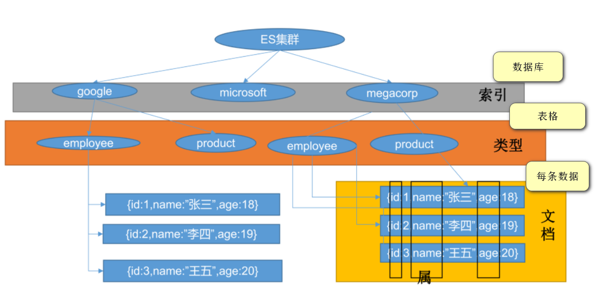
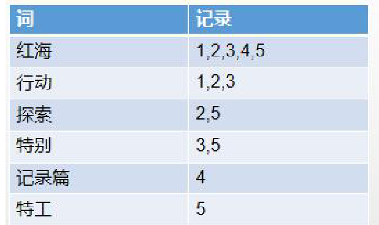
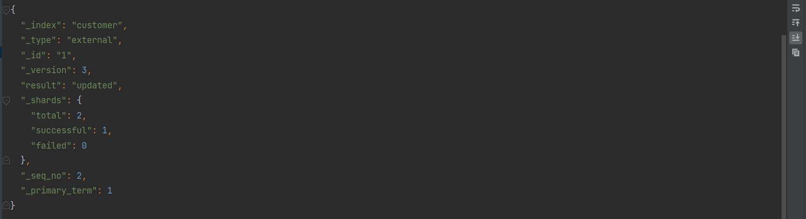
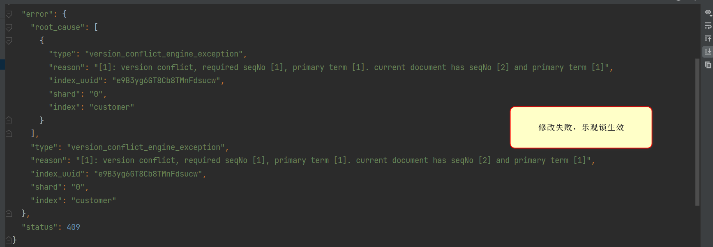
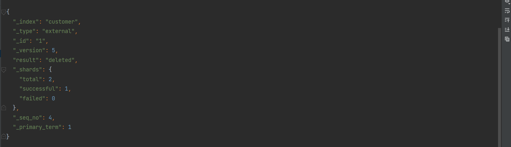
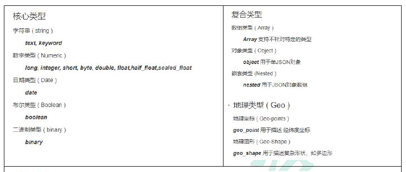
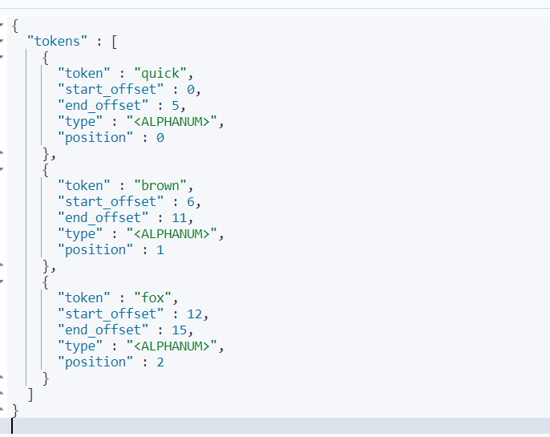
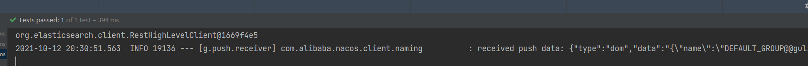
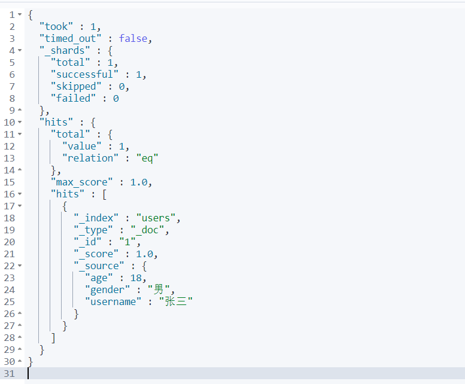

# 一、Elasticsearch

## 1、Elasticsearch简介

全文搜索属于最常见的需求，开源的 Elasticsearch 是目前全文搜索引擎的首选。它可以快速地储存、搜索和分析海量数据。维基百科、Stack Overflow、Github 都采用它


文档：

官方文档：https://www.elastic.co/guide/en/elasticsearch/reference/current/index.html

官方中文:https://www.elastic.co/guide/cn/elasticsearch/guide/current/foreword_id.html

社区中文：

https://es.xiaoleilu.com/index.html
http://doc.codingdict.com/elasticsearch/0/

（其中中文文档都是比较旧的版本）

## 2、基本概念

1、Index（索引)：

动词，相当于 MySQL 中的 insert；
名词，相当于 MySQL 中的 Database

2、Type(类型):

在 Index（索引）中，可以定义一个或多个类型。

类似于 MySQL 中的 Table；每一种类型的数据放在一起

3、Document（文档）

保存在某个索引（Index）下，某种类型（Type）的一个数据（Document），文档是 JSON 格式的，Document 就像是 MySQL 中的某个 Table 里面的内容



4、为什么ES搜索快？ 倒排索引



对每条要存储的文档进行分词，然后对每个词和所在的记录进行存储。在搜索时，先搜索含有其关键字的记录，然后对所记录计算相关性得分，得出最终的搜索结果

## 3、Docker安装Elasticsearch

1、下载镜像文件

```shell
docker pull elasticsearch:7.4.2  存储和检索数据
docker pull kibana:7.4.2         可视化检索数据
```

注意版本要对应

2、创建实例

```shell
mkdir -p /mydata/elasticsearch/config
mkdir -p /mydata/elasticsearch/data
echo "http.host: 0.0.0.0" >> /mydata/elasticsearch/config/elasticsearch.yml

chmod -R 777 /mydata/elasticsearch/ 保证权限

docker run --name elasticsearch -p 9200:9200 -p 9300:9300 \
-e "discovery.type=single-node" \
-e ES_JAVA_OPTS="-Xms64m -Xmx512m" \
-v /mydata/elasticsearch/config/elasticsearch.yml:/usr/share/elasticsearch/config/elasticsearch.yml \
-v /mydata/elasticsearch/data:/usr/share/elasticsearch/data \
-v /mydata/elasticsearch/plugins:/usr/share/elasticsearch/plugins \
-d elasticsearch:7.4.2
```

以后再外面装好插件重启即可；

> 特别注意：
> -e ES_JAVA_OPTS="-Xms64m -Xmx256m" \ 测试环境下，设置 ES 的初始内存和最大内存，否则导致过大启动不了 ES

3、访问测试


4、安装Kibana

```shel
docker run --name kibana -e ELASTICSEARCH_HOSTS=http://59.110.106.16:9200 -p 5601:5601 \
-d kibana:7.4.2
```

> http://192.168.56.10:9200 一定改为自己虚拟机的地址

5、访问测试`59.110.106.16:5601`


## 4、初步检索

**1、_cat**

```
GET /_cat/nodes：查看所有节点
GET /_cat/health：查看 es 健康状况
GET /_cat/master：查看主节点
GET /_cat/indices：查看所有索引 show databases;
```


**2、索引一个文档（保存）**

保存一个数据，保存在哪个索引的哪个类型下，指定用哪个唯一标识PUT customer/external/1；在 customer 索引下的 external 类型下保存 1 号数据为

```
# # 在customer索引下的external类型下保存1号数据
PUT customer/external/1
```

httpclinet

```http
PUT http://59.110.106.16:9200/customer/external/1
Content-Type: application/json

{
  "name": "John Doe"
}
```


返回数据

```json
返回数据：
带有下划线开头的，称为元数据，反映了当前的基本信息。
{
  "_index": "customer", 表明该数据在哪个数据库下；
    "_type": "external", 表明该数据在哪个类型下；
    "_id": "1",  表明被保存数据的id；
    "_version": 1,  被保存数据的版本
    "result": "created", 这里是创建了一条数据，如果重新put一条数据，则该状态会变为updated，并且版本号也会发生变化。
  "_shards": {
    "total": 2,
    "successful": 1,
    "failed": 0
  },
  "_seq_no": 1,
  "_primary_term": 1
}
```

> PUT 和 POST 都可以，
> POST 新增。如果不指定 id，会自动生成 id, 新增这个数据。指定 id 就会修改这个数据，并新增版本号
> PUT 可以新增可以修改。PUT 必须指定 id；由于 PUT 需要指定 id，我们一般都用来做修改操作，不指定 id 会报错。


**3、查询文档**

```
GET customer/external/1
```

httpclient

```http
### GET request with a header
GET http://59.110.106.16:9200/customer/external/1
Accept: application/json
```

返回数据：

```json
{
  "_index": "customer",
  "_type": "external",
  "_id": "1",
  "_version": 2,
  "_seq_no": 1, //并发控制字段，每次更新都会+1，用来做乐观锁
  "_primary_term": 1,//同上，主分片重新分配，如重启，就会变化
  "found": true,
  "_source": { //存储的信息
    "name": "John Doe"
  }
}
```

> 乐观锁用法：通过“`if_seq_no=1&if_primary_term=1`”，当序列号匹配的时候，才进行修改，否则不修改。

示例：

当seq_no=1&primary_term=1时，就修改

```http
###
PUT http://59.110.106.16:9200/customer/external/1?if_seq_no=1&if_primary_term=1
Content-Type: application/json

{
  "name": "John Doe"
}
```

修改成功，修改之后seq_no变成2



再次发送上面的请求，修改失败，乐观锁是生效




**4、更新文档**

```
POST customer/external/1/_update
{
   "doc":{
       "name": "John Doew"
   }
}

或者
POST customer/external/1
{

   "name": "John Doe2"
}

或者
PUT customer/external/1
{
   "name": "John Doe"
}
```

> * 注意带不带_update的语法不同
> * 带_update会跟原数据对比，跟原来一样就什么都不做,version不增加。 应用场景：对于大并发查询，偶尔更新，带update；对比更新呢，重新计算分配规则
> * post不带_update,不会检查原数据,直接更新。 应用场景：对于大并发更新，不带update

发送之后，与元素据对比，发现相同，不做任何操作

```http
POST http://59.110.106.16:9200/customer/external/1/_update
Content-Type: application/json

{
  "doc":{
    "name": "John"
  }
}
```


**5、删除文档&索引**

```
DELETE customer/external/1
DELETE customer
```

> 注：elasticsearch并没有提供删除类型的操作，只提供了删除索引和文档的操作。

删除id=1的数据

```http
DELETE http://59.110.106.16:9200/customer/external/1
```



删除customer索引

```http
DELETE http://59.110.106.16:9200/customer
```

```json
响应
{
    "acknowledged": true
}
```


**6、ES的批量操作——bulk**

用Kibana之中的Dev Tools

示例1:

```http
POST customer/external/_bulk

{"index":{"_id":"1"}}
{"name": "John Doe" }

{"index":{"_id":"2"}}
{"name": "Jane Doe" }
```

语法格式: 两行一组，第一行为操作，第二行为数据

```
{ action: { metadata }}\n
{ request body}\n

{ action: { metadata }}\n
{ request body}\n
```

这里的批量操作，当发生某一条执行发生失败时，其他的数据仍然能够接着执行，也就是说彼此之间是独立的。

> bulk API 以此按顺序执行所有的 action（动作）。如果一个单个的动作因任何原因而失败，它将继续处理它后面剩余的动作。当 bulk API 返回时，它将提供每个动作的状态（与发送的顺序相同），所以您可以检查是否一个指定的动作是不是失败了。

返回数据

```json
#! Deprecation: [types removal] Specifying types in bulk requests is deprecated.
{
  "took" : 318,  花费了多少ms
  "errors" : false, 没有发生任何错误
  "items" : [ 每个数据的结果
    {
      "index" : { 保存
        "_index" : "customer", 索引
        "_type" : "external", 类型
        "_id" : "1", 文档
        "_version" : 1, 版本
        "result" : "created", 创建
        "_shards" : {
          "total" : 2,
          "successful" : 1,
          "failed" : 0
        },
        "_seq_no" : 0,
        "_primary_term" : 1,
        "status" : 201 新建完成
      }
    },
    {
      "index" : { 第二条记录
        "_index" : "customer",
        "_type" : "external",
        "_id" : "2",
        "_version" : 1,
        "result" : "created",
        "_shards" : {
          "total" : 2,
          "successful" : 1,
          "failed" : 0
        },
        "_seq_no" : 1,
        "_primary_term" : 1,
        "status" : 201
      }
    }
  ]
}
```

示例2：

```http
POST /_bulk

{"delete":{"_index":"website","_type":"blog","_id":"123"}}

{"create":{"_index":"website","_type":"blog","_id":"123"}}
{"title":"my first blog post"}

{"index":{"_index":"website","_type":"blog"}}
{"title":"my second blog post"}

{"update":{"_index":"website","_type":"blog","_id":"123"}}
{"doc":{"title":"my updated blog post"}}
```


**7、样本测试数据**

一份顾客银行账户信息的虚构的 JSON 文档样本。每个文档都有下列的 schema(模式):

```json
{
"account_number": 0,
"balance": 16623,
"firstname": "Bradshaw",
"lastname": "Mckenzie",
"age": 29,
"gender": "F",
"address": "244 Columbus Place",
"employer": "Euron",
"email": "bradshawmckenzie@euron.com",
"city": "Hobucken",
"state": "CO"
}
```

测试数据地址https://gitee.com/xlh_blog/common_content/blob/master/es%E6%B5%8B%E8%AF%95%E6%95%B0%E6%8D%AE.json

```http
POST bank/account/_bulk

//上面的数据

//GET _cat/indices, 查看索引
//刚导入了1000条数据
yellow open bank                     dno5JY9tTrGHdsjIMkvQyA 1 1 1000 0 414.2kb 414.2kb
```


## 5、进阶检索

### **1、SearchAPI**

ES 支持两种基本方式检索：

* 一个是通过使用 REST request URI 发送搜索参数（uri+检索参数）
* 另一个是通过使用 REST request body 来发送它们（uri+请求体）

1）、信息检索

```
GET bank/_search     													检索 bank 下所有信息，包括 type 和 docs

GET bank/_search?q=*&sort=account_number:asc							请求参数方式检索
说明：
q=* # 查询所有
sort # 排序字段
asc #升序
```

返回内容：


`took` – 花费多少ms搜索
`timed_out` – 是否超时
`_shards `– 多少分片被搜索了，以及多少成功/失败的搜索分片
`max_score` –文档相关性最高得分
`hits.total.value` - 多少匹配文档被找到
`hits.sort` - 结果的排序key（列），没有的话按照score排序
`hits._score` - 相关得分 (not applicable when using match_all)


uri+请求体行检索

```http
GET /bank/_search
{
  "query": { "match_all": {} },
  "sort": [
    { "account_number": "asc" },
    { "balance":"desc"}
  ]
}
```

HTTP客户端工具（POSTMAN），get请求不能携带请求体，我们变为post也是一样的。我们POST一个JSON风格的查询请求体到_search API。

需要了解，一旦搜索的结果被返回Elasticsearch就完成了这次请求，并且不会维护任何服务端的资源或者结果的cursor（游标）

### 2、Query DSL

Elasticsearch提供了一个可以执行查询的Json风格的DSL(domain-specific language领域特定语言)。这个被称为Query DSL，该查询语言非常全面。


1、基本语法格式

```json
如果针对于某个字段，那么它的结构如下：
{
  QUERY_NAME:{   # 使用的功能
     FIELD_NAME:{  #  功能参数
       ARGUMENT:VALUE,
       ARGUMENT:VALUE,...
      }   
   }
}
```

```java
示例  使用时不要加#注释内容
GET bank/_search
{
  "query": {  #  查询的字段
    "match_all": {}
  },
  "from": 0,  # 从第几条文档开始查
  "size": 5,  # 查几条文档
  "_source":["balance"], # 返回的数据字段， 这里只查balance
  "sort": [
    {
      "account_number": {  # 返回结果按哪个列排序
        "order": "desc"  # 降序
      }
    }
  ]
}
```

query定义如何查询；

* match_all查询类型【代表查询所有的索引】，es中可以在query中组合非常多的查询类型完成复杂查询；
* 除了query参数之外，我们可也传递其他的参数以改变查询结果，如sort，size；
* from+size限定，完成分页功能；
* sort排序，多字段排序，会在前序字段相等时后续字段内部排序，否则以前序为准；


2、`query/match`匹配查询

> 如果是非字符串，会进行精确匹配。如果是字符串，会进行全文检索

- 基本类型（非字符串），精确控制: 查询account_number == 20的文档

```http
GET bank/_search
{
  "query": {
    "match": {
      "account_number": "20"
    }
  }
}
```

- 字符串，全文检索: 查询address中含有kings的文档

```http
GET bank/_search
{
  "query": {
    "match": {
      "address": "kings"
    }
  }
}
```

* 字符串，全文检索：最终查询出 address 中包含 mill 或者 road 或者 mill road 的所有记录，并给出相关性得分

```http
GET bank/_search
{
   "query": {
      "match": {
         "address": "mill road"
      }
   }
}
```

全文检索，最终会按照评分进行排序，会对检索条件进行分词匹配。


3、`query/match_phrase`【短语匹配】

将需要匹配的值当成一整个单词（不分词）进行检索

- `match`：拆分字符串进行检索。 包含mill 或 road 或 mill road
- `match_phrase`：不拆分字符串进行检索。 包含mill road
- `字段.keyword`：必须全匹配上才检索成功。 

```http
GET bank/_search
{
  "query": {
    "match_phrase": {
      "address": "mill road"   #  就是说不要匹配只有mill或只有road的，要匹配mill road一整个子串
      
      # "address.keyword": "990 Mill"  # 字段后面加上 .keyword, 必须完全匹配
      
    }
  }
}
```


4、`query/multi_math`【多字段匹配】

`state或者address中包含mill`，并且在查询过程中，会对于查询条件进行分词。

```http
GET bank/_search
{
  "query": {
    "multi_match": {  # 前面的match仅指定了一个字段。
      "query": "mill",
      "fields": [ # state和address有mill子串  不要求都有
        "state",
        "address"
      ]
    }
  }
}
```


5、`query/bool/must`复合查询

复合语句可以合并，任何其他查询语句，包括符合语句。这也就意味着，复合语句之间可以互相嵌套，可以表达非常复杂的逻辑。

* must：必须达到must所列举的所有条件
* must_not：必须不匹配must_not所列举的所有条件。
* should：应该满足should所列举的条件。满足条件最好，不满足也可以，满足得分更高

```http
GET bank/_search
{
  "query": {
    "bool": {
      "must": [   # gender必须是M， address必须包含mill
        {
          "match": {
            "gender": "M"
          }
        },
        {
          "match": {
            "address": "mill"
          }
        }
      ],
      "must_not": [   # age必须不等于18
        {
          "match": {
            "age": "18"
          }
        }
      ],
      "should": [    # lastname最好包含wallace
        {
          "match": {
            "lastname": "Wallace"
          }
        }
      ]
    }
  }
}
```


6、`query/filter`【结果过滤】

* 上面的must和should影响相关性得分，而must_not仅仅是一个filter ，不贡献得分

* must改为filter就使must不贡献得分

* 如果只有filter条件的话，我们会发现得分都是0

并不是所有的查询都需要产生分数，特别是哪些仅用于filtering过滤的文档。不参与评分更快, 为了不计算分数，elasticsearch会自动检查场景并且优化查询的执行。

```http
GET bank/_search
{
  "query": {
    "bool": {
      "must": [
        { "match": {"address": "mill" } }
      ],
      "filter": {  # query.bool.filter
        "range": {
          "balance": {  # 哪个字段
            "gte": "10000",
            "lte": "20000"
          }
        }
      }
    }
  }
}

这里先是查询所有匹配address包含mill的文档，然后再根据10000<=balance<=20000进行过滤查询结果
```


7、`query/term`

和 match 一样。匹配某个属性的值。全文检索字段用 match，其他非 text 字段匹配用 term。

比如：年龄为23岁，用term， address为mill road就用match

```http
GET bank/_search
{
   "query": {
      "bool": {
         "must": [
            {"term": {
               "age": {
                  "value": "28"
               }
            }},
            {"match": {
               "address": "990 Mill Road"
            }}
         ]
      }
   }
}
```


8、`aggregations`（执行聚合）

​	聚合提供了从数据中分组和提取数据的能力。最简单的聚合方法大致等于 SQL GROUP BY 和 SQL 聚合函数。在 Elasticsearch 中，`有执行搜索返回 hits（命中结果），并且同时返回聚合结果`，把一个响应中的所有 hits（命中结果）分隔开的能力。这是非常强大且有效的，您可以执行查询和多个聚合，并且在一次使用中得到各自的（任何一个的）返回结果，使用一次简洁和简化的 API 来避免网络往返。


例：搜索 address 中包含 mill 的所有人的年龄分布以及平均年龄，但不显示这些人的详情。

```http
GET bank/_search
{
  "query": { # 查询出包含mill的
    "match": {
      "address": "Mill"
    }
  },
  "aggs": { #基于查询聚合
    "ageAgg": {  # 聚合的名字，随便起
      "terms": { # 看值的可能性分布
        "field": "age",
        "size": 10
      }
    },
    "ageAvg": { 
      "avg": { # 看age值的平均
        "field": "age"
      }
    },
    "balanceAvg": {
      "avg": { # 看balance的平均
        "field": "balance"
      }
    }
  },
  "size": 0  # 不看详情
}
```

查询结果：

```json
{
  "took" : 2,
  "timed_out" : false,
  "_shards" : {
    "total" : 1,
    "successful" : 1,
    "skipped" : 0,
    "failed" : 0
  },
  "hits" : {
    "total" : {
      "value" : 4, // 命中4条
      "relation" : "eq"
    },
    "max_score" : null,
    "hits" : [ ]
  },
  "aggregations" : {
    "ageAgg" : { // 第一个聚合的结果
      "doc_count_error_upper_bound" : 0,
      "sum_other_doc_count" : 0,
      "buckets" : [
        {
          "key" : 38,  # age为38的有2条
          "doc_count" : 2
        },
        {
          "key" : 28,
          "doc_count" : 1
        },
        {
          "key" : 32,
          "doc_count" : 1
        }
      ]
    },
    "ageAvg" : { // 第二个聚合的结果
      "value" : 34.0  # balance字段的平均值是34
    },
    "balanceAvg" : {
      "value" : 25208.0
    }
  }
}
```


例：按照年龄聚合，并且求这些年龄段的这些人的平均薪资

`aggs/aggName/aggs/aggName`子聚合

> 写到一个聚合里是基于上个聚合进行子聚合。
>
> 下面求每个age分布的平均balance

```http
GET bank/_search
{
  "query": {
    "match_all": {}
  },
  "aggs": {
    "ageAgg": {
      "terms": { # 看分布
        "field": "age",
        "size": 100
      },
      "aggs": { # 与terms并列
        "ageAvg": { #平均
          "avg": {
            "field": "balance"
          }
        }
      }
    }
  },
  "size": 0
}
```


例：复杂子聚合：查出所有年龄分布，并且这些**年龄段**中M的平均薪资和F的平均薪资以及这个年龄段的总体平均薪资

```http
GET bank/_search
{
  "query": {
    "match_all": {}
  },
  "aggs": {
    "ageAgg": {
      "terms": {  #  看age分布
        "field": "age",
        "size": 100
      },
      "aggs": { # 子聚合
        "genderAgg": {
          "terms": { # 看gender分布
            "field": "gender.keyword" # 注意这里，文本字段应该用.keyword
          },
          "aggs": { # 子聚合
            "balanceAvg": {
              "avg": { # 男性的平均
                "field": "balance"
              }
            }
          }
        },
        "ageBalanceAvg": {
          "avg": { #age分布的平均（男女）
            "field": "balance"
          }
        }
      }
    }
  },
  "size": 0
}
```

### 3、Mapping字段映射

1、字段类型



> - `text` ⽤于全⽂索引，搜索时会自动使用分词器进⾏分词再匹配
> - `keyword` 不分词，搜索时需要匹配完整的值


2、Mapping（映射）
Mapping 是用来定义一个文档（document），以及它所包含的属性（field）是如何存储和索引的。比如，使用 mapping 来定义：

- 哪些字符串属性应该被看做全文本属性（full text fields）；
- 哪些属性包含数字，日期或地理位置；
- 文档中的所有属性是否都能被索引（all 配置）；
- 日期的格式；
- 自定义映射规则来执行动态添加属性；
- 查看mapping信息：`GET bank/_mapping`


3、新版本改变

ElasticSearch7-去掉type概念

* 关系型数据库中两个数据表示是独立的，即使他们里面有相同名称的列也不影响使用，但ES中不是这样的。elasticsearch是基于Lucene开发的搜索引擎，而ES中不同type下名称相同的filed最终在Lucene中的处理方式是一样的。
  * 两个不同type下的两个user_name，在ES同一个索引下其实被认为是同一个filed，你必须在两个不同的type中定义相同的filed映射。否则，不同type中的相同字段名称就会在处理中出现冲突的情况，导致Lucene处理效率下降。
  * 去掉type就是为了提高ES处理数据的效率。

Elasticsearch 7.x URL中的type参数为可选。比如，索引一个文档不再要求提供文档类型。

Elasticsearch 8.x 不再支持URL中的type参数。

解决：
 1）将索引从多类型迁移到单类型，每种类型文档一个独立索引

 2）将已存在的索引下的类型数据，全部迁移到指定位置即可。详见数据迁移


4、对映射的操作

1）创建索引并指定映射

```json
PUT /my_index
{
  "mappings": {
    "properties": {
      "age": {
        "type": "integer"
      },
      "email": {
        "type": "keyword" # 指定为keyword
      },
      "name": {
        "type": "text" # 全文检索。保存时候分词，检索时候进行分词匹配
      }
    }
  }
}
```


2）添加新的字段映射

```json
PUT /my_index/_mapping
{
  "properties": {
    "employee-id": {
      "type": "keyword",
      "index": false # 字段不能被检索。检索
    }
  }
}
```


3)更新映射

对于已经存在的映射字段，我们不能更新。更新必须创建新的索引进行数据迁移


4）数据迁移

先创建new_twitter的正确映射，然后使用如下方式进行数据迁移。

```json
6.0以后写法
POST reindex
{
  "source":{
      "index":"twitter"
   },
  "dest":{
      "index":"new_twitters"
   }
}


老版本写法
POST reindex
{
  "source":{
      "index":"twitter",
      "twitter":"twitter"
   },
  "dest":{
      "index":"new_twitters"
   }
}
```


示例：把bank/account下的文档迁移到newbank下

* 创建newbank索引

  ```json
  PUT /newbank
  {
    "mappings": {
      "properties": {
        "account_number": {
          "type": "long"
        },
        "address": {
          "type": "text"
        },
        "age": {
          "type": "integer"
        },
        "balance": {
          "type": "long"
        },
        "city": {
          "type": "keyword"
        },
        "email": {
          "type": "keyword"
        },
        "employer": {
          "type": "keyword"
        },
        "firstname": {
          "type": "text"
        },
        "gender": {
          "type": "keyword"
        },
        "lastname": {
          "type": "text",
          "fields": {
            "keyword": {
              "type": "keyword",
              "ignore_above": 256
            }
          }
        },
        "state": {
          "type": "keyword"
        }
      }
    }
  }
  ```

* 数据迁移

  ```json
  POST _reindex
  {
    "source": {
      "index": "bank",
      "type": "account"
    },
    "dest": {
      "index": "newbank"
    }
  }
  ```

* 查看newbank中的数据

  ```json
  GET /newbank/_search
  
  输出
    "hits" : {
      "total" : {
        "value" : 1000,
        "relation" : "eq"
      },
      "max_score" : 1.0,
      "hits" : [
        {
          "_index" : "newbank",
          "_type" : "_doc", # 没有了类型
  ```


### 4、分词

* 一个tokenizer（分词器）接收一个字符流，将之分割为独立的tokens（词元，通常是独立的单词），然后输出tokens流。

* 例如：whitespace tokenizer遇到空白字符时分割文本。它会将文本"Quick brown fox!"分割为[Quick,brown,fox!]

* 该tokenizer（分词器）还负责记录各个terms(词条)的顺序或position位置（用于phrase短语和word proximity词近邻查询），以及term（词条）所代表的原始word（单词）的start（起始）和end（结束）的character offsets（字符串偏移量）（用于高亮显示搜索的内容）。

* elasticsearch提供了很多内置的分词器（标准分词器），可以用来构建custom analyzers（自定义分词器）

示例：

```json
POST _analyze
{
  "analyzer": "standard",
  "text": "Quick brown fox!"
}
```

分词结果：




**1、安装ik分词器**

所有的语言分词，默认使用的都是“Standard Analyzer”，但是这些分词器针对于中文的分词，并不友好。为此需要安装中文的分词器。

下载地址：https://github.com/medcl/elasticsearch-analysis-ik/releases

在前面安装的elasticsearch时，我们已经将elasticsearch容器的“/usr/share/elasticsearch/plugins”目录，映射到宿主机的“ /mydata/elasticsearch/plugins”目录下，所以比较方便的做法就是下载“/elasticsearch-analysis-ik-7.4.2.zip”文件，然后解压到该文件夹下即可。安装完毕后，需要重启elasticsearch容器。


**2、测试分词器**

1、ik_smart

```json
POST _analyze
{
  "analyzer": "ik_smart",
  "text": "我是中国人"
}
```

返回结果

```json
{
  "tokens" : [
    {
      "token" : "我",
      "start_offset" : 0,
      "end_offset" : 1,
      "type" : "CN_CHAR",
      "position" : 0
    },
    {
      "token" : "是",
      "start_offset" : 1,
      "end_offset" : 2,
      "type" : "CN_CHAR",
      "position" : 1
    },
    {
      "token" : "中国人",
      "start_offset" : 2,
      "end_offset" : 5,
      "type" : "CN_WORD",
      "position" : 2
    }
  ]
}
```

2、ik_max_word

```json
POST _analyze
{
  "analyzer": "ik_max_word",
  "text": "我是中国人"
}
```

返回结果

```json
{
  "tokens" : [
    {
      "token" : "我",
      "start_offset" : 0,
      "end_offset" : 1,
      "type" : "CN_CHAR",
      "position" : 0
    },
    {
      "token" : "是",
      "start_offset" : 1,
      "end_offset" : 2,
      "type" : "CN_CHAR",
      "position" : 1
    },
    {
      "token" : "中国人",
      "start_offset" : 2,
      "end_offset" : 5,
      "type" : "CN_WORD",
      "position" : 2
    },
    {
      "token" : "中国",
      "start_offset" : 2,
      "end_offset" : 4,
      "type" : "CN_WORD",
      "position" : 3
    },
    {
      "token" : "国人",
      "start_offset" : 3,
      "end_offset" : 5,
      "type" : "CN_WORD",
      "position" : 4
    }
  ]
}
```


**3、自定义词库**

先安装nginx

1）随便启动一个 nginx 实例，只是为了复制出配置

```shell
docker run -p 80:80 --name nginx -d nginx:1.10
```

2)将容器内的配置文件拷贝到当前目录

```shell
docker container cp nginx:/etc/nginx .
```

3）修改文件名称：mv nginx conf 把这个 conf 移动到/mydata/nginx 下

4）终止原容器：docker stop nginx

5）执行命令删除原容器：docker rm $ContainerId

6）创建新的 nginx；执行以下命令

```she
docker run -p 80:80 --name nginx \
-v /mydata/nginx/html:/usr/share/nginx/html \
-v /mydata/nginx/logs:/var/log/nginx \
-v /mydata/nginx/conf:/etc/nginx \
-d nginx:1.10
```

7)给 nginx 的 html 下面放的所有资源可以直接访问；

8)在nginx/html/中创建一个es文件夹，在里面新建文件fenci.txt，用作分词表，写入：尚硅谷


9）访问，由于访问nginx中资源，都在html文件夹下查找，所以直接访问/es/fenci.txt即可（乱码先不用管，访问到了即可）


10）修改/usr/share/elasticsearch/plugins/ik/config中的IKAnalyzer.cfg.xml

```xml
<?xml version="1.0" encoding="UTF-8"?>
<!DOCTYPE properties SYSTEM "http://java.sun.com/dtd/properties.dtd">
<properties>
	<comment>IK Analyzer 扩展配置</comment>
	<!--用户可以在这里配置自己的扩展字典 -->
	<entry key="ext_dict"></entry>
	 <!--用户可以在这里配置自己的扩展停止词字典-->
	<entry key="ext_stopwords"></entry>
	<!--用户可以在这里配置远程扩展字典 -->
	<entry key="remote_ext_dict">http://192.168.56.10/es/fenci.txt</entry> 
	<!--用户可以在这里配置远程扩展停止词字典-->
	<!-- <entry key="remote_ext_stopwords">words_location</entry> -->
</properties>
```

11）重启es,验证分词效果

```json
POST _analyze
{
  "analyzer": "ik_max_word",
  "text": "尚硅谷不错"
}
```

分词效果

```json
{
  "tokens" : [
    {
      "token" : "尚硅谷",
      "start_offset" : 0,
      "end_offset" : 3,
      "type" : "CN_WORD",
      "position" : 0
    },
    {
      "token" : "硅谷",
      "start_offset" : 1,
      "end_offset" : 3,
      "type" : "CN_WORD",
      "position" : 1
    },
    {
      "token" : "不错",
      "start_offset" : 3,
      "end_offset" : 5,
      "type" : "CN_WORD",
      "position" : 2
    }
  ]
}
```


## 6、整合springboot

选择Elasticsearch-Rest-Client（elasticsearch-rest-high-level-client）操作es

官方文档：https://www.elastic.co/guide/en/elasticsearch/client/java-rest/current/java-rest-high.html

### 1、创建项目gulimall-search

pom.xml

```xml
    <dependencies>
        <dependency>
            <groupId>com.xmh.gulimall</groupId>
            <artifactId>gulimall-common</artifactId>
            <version>1.0.0-SNAPSHOT</version>
            <!--去除数据源-->
            <exclusions>
                <exclusion>
                    <groupId>com.baomidou</groupId>
                    <artifactId>mybatis-plus-boot-starter</artifactId>
                </exclusion>
            </exclusions>
        </dependency>
        <!--web-->
        <dependency>
            <groupId>org.springframework.boot</groupId>
            <artifactId>spring-boot-starter-web</artifactId>
        </dependency>
        <dependency>
            <groupId>org.springframework.boot</groupId>
            <artifactId>spring-boot-starter-actuator</artifactId>
        </dependency>
        <dependency>
            <groupId>org.elasticsearch.client</groupId>
            <artifactId>elasticsearch-rest-high-level-client</artifactId>
        </dependency>
        <dependency>
            <groupId>org.springframework.boot</groupId>
            <artifactId>spring-boot-starter-test</artifactId>
            <scope>test</scope>
        </dependency>
    </dependencies>
```

父工程pom.xml

```xml
<elasticsearch.version>7.4.2</elasticsearch.version>


	<!--在spring-boot-dependencies中所依赖的ES版本位6.8.5，要改掉-->
      <dependency>
        <groupId>org.elasticsearch.client</groupId>
        <artifactId>elasticsearch-rest-high-level-client</artifactId>
        <version>${elasticsearch.version}</version>
      </dependency>
      <dependency>
        <groupId>org.elasticsearch</groupId>
        <artifactId>elasticsearch</artifactId>
        <version>${elasticsearch.version}</version>
      </dependency>
      <dependency>
        <groupId>org.elasticsearch.client</groupId>
        <artifactId>elasticsearch-rest-client</artifactId>
        <version>${elasticsearch.version}</version>
        <exclusions>
          <exclusion>
            <groupId>commons-logging</groupId>
            <artifactId>commons-logging</artifactId>
          </exclusion>
        </exclusions>
      </dependency>
```

主启动类：com/xmh/gulimall/search/GulimallSearchApplication.java

```java
@EnableDiscoveryClient
@SpringBootApplication
public class GulimallSearchApplication {
     public static void main(String[] args) {
           SpringApplication.run(GulimallSearchApplication.class, args);
      }
}
```

配置文件application.yml

```yml
spring:
  application:
    name: gulimall-search
  cloud:
    nacos:
      discovery:
        server-addr: 127.0.0.1:8848
```

GulimallElasticSearchConfig，官方建议把requestOptions创建成单实例

```java
@Configuration
public class GulimallElasticSearchConfig {

    public static final RequestOptions COMMON_OPTIONS;

    static {
        RequestOptions.Builder builder = RequestOptions.DEFAULT.toBuilder();

        COMMON_OPTIONS = builder.build();
    }
    

    @Bean
    public RestHighLevelClient esRestClient(){
        RestHighLevelClient client = new RestHighLevelClient(
                RestClient.builder(
                        new HttpHost("59.110.106.16", 9200, "http")));

        return client;
    }

}

```

创建单元测试，查看是否注入成功

```java
@RunWith(SpringRunner.class)
@SpringBootTest
public class GulimallSearchApplicationTests {

    @Autowired
    private RestHighLevelClient client;

    @Test
    public void contextLoads(){
        System.out.println(client);
    }

}
```

输出成功




### 2、保存数据

官方文档：https://www.elastic.co/guide/en/elasticsearch/client/java-rest/current/java-rest-high-document-index.html

保存方式分为同步和异步，异步方式多了个listener回调，下面测试同步保存

```java
@Test
public void indexData() throws IOException {
    IndexRequest indexRequest = new IndexRequest("users");//新建users索引的请求
    indexRequest.id("1");//数据的id

    User user = new User();//要保存的数据
    user.setUsername("张三");
    user.setAge(18);
    user.setGender("男");
    //把对象转化成json，填入请求之中
    String jsonString = JSON.toJSONString(user);
    indexRequest.source(jsonString, XContentType.JSON);

    //执行保存操作
    IndexResponse index = client.index(indexRequest, GulimallElasticSearchConfig.COMMON_OPTIONS);

    //提取有用的相应数据
    System.out.println(index);
}

@Data
class User{
    private String username;
    private String gender;
    private Integer age;
}
```

查看结果`GET /users/_search`




### 3、复杂检索

内部实体类:

```java
	@Data
    @ToString
    public static class Account {
        private int account_number;
        private int balance;
        private String firstname;
        private String lastname;
        private int age;
        private String gender;
        private String address;
        private String employer;
        private String email;
        private String city;
        private String state;
    }
```

复杂检索：1、创建检索请求；2、执行检索；3、分析结果

```java
@Test
public void searchData() throws IOException {
    //1、创建检索请求
    SearchRequest searchRequest = new SearchRequest();
    //指定索引
    searchRequest.indices("bank");
    //指定DSL，检索条件
    //SearchSourceBuilder sourceBuilder 封装查询的条件
    SearchSourceBuilder sourceBuilder = new SearchSourceBuilder();

    //1.1、构造检索条件，查询地址包含mill的
    //sourceBuilder.query();
    //sourceBuilder.from();
    //sourceBuilder.size();
    //sourceBuilder.aggregation();
    sourceBuilder.query(QueryBuilders.matchQuery("address", "mill"));
    searchRequest.source(sourceBuilder);
    System.out.println(sourceBuilder.toString()); //打印构造条件

    //1.2、按照年龄的值分布进行聚合
    TermsAggregationBuilder ageAgg = AggregationBuilders.terms("ageAgg").field("age").size(10);
    sourceBuilder.aggregation(ageAgg);

    //1.3、计算平均薪资
    AvgAggregationBuilder balanceAvg = AggregationBuilders.avg("balanceAvg").field("balance");
    sourceBuilder.aggregation(balanceAvg);


    //2、执行检索
    SearchResponse search = client.search(searchRequest, GulimallElasticSearchConfig.COMMON_OPTIONS);


    //3、分析结果
    System.out.println(search.toString());
    //3.1、获取所有查到的数据
    SearchHits hits = search.getHits();
    SearchHit[] searchHits = hits.getHits();
    for (SearchHit hit : searchHits) {
        //hit.getIndex();hit.getType();hit.getId();  //获取一些基本属性
        String sourceAsString = hit.getSourceAsString();  //把查询出来的结果转化为json字符串
        Account account = JSON.parseObject(sourceAsString, Account.class);
        System.out.println("account" + account);
    }

    //3.2、获取这次检索到的聚合信息
    Aggregations aggregations = search.getAggregations();
    Terms ageAgg1 = aggregations.get("ageAgg");//聚合的名字
    for (Terms.Bucket bucket : ageAgg1.getBuckets()) {
        String keyAsString = bucket.getKeyAsString();
        System.out.println("年龄为" + keyAsString + "岁的人有" + bucket.getDocCount() + "人");
    }

    Avg balanceAvg1 = aggregations.get("balanceAvg");
    double value = balanceAvg1.getValue();
    System.out.println("平均薪资为：" + value);

}
```


# 二、商品上架

## 1、商品上架es准备

需求：

- 上架的商品才可以在网站展示。
- 上架的商品需要可以被检索。


**1、分析sku在es中如何存储**
商品mapping

分析：商品上架在es中是存sku还是spu？

1）、检索的时候输入名字，是需要按照sku的title进行全文检索的
2）、检素使用商品规格，规格是spu的公共属性，每个spu是一样的
3）、按照分类id进去的都是直接列出spu的，还可以切换。
4〕、我们如果将sku的全量信息保存到es中（包括spu属性〕就太多字段了


选取如下方案：

```json
{
    skuId:1
    spuId:11
    skyTitile:华为xx
    price:999
    saleCount:99
    attr:[
        {尺寸:5},
        {CPU:高通945},
        {分辨率:全高清}
	]
优点：方便检索
缺点：如果每个sku都存储规格参数(如尺寸)，会有冗余存储，因为每个spu对应的sku的规格参数都一样
```


**2、建立product索引**

* `{ “type”: “keyword” }`, # 保持数据精度问题，可以检索，但不分词
* `“analyzer”: “ik_smart”` # 中文分词器
* `“index”: false`, # 不可被检索，不生成index
* `“doc_values”: false` # 默认为true，设置为false，表示不可以做排序、聚合以及脚本操作，这样更节省磁盘空间。还可以通过设定doc_values为true，index为false来让字段不能被搜索但可以用于排序、聚合以及脚本操作

```json
PUT product
{
    "mappings":{
        "properties": {
            "skuId":{ "type": "long" },
            "spuId":{ "type": "keyword" },
            "skuTitle": {
                "type": "text",
                "analyzer": "ik_smart"  
            },
            "skuPrice": { "type": "keyword" },
            "skuImg"  : {
                "type": "keyword",
                "index": false,
                "doc_values": false
            },
            "saleCount":{ "type":"long" },
            "hasStock": { "type": "boolean" },
            "hotScore": { "type": "long"  },
            "brandId":  { "type": "long" },
            "catalogId": { "type": "long"  },
            "brandName": {
              "type": "keyword",
              "index": false,
              "doc_values": false
            },
            "brandImg":{
                "type": "keyword",
                "index": false,
                "doc_values": false 
            },
            "catalogName": {
              "type": "keyword",
              "index": false,
              "doc_values": false
            }, 
            "attrs": {
                "type": "nested",
                "properties": {
                    "attrId": {"type": "long"},
                    "attrName": {
                        "type": "keyword",
                        "index": false,
                        "doc_values": false
                    },
                    "attrValue": {"type": "keyword" }
                }
            }
        }
    }
}
```


**nested嵌入式对象**

属性是"type": “nested”,因为是内部的属性进行检索

数组类型的对象会被扁平化处理（对象的每个属性会分别存储到一起）

```java
user.name=["aaa","bbb"]
user.addr=["ccc","ddd"]

这种存储方式，可能会发生如下错误：
错误检索到{aaa,ddd}，这个组合是不存在的
```

数组的扁平化处理会使检索能检索到本身不存在的，为了解决这个问题，就采用了嵌入式属性，数组里是对象时用嵌入式属性（不是对象无需用嵌入式属性）

nested阅读：https://blog.csdn.net/weixin_40341116/article/details/80778599

使用聚合：https://blog.csdn.net/kabike/article/details/101460578


## 2、商品上架

> 此部分代码太多，粘贴上来部分重要代码

1、商品系统20，url：`/product/spuinfo/{spuId}/up`

* 给定spuid，该spuid下的所有sku都上架

* 在common中新建`to/es/SkuEsModel`,用来和es之间传输数据

  ```java
  @Data
  public class SkuEsModel { //common中
      private Long skuId;
      private Long spuId;
      private String skuTitle;
      private BigDecimal skuPrice;
      private String skuImg;
      private Long saleCount;
      private boolean hasStock;
      private Long hotScore;
      private Long brandId;
      private Long catalogId;
      private String brandName;
      private String brandImg;
      private String catalogName;
      private List<Attr> attrs;
  
      @Data
      public static class Attr{
          private Long attrId;
          private String attrName;
          private String attrValue;
      }
  }
  ```

* 上架要确保还有库存，在ware微服务里添加"查询sku是否有库存"的controller

  为了减少远程服务调用，利用一次查询，把所有的skuid传过来，返回`List<SkuHasStockTo>`，to中包括skuid，hasStock

  ```java
      //SkuHasStockTo
  	@Data
      public class SkuHasStockTo {
          private Long skuId;
          private boolean hasStock;
  
          public boolean getHasStock(){
              return this.hasStock;
          }
      }
  
  
  	//ware服务中WareSkuController.java
  	@PostMapping("/hasStock")
      //@RequiresPermissions("ware:waresku:list")
      public List<SkuHasStockTo> hasStock(@RequestBody List<Long> skuIds){
          List<SkuHasStockTo> skuHasStockTos = wareSkuService.getSkuHasStock(skuIds);
          return skuHasStockTos;
      }
  
  	//WareSkuServiceImpl.java
      @Override
      public List<SkuHasStockTo> getSkuHasStock(List<Long> skuIds) {
          List<SkuHasStockTo> collect = skuIds.stream().map(skuId -> {
              SkuHasStockTo stockTo = new SkuHasStockTo();
              stockTo.setSkuId(skuId);
              Long count = baseMapper.getSkuStock(skuId);
              stockTo.setHasStock(count != null && count > 0);
              return stockTo;
          }).collect(Collectors.toList());
          return collect;
      }
  ```

  在product服务中新建feign接口

  ```java
  @FeignClient("gulimall-ware")
  public interface WareFeignService {
      @PostMapping("/ware/waresku/hasStock")
      List<SkuHasStockTo> hasStock(@RequestBody List<Long> skuIds);
  }
  ```

* 下面为代码为前端传入spuid，商品上架的各个步骤，包括搜集信息，封装成to，传给es上传，修改spu上架状态

  ```java
  	//product服务的SpuInfoServiceImpl
  	@Override
      public void up(Long spuId) {
          //1、查出当前spuid对应的所有sku信息，对应品牌名字
          List<SkuInfoEntity> skuInfoEntities = skuInfoService.getSkusBySpuId(spuId);
          List<Long> skuIds = skuInfoEntities.stream().map(item -> item.getSkuId()).collect(Collectors.toList());
  
          //TODO 3、查询品牌名字和分类的信息 brandName,brandImg,catalogName
          Long brandId = skuInfoEntities.get(0).getBrandId();
          BrandEntity brandEntity = brandService.getById(brandId);
          String brandName = brandEntity.getName();
          String brandImg = brandEntity.getLogo();
          String cateName = categoryService.getById(skuInfoEntities.get(0).getCatalogId()).getName();
  
          //TODO 4、查询当前sku的所有可以被用来检索的规格属性
          List<ProductAttrValueEntity> baseAttrs = productAttrValueService.baseAttrlistForSpu(spuId);
          List<Long> attrIds = baseAttrs.stream().map(baseAttr -> {
              return baseAttr.getAttrId();
          }).collect(Collectors.toList());
          List<AttrEntity> searchAttrs = attrService.getSearchAttr(attrIds);
          List<Long> searchAttrIds = searchAttrs.stream().map(searchAttr -> searchAttr.getAttrId()).collect(Collectors.toList());
          //可搜索的属性规格id
          Set<Long> idSet = new HashSet<>(searchAttrIds);
          //根据set把当前spu的attr过滤一下，剩下可检索的attr
          List<SkuEsModel.Attr> attrsList = baseAttrs.stream().filter(item -> {
              return idSet.contains(item.getAttrId());
          }).map(item -> {
              SkuEsModel.Attr attr = new SkuEsModel.Attr();
              BeanUtils.copyProperties(item, attr);
              return attr;
          }).collect(Collectors.toList());
  
  
          //TODO 1、发送远程调用，库存系统是否还有库存  hasStock
          //查一次，返回所有的sku的库存情况
          Map<Long, Boolean> stockMap = null;
          try {
              List<SkuHasStockTo> hasStock = wareFeignService.hasStock(skuIds);
              stockMap = hasStock.stream().collect(Collectors.toMap(item -> item.getSkuId(), item -> item.getHasStock()));
          }catch (Exception e) {
              log.error("远程查询服务异常,原因:{}", e);
          }
  
  
          //2、把每个sku都封装成SkuEsModel
          Map<Long, Boolean> finalStockMap = stockMap;
          List<SkuEsModel> skuEsModels = skuInfoEntities.stream().map(sku -> {
              SkuEsModel skuEsModel = new SkuEsModel();
              BeanUtils.copyProperties(sku, skuEsModel);
              skuEsModel.setSkuPrice(sku.getPrice());
              skuEsModel.setSkuImg(sku.getSkuDefaultImg());
              //1、发送远程调用，库存系统是否还有库存  hasStock
              if (finalStockMap == null){
                  skuEsModel.setHasStock(false);
              }else{
                  skuEsModel.setHasStock(finalStockMap.get(sku.getSkuId()));
              }
  
  
              //2、热度评分
              skuEsModel.setHotScore(0L);
  
              //3、查询品牌名字和分类的信息 brandName,brandImg,catalogName
              skuEsModel.setBrandName(brandName);
              skuEsModel.setBrandImg(brandImg);
              skuEsModel.setCatalogName(cateName);
  
              //4、查询当前sku的所有可以被用来检索的规格属性
              skuEsModel.setAttrs(attrsList);
              return skuEsModel;
          }).collect(Collectors.toList());
  
          //TODO 5、将数据发送给es进行保存
          R r = searchFeignService.productStatusUp(skuEsModels);
          if (r.getCode() == 0){
              //远程上架成功
              //TODO 6、修改当前spu的状态
              baseMapper.updataSpuStatus(spuId, ProductConstant.StatusEnum.SPU_UP.getCode());
          }else{
              //远程上架失败
              //TODO 7、重复调用？接口幂等性
          }
      }
  ```

* es上传

  `search服务中的ElasticSaveController.java`

  ```java
      //search服务中的ElasticSaveController.java
  	//上架商品
      @PostMapping("/product")
      public R productStatusUp(@RequestBody List<SkuEsModel> skuEsModels){
          boolean b = false;
          try {
              b = productSaveService.productStatusUp(skuEsModels);
          }catch (Exception e){
              log.error("ElasticSaveController商品上架错误 {}", e);
              return R.error(BizCodeEnume.PRODUCT_UP_EXCEPTION.getCode(), BizCodeEnume.PRODUCT_UP_EXCEPTION.getMsg());
          }
          if (!b){
              return R.ok();
          }else{
              return R.error(BizCodeEnume.PRODUCT_UP_EXCEPTION.getCode(), BizCodeEnume.PRODUCT_UP_EXCEPTION.getMsg());
          }
      }
  ```

  `search服务中的ProductSaveServiceImpl.java`

  ```java
  	//search服务中的ProductSaveServiceImpl.java
  	@Override
      public boolean productStatusUp(List<SkuEsModel> skuEsModels) throws IOException {
  
          //保存到es中
          //1、给es中建立索引。product， 建立好映射关系
  
          //2、给es中保存这些数据 bulk 批量保存
          BulkRequest bulkRequest = new BulkRequest();
          for (SkuEsModel skuEsModel : skuEsModels) {
              //构建一个一个的保存请求
              IndexRequest indexRequest = new IndexRequest(EsConstant.PRODUCT_INDEX);
              //指定每个商品的id
              indexRequest.id(skuEsModel.getSkuId().toString());
              //每个商品的内容,Json
              String s = JSON.toJSONString(skuEsModel);
              indexRequest.source(s, XContentType.JSON);
              //把每一个保存请求都放在bulk请求中
              bulkRequest.add(indexRequest);
          }
          BulkResponse bulk = restHighLevelClient.bulk(bulkRequest, GulimallElasticSearchConfig.COMMON_OPTIONS);
          //TODO 如果批量错误
          boolean b = bulk.hasFailures();
          List<String> collect = Arrays.stream(bulk.getItems()).map(item -> {
              return item.getId();
          }).collect(Collectors.toList());
          log.error("商品上架成功:{}", collect);
          return b;
      }
  ```

  `product服务中的远程接口SearchFeignService`

  ```java
  //product服务中的远程接口SearchFeignService
  @FeignClient("gulimall-search")
  public interface SearchFeignService {
      @PostMapping("/search/save/product")
      R productStatusUp(@RequestBody List<SkuEsModel> skuEsModels);
  }

